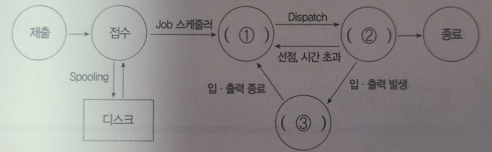
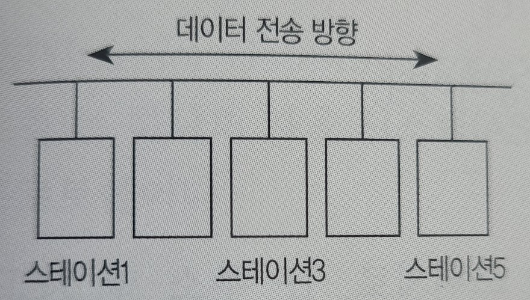

# 11장 응용 SW 기초 기술 활용

```
1.
다음이 설명하는 용어가 무엇인지 쓰시오.

- 컴퓨터 시스템의 자원들을 효율적으로 관리하며, 사용자가 컴퓨터를 편리하고 효과적으로 
사용할 수 있도록 환경을 제공하는 여러 프로그램의 모임이다.
- 다중 사용자와 다중 응용 프로그램 환경 하에서 자원의 현재 상태를 파악하고, 자원 분배를 
위한 스케줄링을 담당한다.
- CPU, 메모리 공간, 기억장치, 입-출력장치 등의 자원을 관리한다.
- 입-출력장치와 사용자 프로그램을 제어한다.

- ()
```

```
2.
운영체제(OS)의 목적 4가지를 쓰시오.

- ()
```

```
3.
다음 설명과 가장 부합하는 운영체제(OS)를 쓰시오.

- 1960년대 AT&T 벨(Bell) 연구소가 MIT, General Electric 사와 함께 공동 개발한 
운영체제이다.
- 시분할 시스템(Time Sharing System)을 위해 설계된 대화식 운영체제이다.
- 대부분 C 언어로 작성되어 있어 이식성이 높으며 장치, 프로세스 간의 호환성이 높다.
- 트리 구조의 파일 시스템을 갖는다.

- ()
```

```
4.
다음이 설명하는 UNIX 시스템의 구성 요소를 쓰시오.

- UNIX의 가장 핵심적인 부분으로, 컴퓨터가 부팅될 때 주기억장치에 적재된 후 상주하면서 
실행된다.
- 프로세스(CPU 스케줄링) 관리, 기억장치 관리, 파일 관리, 입-출력 관리, 프로세스간 통신, 
데이터 전송 및 변환 등 여러 가지 기능을 수행한다.

- ()
```

```
5.
다음이 설명하는 운영체제(OS)를 쓰시오.

- 1991년 Linus Torvalds가 UNIX를 기반으로 개발한 운영체제이다.
- 프로그램 소스 코드가 무료로 공개되어 있기 때문에 프로그래머가 원하는 기능을 추가할 수 
있고, 다양한 플랫폼에 설치하여 사용이 가능하다.

- ()
```

```
6.
리눅스의 커널 위에서 동작하며, 자바와 코틀린으로 애플리케이션을 작성하는 등 휴대용 장치에서 주로 사용되는 운영체제를 쓰시오.

- ()
```

```
7.
보조기억장치에 보관중인 프로그램이나 데이터를 언제 주기억장치로 적재할 것인지를 결정하는 
기억장치 관리 전략을 쓰시오.

- ()
```

```
8.
메모리 관리 기법 중 Worst Fit 방법을 사용할 경우 10K 크기의 프로그램 실행을 위해서는 어느 부분에 할당되어야 하는지 영역 번호로 쓰시오.

- ()
```
<table border="1">
    <tr>
        <th>영역 번호
        </th>
        <th>메모리 크기
        </th>
        <th>사용 여부
        </th>
    </tr>
    <tr>
        <td>N01
        </td>
        <td>8K
        </td>
        <td>FREE
        </td>
    </tr>
    <tr>
        <td>N02
        </td>
        <td>12K
        </td>
        <td>FREE
        </td>
    </tr>
    <tr>
        <td>N03
        </td>
        <td>10K
        </td>
        <td>IN USE
        </td>
    </tr>
    <tr>
        <td>N04
        </td>
        <td>20K
        </td>
        <td>IN USE
        </td>
    </tr>
    <tr>
        <td>N05
        </td>
        <td>16K
        </td>
        <td>FREE
        </td>
    </tr>
</table>

```
9.
주기억장치의 할당 기법 중 분산 할당 기법에 해당하는 것을 모두 골라 기호(ㄱ~ㅂ)로 쓰시오.

ㄱ. 다중 분할 할당 기법             ㄴ. 오버레이 기법
ㄷ. 페이징 기법                     ㄹ. 단일 분할 할당 기법
ㅁ. 세그먼테이션 기법               ㅂ. 스와핑 기법

- ()
```

```
10.
다음은 단일 분할 할당 기법에 대한 설명이다. 괄호(1,2)에 들어갈 알맞은 기법을 쓰시오.

- ()
```
<table border="1">
    <tr>
        <td>(1) 기법
        </td>
        <td>주기억장치보다 큰 사용자 프로그램을 실행하기 위한 기법이다.
        </td>
    </tr>
    <tr>
        <td>(2) 기법
        </td>
        <td>하나의 프로그램 전체를 주기억장치에 할당하여 사용하다 필요에 따라 다른 프로그램과 교체하는 기법이다.
        </td>
    </tr>
</table>

```
11.
주기억장치의 사용자 영역을 일정 수의 고정된 크기로 분할한 후 준비상태 큐에서 준비 중인 
프로그램을 각 영역에 할당하여 수행하는 주기억장치 할당 기법을 쓰시오.

- ()
```

```
12.
보조기억장치의 일부를 주기억장치처럼 사용하는 것으로, 용량이 작은 주기억장치를 마치 큰 
용량을 가진 것처럼 사용하는 기법을 쓰시오.

- ()
```

```
13.
다음은 가상기억장치의 구현 방법에 대한 설명이다. 괄호(1,2)에 들어갈 알맞은 용어를 쓰시오.

가상기억장치의 일반적인 구현 방법은 블록의 종류에 따라 (1) 기법과 (2) 기법으로 나눌 수 
있다. (1) 기법은 프로그램을 고정된 크기의 일정한 블록으로 나누고, (2) 기법은 가변적인 
크기의 블록으로 나눈다.

- ()
```

```
14.
다음 중 페이지 교체 알고리즘에 해당하는 것을 모두 골라 쓰시오.

OPT     NFT     LFU     NCS     EDI     SDN
FIFO    NUR     INT     EXEC    SQL

- ()
```

```
15.
벨레이디(Belady)가 제안한 페이지 교체 기법으로, 앞으로 가장 오랫동안 사용하지 않을 
페이지를 교체하는 기법은 무엇인지 영문 약어로 쓰시오.

- ()
```

```
16.
4개의 페이지를 수용할 수 있는 주기억장치가 있으며, 초기에는 모두 비어있다고 가정한다. 
다음의 순서로 페이지 참조가 발생할 때, FIFO 페이지 교체 알고리즘을 사용할 경우 페이지 
결함의 발생 횟수를 구하시오.

페이지 참조 순서 : 1, 2, 3, 1, 2, 4, 5, 1

- ()
```

```
17.
주기억장치에 완전히 비어 있는 3개의 페이지가 있다. 페이지 교체 방법으로 LRU를 사용할 때 요청된 페이지 번호의 순서가 0, 1, 2, 3, 0, 1, 4, 0인 경우 페이지 부재(Page Fault)는 몇 번 발생하는지 쓰시오.

- ()
```

```
18.
페이지 교체 기법 중 사용 빈도가 가장 적은 페이지를 교체하는 기법을 쓰시오.

- ()
```

```
19.
페이지 교체 기법 중 매 페이지마다 두 개의 하드웨어 비트, 즉 참조 비트와 변형 비트가 필요한 
기법을 쓰시오.

- ()
```

```
20.
페이지 교체 기법 중 가장 오랫동안 주기억장치에 있던 페이지 중 자주 사용되는 페이지의 교체를 
방지하기 위한 기법은 무엇인지 쓰시오.

- ()
```

```
21.
프로세스 적재 정책에 대한 다음 설명에서 괄호에 공통으로 들어갈 알맞은 용어를 영문으로 
쓰시오.

()은 프로세스가 실행되는 동안 주기억장치를 참조할 때 일부 페이지만 집중적으로 참조하는 
성질을 의미한다. 시간 ()은 일정 시간에 집중되는 현상을, 공간 ()은 일정 위치에 집중되는 
현상을 가리킨다.

- ()
```

```
22.
운영체제의 가상기억장치 관리에서 프로세스가 일정 시간 동안 자주 참조하는 페이지들의 집합을 
의미하는 용어를 쓰시오.

- ()
```

```
23.
기억장치 관리 중 발생할 수 있는 스래싱(Thrashing)에 대해 간략히 서술하시오.

- ()
```

```
24.
다음 설명은 무엇에 대한 정의인지 쓰시오.

- 실행중인 프로그램이다.
- 프로시저가 활동 중인 것이다.
- 비동기적 행위를 일으키는 주체이다.
- PCB의 존재로서 명시되는 것이다.

- ()
```

```
25.
다음 중 PCB(Process Control Block)에 저장되어 있는 정보만 모두 골라 기호로 쓰시오.

ㄱ. 포인터                      ㄴ. 프로세스 오류의 수정 방법
ㄷ. 페이지 부재 발생 횟수        ㄹ. 주기억장치 관리 정보
ㅁ. 초기값 정보                 ㅂ. CPU 레지스터 정보
ㅅ. 프로세스 현재 상태           ㅇ. 우선순위를 위한 스케줄러

- ()
```

```
26.
다음은 프로세스 상태 전이도이다. 괄호(1~3)에 들어갈 알맞은 상태를 쓰시오.

- ()
```


```
27.
프로세스 상태 전이는 프로세스가 시스템 내에 존재하는 동안 프로세스의 상태가 변하는 것을 
의미한다. 준비 상태에서 대기하고 있는 프로세스 중 하나가 스케줄링되어 중앙처리장치를 할당 
받아 실행 상태로 전이되는 과정을 무엇이라 하는지 쓰시오.

- ()
```

```
28.
시스템의 여러 자원을 할당받아 실행하는 프로그램 단위 또는 프로세스 내에서의 작업 단위로, 
프로세스의 일부 특성을 갖고 있기 때문에 경량(Light Weight) 프로세스라고도 불리는 것은 
무엇인지 쓰시오.

- ()
```

```
29.
프로세스가 생성되어 실행될 때 필요한 시스템의 여러 자원을 해당 프로세스에게 할당하는 
작업으로, 공정성, 처리율 증가, CPU 이용률 증가, 응답 시간 및 반환 시간 최소화를 목적으로 
하는 것은 무엇인지 쓰시오.

- ()
```

```
30.
다음 중 비선점 스케줄링의 종류를 모두 골라 쓰시오.

- Round Robin       - 기한부        - FCFS
- 다단계 큐          - HRN          - 우선순위
- SRT               - SJF           - 선점 우선순위

- ()
```

```
31.
다음 중 선점 스케줄링의 종류를 모두 골라 쓰시오.

- Round Robin       - 기한부        - FCFS
- 다단계 큐          - HRN          - 우선순위
- SRT               - SJF           - 선점 우선순위

- ()
```

```
32.
FIFO 스케줄링에서 3개의 작업 도착 시간과 CPU 사용시간(Burst Time)이 다음 표와 같을 때 
모든 작업들의 평균 반환 시간(Turn Around Time)은 약 얼마인지 쓰시오.

- ()
```
<table border="1">
    <tr>
        <th>작업
        </th>
        <th>도착시간
        </th>
        <th>CPU 사용시간(Burst Time)
        </th>
    </tr>
    <tr>
        <td>JOB 1
        </td>
        <td>0
        </td>
        <td>13
        </td>
    </tr>
    <tr>
        <td>JOB 2
        </td>
        <td>3
        </td>
        <td>35
        </td>
    </tr>
    <tr>
        <td>JOB 3
        </td>
        <td>8
        </td>
        <td>2
        </td>
    </tr>
</table>

```
33.
SJF(Shortest Job First) 스케줄링에서 다음과 같은 프로세스가 차례로 큐에 도착하였을 때, 평균 반환 시간과 평균 대기 시간을 계산하시오.

- ()
```
<table border="1">
    <tr>
        <th>프로세스 번호
        </th>
        <th>실행시간
        </th>
    </tr>
    <tr>
        <td>P1
        </td>
        <td>7
        </td>
    </tr>
    <tr>
        <td>P2
        </td>
        <td>8
        </td>
    </tr>
    <tr>
        <td>P3
        </td>
        <td>4
        </td>
    </tr>
    <tr>
        <td>P4
        </td>
        <td>3
        </td>
    </tr>
</table>

```
34.
HRN 비선점형 스케줄링의 우선순위를 구하는 계산식을 쓰시오.

- ()
```

```
35.
다음 보기에서 UNIX SHELL 환경 변수를 출력하는 명령어를 모두 골라 쓰시오.

- set       - configenv     - admintool         - env
- printenv  - pkginfo       - setenv            - badblocks

- ()
```

```
36.
Windows에서 디스크 표면을 트랙과 섹터로 나누어 초기화할 때 사용하는 명령어를 쓰시오.

- ()
```

```
37.
UNIX에서 사용하는 명령어 중 새로운 프로세스를 생성하는 명령어를 쓰시오.

- ()
```

```
38.
리눅스 또는 유닉스에서 'a.txt' 파일에 대해 다음 <처리 조건>과 같이 권한을 부여하고자 한다. 
<처리 조건>을 준수하여 적합한 명령문을 작성하시오.

<처리 조건>
- 사용자에게 읽기, 쓰기, 실행 권한을 부여한다.
- 그룹에게 읽기, 실행 권한을 부여한다.
- 기타 사용자에게 실행 권한을 부여한다.
- 한 줄로 작성하고, 8진법 숫자를 이용한 명령문을 이용한다.

- ()
```

```
39.
인터넷에 대한 다음 설명에서 괄호(1,2)에 들어갈 알맞은 답을 쓰시오.

1. IPv6는 (1) 비트의 주소를 가지며, 인증성, 기밀성, 데이터 무결성의 지원으로 보안 문제를 해결할 수 있고, 주소의 확장성, 융통성, 연동성이 뛰어나다.
2. IPv4는32 비트의 주소를 가지며 (2) 비트씩 4부분, 총 32비트로 구성되어 있다. IPv4는 네트워크 부분의 길이에 따라 A 클래스에서 E 클래스까지 총 5단계로 구성되어 있다.

- ()
```

```
40.
네트워크 및 인터넷과 관련된 다음 설명에 해당하는 용어를 쓰시오.

- 현재 사용하고 있는 IP 주소 체계인 IPv4의 주소 부족 문제를 해결하기 위해 개발되었다.
- 16비트씩 8부분, 총 128비트로 구성되어 있다.
- 각 부분을 16진수로 표현하고, 콜론(:)으로 구분한다.
- 인증성, 기밀성, 데이터 무결성의 지원으로 보안 문제를 해결할 수 있다.

- ()
```

```
41.
IPv4의 주소 부족 문제를 해결하기 위해 개발된 IPv6의 주소 체계 세 가지를 쓰시오.

- ()
```

```
42.
4바이트의 IP 주소 중 네트워크 주소와 호스트 주소를 구분하여 할당된 네트워크 주소를 다시 
여러 개의 작은 네트워크로 나누어 사용하는 방식을 가리키는 용어를 쓰시오.

- ()
```

```
43.
다음 설명에서 괄호(1,2)에 들어갈 알맞은 용어를 쓰시오.

- (1)은 숫자로 된 IP 주소를 사람이 이해하기 쉬운 문자 형태로 표현한 것이다.
- (1)을 컴퓨터가 이해할 수 있는 IP 주소로 변환하는 역할을 하는 시스템을 (2)라고 한다.

- ()
```

```
44.
OSI 7 Layer에 대한 다음 설명에서 각 번호(1~3)에 해당하는 알맞은 계층(Layer)을 쓰시오.

OSI 7 Layer는 다른 시스템 간의 원활한 통신을 위해 ISO(국제표준화기구)에서 제안한 통신 규약
(Protocol)이다.
1. 물리적으로 연결된 두 개의 인접한 개방 시스템들 간에 신뢰성 있고 효율적인 정보 전송을 할 
수 있도록 연결 설정, 데이터 전송, 오류 제어 등의 기능을 수행한다.
2. 개방 시스템들 간의 네트워크 연결을 관리하며, 경로 제어, 패킷 교환, 트래픽 제어 등의 
기능을 수행한다.
3. 서로 다른 데이터 표현 형태를 갖는 시스템 간의 상호 접속을 위해 필요한 계층으로, 코드 변환, 데이터 암호화, 데이터 압축, 구문 검색 등의 기능을 수행한다.

- ()
```

```
45.
다음이 설명하는 OSI 참조 모델의 계층을 쓰시오.

- 다양한 전송매체를 통해 비트 스트림을 전송한다.
- 전송에 필요한 두 장치 간의 실제 접속과 절단 등 기계적, 전기적, 기능적, 절차적 특성에 
대한 규칙을 정의한다.

- ()
```

```
46.
서로 다른 네트워크 대역에 있는 호스트들 상호간에 통신할 수 있도록 해주는 기능에 데이터 전송의 최적 경로를 선택해 주는 네트워크 장비를 쓰시오.

- ()
```

```
47.
다음 네트워크 관련 설명의 괄호에 들어갈 알맞은 용어를 쓰시오.

심리학자 톰 마릴은 컴퓨터가 메시지를 전달하고, 메시지가 제대로 도착했는지 확인하며, 
도착하지 않았을 경우 메시지를 재전송하는 일련의 방법을 '기술적 은어'를 뜻하는 ()이라는 
용어로 정의하였다.

- ()
```

```
48.
프로토콜은 서로 다른 기기들 간에 데이터 교환을 원활하게 수행할 수 있도록 표준화시켜 놓은 통신 규약이다. 프로토콜의 기본 요소 3가지를 쓰시오.

- ()
```

```
49.
패킷 교환 방식의 종류에 관련된 다음 설명에서 괄호(1,2)에 들어갈 알맞은 용어를 쓰시오.

- (1) : 연결형 통신에서 주로 사용되는 방식으로, 출발지와 목적지의 전송 경로를 미리 
연결하여 논리적으로 고정한 후 통신하는 방식
- (2) : 비연결형 통신에서 주로 사용되는 방식으로, 사전에 접속 절차를 수행하지 않고 헤더에 
출발지에서 목적지까지의 경로 지정을 위한 충분한 정보를 붙여서 개별적으로 전달하는 방식

- ()
```

```
50.
다음 설명에 해당하는 네트워크 프로토콜을 영문 약어로 쓰시오.

- 흐름 제어(Flow Control)의 기능을 수행한다.
- 전이중(Full Duplex) 방식의 양방향 가상회선을 제공한다.
- 전송 데이터와 응답 데이터를 함께 전송할 수 있다.
- 신뢰성이 있는 연결 지향형 전달 서비스이다.

- ()
```

```
51.
다음 중 TCP/IP의 응용 계층에 속하는 프로토콜을 모두 골라 쓰시오.

DNS         ICMP            UDP         SNMP            IP
ARP         FTP             TELNET      TCP             HDLC

- ()
```

```
52.
데이터 전송 전에 연결을 설정하지 않는 비연결형 서비스를 제공하고, 흐름 제어나 순서 제어가 
없어 전송 속도가 빠른 TCP/IP 전송 계층의 프로토콜을 영문 약어로 쓰시오.

- ()
```

```
53.
RTP 패킷의 전송 품질을 제어하기 위한 제어 프로토콜로, 세션(Session)에 참여한 각 
참여자들에게 주기적으로 제어정보를 전송하는 프로토콜은 무엇인지 영문 약어로 쓰시오.

- ()
```

```
54.
다음 네트워크 관련 설명의 괄호에 들어갈 알맞은 용어를 영문 약어로 쓰시오.

()는 TCP/IP 기반의 인터넷 통신 서비스에서 인터넷 프로토콜(IP)과 조합하여 통신 중에 
발생하는 오류의 처리와 전송 경로의 변경 등을 위한 제어 메시지를 취급하는 무연결 전송용 
프로토콜로, OSI 기본 참조 모델의 네트워크 계층에 속한다.

- ()
```

```
55.
네트워크 및 인터넷과 관련된 다음 설명에 해당하는 프로토콜을 영문 약어로 쓰시오.

인터넷 환경에서의 호스트 상호 간 통신에서 연결된 네트워크 접속 장치의 물리적 주소인 MAC 
주소를 이용하여 IP 주소를 찾는 인터넷 계층의 프로토콜로, 역순 주소 결정 프로토콜이라 
불린다.

- ()
```

```
56.
네트워크 및 인터넷과 관련된 다음 설명에 해당하는 용어를 쓰시오.

- 재난 및 군사 현장과 같이 별도의 고정된 유선망을 구축할 수 없는 장소에서 모바일 호스트
(Mobile Host)만을 이용하여 구성한 네트워크이다.
- 망을 구성한 후 단기간 사용되는 경우나 유선망을 구성하기 어려운 경우에 적합하다.
- 멀티 홉 라우팅 기능을 지원한다.

- ()
```

```
57.
네트워크 및 인터넷과 관련된 다음 설명에 해당하는 용어를 쓰시오.

웹상에 존재하는 데이터를 개별 URI(Uniform Resource Identifier)로 식별하고, 각 URI에 
링크 정보를 부여함으로써 상호 연결된 웹을 지향하는 모형이다. 링크 기능이 강조된 시맨틱웹의 
모형에 속한다고 볼 수 있으며 팀 버너스 리의 W3C를 중심으로 발전하고 있다.

- ()
```

```
58.
다음 LAN의 네트워크 토폴로지(Topology)를 쓰시오.

- ()
```


```
59.
학교나 회사 등 가까운 거리에 있는 컴퓨터들을 연결하여 구성하는 네트워크로, 사이트 간의 
거리가 짧아 데이터의 전송 속도가 빠르고, 에러 발생율이 낮은 네트워크가 무엇인지 쓰시오.

- ()
```

```
60.
IEEE 802.3 LAN에서 사용되는 전송 매체 접속 제어(MAC) 방식은 무엇인지 쓰시오.

- ()
```

```
61.
IEEE 802.11 워킹 그룹의 무선 LAN 표준화 버전 중 QoS 강화를 위해 MAC 지원 기능을 채택한 
규격을 쓰시오.

- ()
```

```
62.
네트워크에 대한 다음 설명에 해당하는 용어를 쓰시오.

- 우리말로 번역하면 '네트워크 주소 변환'이라는 의미의 영문 3글자 약자이다.
- 1개의 정식 IP 주소에 대량의 가상 사설 IP 주소를 할당 및 연결하는 방식이다.
- 1개의 IP 주소를 사용해서 외부에 접속할 수 있는 노드는 어느 시점에서 1개만으로 제한되는 
문제가 있으나, 이때는 IP 마스커레이드(Masquerade)를 이용하면 된다.

- ()
```

```
63.
다음 설명에 가장 부합하는 스위치(Switch)를 쓰시오.

- L2 스위치에 라우터 기능이 추가된 스위치로, IP 주소를 기반으로 패킷을 전송한다.
- 서로 다른 네트워크 간의 연결이 가능하다.

- ()
```

```
64.
다음 중 경로 제어 프로토콜(Routing Protocol)만 모두 골라 쓰시오.

SMTP        EGP         ICM         RARP            OSPF
BGP         UDP         RTCP        RIP             POP3

- ()
```

```
65.
다음 설명에 해당하는 라우팅 프로토콜(Routing Protocol)을 영문 약어로 쓰시오.

- RIP의 단점을 해결하여 새로운 기능을 지원하는 인터넷 프로토콜이다.
- 인터넷 망에서 이용자가 최단 경로를 선정할 수 있도록 라우팅 정보에 노드 간의 거리 정보, 링크 상태 정보를 실시간으로 반영하여 최단 경로로 라우팅을 지원한다.
- 대규모 네트워크에서 많이 사용된다.
- 최단 경로 탐색에 Dijkstra 알고리즘을 사용한다.

- ()
```

```
66.
다음에서 설명하고 있는 Routing Protocol을 영문 약어로 쓰시오.

EGP의 단점을 보완하기 위해 만들어진 프로토콜로, 초기에 BGP 라우터들이 연결될 때에는 전체 
Routing Table을 교환하고, 이후에는 변화된 정보만을 교환한다.

- ()
```

```
67.
TCP 흐름 제어 기법 중 프레임이 손실되었을 때, 손실된 프레임 1개를 전송하고 수신자의 응답을 기다리는 방식으로 한 번에 프레임 1개만 전송할 수 있는 기법을 쓰시오.

- ()
```

```
68.
피투피(P2P) 네트워크를 이용하여 온라인 금융거래 정보를 온라인 네트워크 참여자(Peer)의 
디지털 장비에 분산 저장하는 기술을 쓰시오.

- ()
```

```
69.
다음 괄호에 공통적으로 들어갈 알맞은 기술을 쓰시오.

- ()은 웹에서 제공하는 정보 및 서비스를 이용하여 새로운 소프트웨어나 서비스, 데이터베이스 등을 만드는 기술이다.
- 구글 지도에 부동산 매물 정보를 결합한 구글의 하우징맵스(Housing Maps)가 대표적인 ()이다.

- ()
```

```
70.
PC, TV, 휴대폰 등 여러 개의 서로 다른 단말기에서 동일한 컨텐츠를 자유롭게 이용할 수 있는 
서비스를 의미하는 용어를 쓰시오.

- ()
```

```
71.
다음 설명에 해당하는 RAID 레벨(Level)을 답란의 괄호에 숫자로 쓰시오.

- 여러 개의 하드디스크로 디스크 배열을 구성하고, 파일을 구성하는 데이터 블록들을 서로 다른 
디스크들에 분산 저장할 경우 그 블록들을 여러 디스크에서 동시에 읽고 쓸 수 있으므로 디스크의 
속도가 매우 향상되는데, 이 기술을 RAID라고 한다.
- 패리티가 없는 스트리핑된 2개 이상의 디스크를 병렬로 연결하여 구성하는 이 방식은 디스크의 
개수가 증가할수록 입-출력 속도 및 저장 용량이 배로 증가하지만, 하나의 디스크만 손상되어도 
전체 데이터가 유실되는 문제가 발생한다.

- ()
```

```
72.
컴퓨터 운영체제의 커널(Kernel)에 보안 기능을 추가한 것으로, 운영체제의 보안상 결함으로 
인하여 발생 가능한 각종 해킹으로부터 시스템을 보호하기 위하여 사용되는 운영체제를 쓰시오.

- ()
```

```
73.
분산 컴퓨팅에 대한 다음 설명에 해당하는 용어를 쓰시오.

- 오픈 소스 기반 분산 컴퓨팅 플랫폼이다.
- 분산 저장된 데이터들은 클러스터 환경에서 병렬 처리된다.
- 일반 PC급 컴퓨터들로 가상화된 대형 스토리지를 형성하고 그 안에 보관된 거대한 데이터 
세트를 병렬로 처리할 수 있도록 개발되었다.
- 더그 커팅과 마이크 캐퍼렐라가 개발했으며, 구글의 맵리듀스(MapReduce) 엔진을 사용하고 
있다.

- ()
```

```
74.
데이터 마이닝(Data Mining)의 개념을 간략히 서술하시오.

- ()
```

```
75.
트랜잭션들을 수행하는 도중 장애로 인해 손상된 데이터베이스를 손상되기 이전의 정상적인 상태로 복구시키는 작업을 의미하는 용어를 쓰시오.

- ()
```

```
76.
다음 데이터베이스에 대한 설명에 해당하는 DB 트랜잭션 연산을 괄호(1,2)에 쓰시오.

- (1) : 데이터베이스가 비정상적으로 종료되었을 때, 디스크에 저장된 로그를 분석하여 
트랜잭션의 시작(start)과 완료(commit)에 대한 기록이 있는 트랜잭션들의 작업을 재작업한다.
- (2) : 데이터베이스가 비정상적으로 종료되었을 때, 디스크에 저장된 로그를 분석하여 
트랜잭션의 시작을 나타내는 'start'는 있지만 완료를 나타내는 'commit'기록이 없는 
트랜잭션들이 작업한 내용들을 모두 취소한다.

- ()
```

```
77.
트랜잭션이 성공적으로 완료될 때까지 데이터베이스에 대한 실질적인 갱신을 연기하는 방법으로, 
Redo 작업만 가능한 회복 기법은 무엇인지 쓰시오.

- ()
```

```
78.
데이터베이스 회복 기법에 관련된 다음 설명에서 괄호에 공통으로 들어갈 알맞은 답을 쓰시오.

()은 트랜잭션이 데이터를 변경하면 트랜잭션이 부분 완료되기 전이라도 즉시 실제 DB에 그 
내용을 반영하는 기법으로, 장애가 발생하여 회복 작업할 경우를 대비하여 갱신된 내용들을 로그
(Log)에 보관시킨다. ()에서 회복 작업을 수행할 경우 Redo와 Undo 모두 수행이 가능하다.

- ()
```

```
79.
다중 프로그램의 이점을 활용하여 동시에 여러 개의 트래잭션을 병행수행할 때, 동시에 실행되는 
트랜잭션들이 데이터베이스의 일관성을 파괴하지 않도록 트랜잭션 간의 상호 작용을 제어하는 
기능을 의미하는 용어를 쓰시오.

- ()
```

```
80.
데이터베이스의 병행제어(Concurrency Control) 기법 중 하나로, 접근한 데이터에 대한 연산을 모두 마칠 때까지 추가적인 접근을 제한함으로써 상호 배타적으로 접근하여 작업을 수행하도록 하는 기법을 쓰시오.

- ()
```

```
81.
트랜잭션과 트랜잭션이 읽거나 갱신한 데이터에 대해 트랜잭션이 실행을 시작하기 전에 시간표(Time Stamp)를 부여하여 부여된 시간에 따라 트랜잭션 작업을 수행하는 병행제어 기법은 무엇인지 쓰시오.

- ()
```

```
82.
다음 설명에서 괄호 안에 공통으로 들어갈 알맞은 용어를 쓰시오.

- ()는 병행제어에서 한꺼번에 로킹할 수 있는 객체의 크기를 의미한다.
- ()가 크면 병행성 수준이 낮아지고, ()가 작아지면 로킹 오버헤드가 증가한다.

- ()
```

```
83.
교착 상태(DeadLock) 발생의 필요 충분 조건 4가지를 쓰시오.

- ()
```

```
84.
은행가 알고리즘(Banker's Algorithm)은 교착상태(DeadLock)의 해결 방법 중 어떤 기법에 
해당하는지 쓰시오.

- ()
```


```
11장 답 (역순)
84. (회피 기법)
83. (상호 배제, 점유와 대기, 비선점, 환형 대기)
82. (로킹 단위)
81. (타임 스탬프 순서)
80. (로킹)
79. (병행제어)
78. (즉각 갱신 기법)
77. (연기 갱신 기법)
76. (REDO, UNDO)
75. (회복)
74. (대량의 데이터를 분석하여 데이터에 내재된 변수 사이의 상호관계를 규명하여 일정한 
패턴을 찾아내는 기법)
73. ( 하둡(Hadoop) )
72. (Secure OS)
71. (0)
70. (앤 스크린)
69. (매시업)
68. (블록체인)
67. ( 정지-대기(Stop-and-Wait) )
66. (BGP)
65. (OSPF)
64. (EGP, BGP, RIP, OSPF)
63. (L3 스위치)
62. (NAT)
61. (802.11e)
60. (CSMA/CD)
59. ( 근거리 통신망(LAN) )
58. (버스형)
57. ( 개방형 링크드 데이터(LOD; Linked Open Data) )
56. ( 애드혹 네트워크(Ad-hoc Network) )
55. ( RARP(Reverse Address Resolution Protocol) )
54. ( ICMP(Internet Control Message Protocol) )
53. ( RTCP(Real-Time Control Protocol) )
52. (UDP)
51. (DNS, SNMP, FTp, TELNET)
50. (TCP)
49. (가상 회선 방식, 데이터그램 방식)
48. (구문, 의미, 시간)
47. (프로토콜)
46. (라우터)
45. (물리 계층)
44. (데이터 링크 계층, 네트워크 계층, 프레젠테이션 계층)
43. (도메인 네임, DNS)
42. (서브네팅)
41. (유니캐스트, 멀티캐스트, 애니캐스트)
40. (IPv6)
39. (128, 8)
38. (chmod 751 a.txt)
37. (fork)
36. (format)
35. (set, env, printenv, setenv)
34. (대기시간 + 서비스 시간 / 서비스 시간)
33. (11.5, 6)
32. (33.33)
31. (Round Robin, 다단계 큐, SRT, 선점 우선순위)
30. (기한부, FCFS, HRN, 우선순위, SJF)
29. (스케줄링)
28. (스레드)
27. (Dispatch)
26. (준비, 실행, 대기)
25. (ㄱ, ㄹ, ㅂ, ㅅ)
24. (프로세스)
23. (프로세스의 처리 시간보다 페이지 교체에 소요되는 시간이 더 많아지는 현상)
22. (워킹 셋)
21. (Locality)
20. ( SCR(Second Chance Replacement) )
19. ( NUR(Not Used Recently) )
18. ( LFU(Least Frequently Used) )
17. (7)
16. (6)
15. ( OPT(Optimal Replacement) )
14. (FIFO, LFU, OPT, NUR)
13. (페이징, 세그먼테이션)
12. ( 가상기억장치(Virtual Memory) )
11. ( 고정 분할 할당 기법(정적 할당 기법) )
10. (오버레이, 스와핑)
9. (ㄷ, ㅁ)
8. (N05)
7. (반입 전략)
6. (Android)
5. (Linux)
4. (커널)
3. (Unix)
2. (처리 능력 향상, 사용 가능도 향상, 신뢰도 향상, 반환 시간 단축)
1. (운영체제)
```