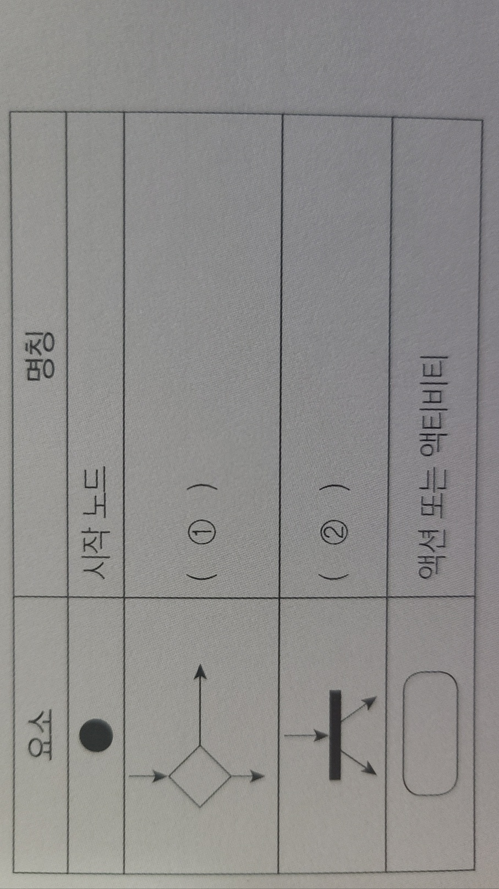
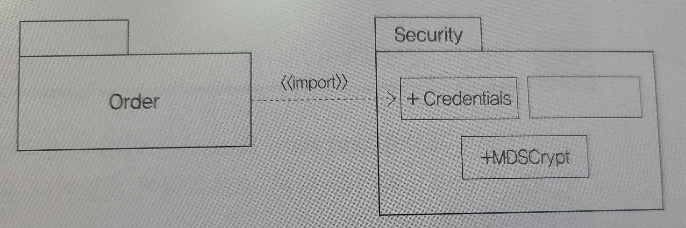
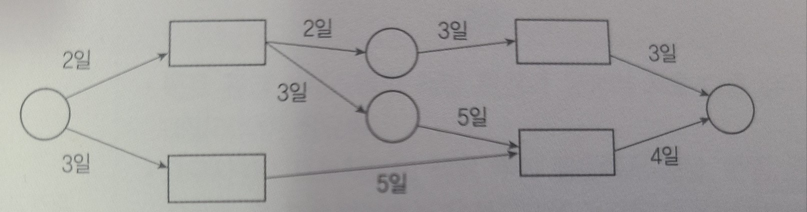
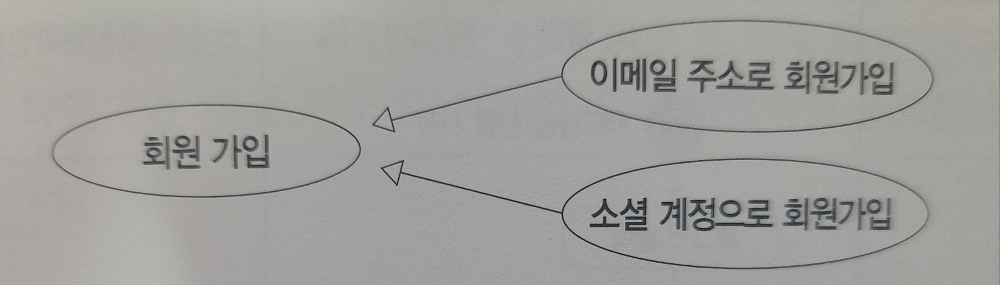
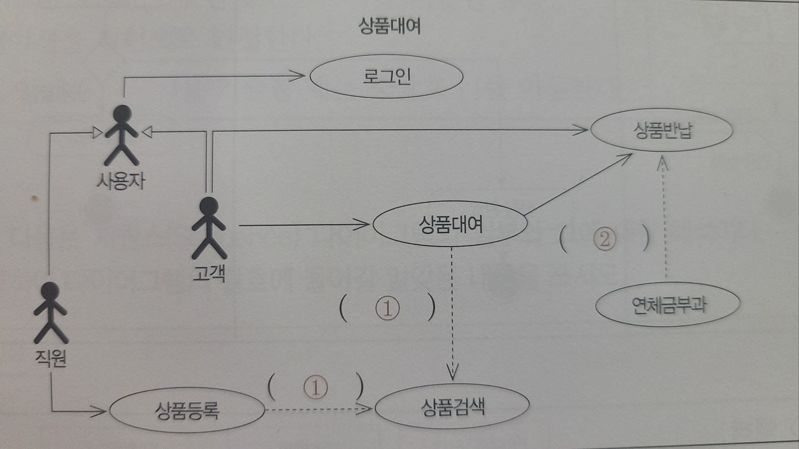
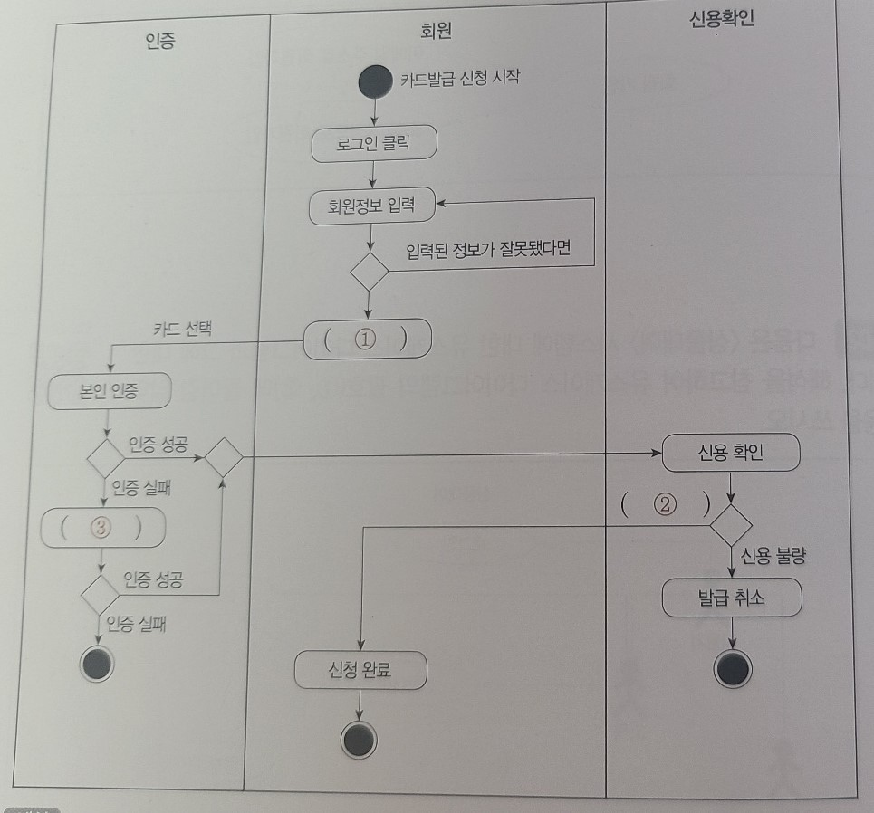
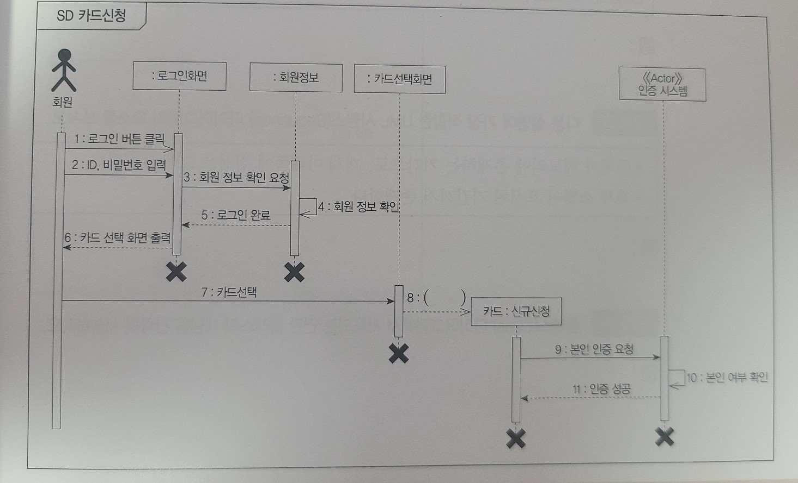
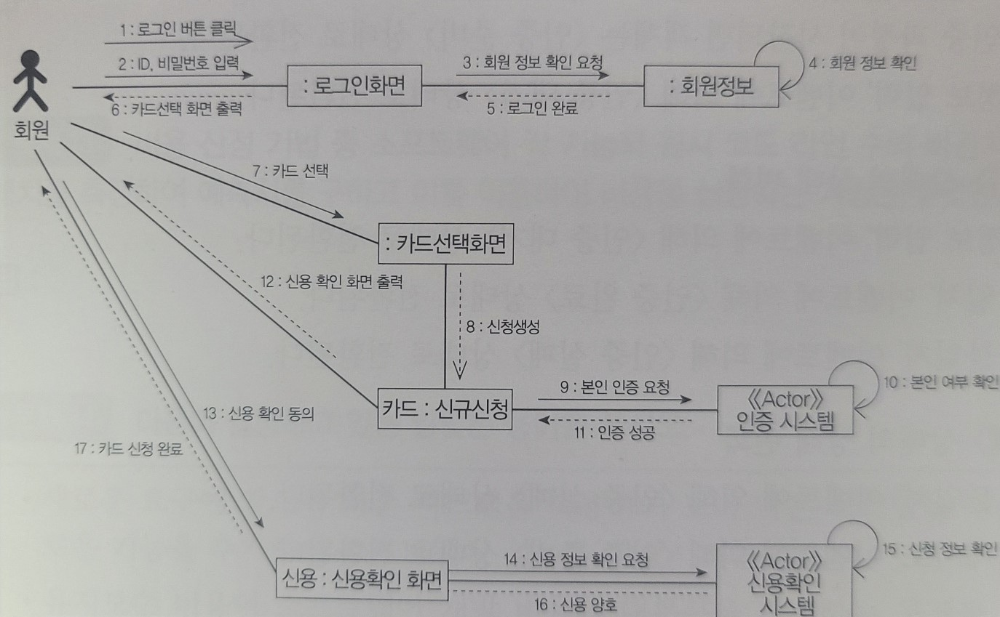
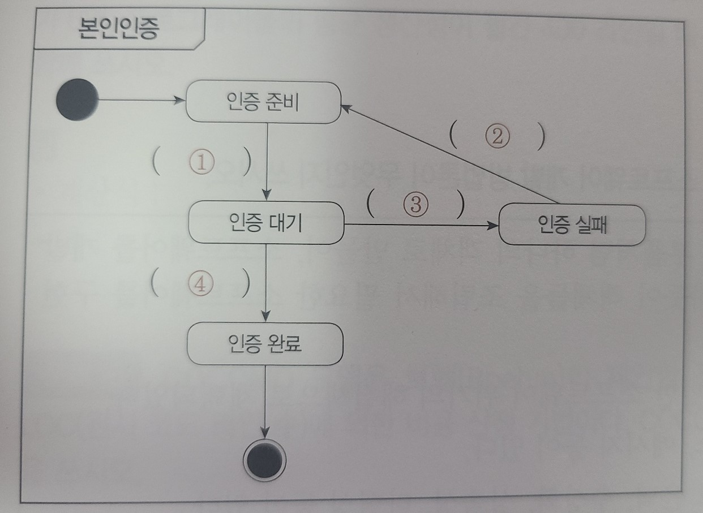
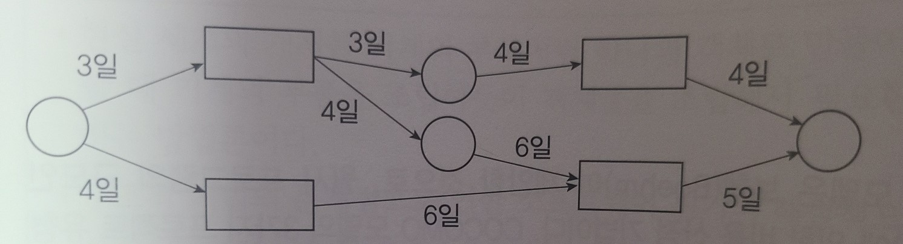

# 1장 요구사항 확인

```
1.
소프트웨어를 개발하기 위한 설계, 운용, 유지보수 등의 과정을 각 단계별로 나눈 것으로,
 소프트웨어 개발 단계와 각 단계별 주요 활동 그리고 활동의 결과에 대한 산출물로 표현한다.

- ()
```

```
2.
다음에 제시된 나선형 모델의 4가지 주요 활동을 순서대로 나열하시오.

위험 분석, 고객 평가, 계획 수립, 개발 및 검증

- ()
```

```
3.
소프트웨어 개발 방법론과 관련하여 다음 설명에 해당하는 모형이 무엇인지 쓰시오.

- 소프트웨어 개발 각 단계를 확실히 매듭짓고 그 결과를 철저하게 검토하여 승인 과정을 거친
 후에 다음 단계를 진행하는 개발 방법론이다.
- 소프트웨어 공학에서 가장 오래되고 가장 폭넓게 사용된 전통적인 소프트웨어 생명 주기 
모형으로, 고전적 생명 주기 모형이라고도 한다.
- 소프트웨어 개발 과정의 한 단계가 끝나야만 다음 단계로 넘어갈 수 있는 선형 순차적 
모형이다.

- ()
```

```
4.
소프트웨어 개발 방법론 중 실제 개발될 소프트웨어에 대한 견본품을 만들어 최종 결과물을
 예측하는 모형이 무엇인지 쓰시오.

- ()
```

```
5.
시제품을 끊임없이 제작하며 사이클을 반복하는 개발 방법론으로, 폭포수와 대조적이며, 
소프트웨어 개발을 넘어 기업 경영 전반에서 사용되고 있다. 고객의 변화하는 요구사항과 환경
 변화에 능동적인 이 소프트웨어 개발 방법론을 쓰시오.

- ()
```

```
6.
애자일 소프트웨어 개발 기법의 가치로 옳은 것을 모두 골라 기호(ㄱ ~ ㄹ)로 쓰시오.

ㄱ. 프로세스의 도구보다는 개인과 상호작용에 더 가치를 둔다.
ㄴ. 계약 협상보다는 고객과의 협업에 더 가치를 둔다.
ㄷ. 실제 작동하는 소프트웨어보다는 이해하기 좋은 문서에 더 가치를 둔다.
ㄹ. 계획을 따르기보다는 변화에 대응하는 것에 더 가치를 둔다.

- ()
```

```
7.
다음 괄호에 공통으로 들어갈 용어를 쓰시오.
()은 소프트웨어의 위기를 극복하기 위한 방안으로 연구된 학문이며, 여러 가지 방법론과 도구,
 관리 기법들을 통하여 소프트웨어의 품질과 생산성 향상을 목적으로 한다.
()의 기본 원칙은 다음과 같다.
- 현대적인 프로그래밍 기술을 계속적으로 적용해야 한다.
- 개발된 소프트웨어의 품질이 유지되도록 지속적으로 검증해야 한다.
- 소프트웨어 개발 관련 사항 및 결과에 대한 명확한 기록을 유지해야 한다.

- ()
```

```
8.
스크럼의 팀 구성원 중 이해관계자들의 의견을 종합하여 백로그(Backlog)를 작성하는 주체가
 누구인지 쓰시오.

- ()
```

```
9.
다음의 스크럼(Scrum) 개발 과정을 진행 순서에 맞게 기호(ㄱ ~ ㅁ)으로 나열하시오.
ㄱ. 스프린트(Sprint)
ㄴ. 스프린트 회고(Sprint Retrospective)
ㄷ. 일일 스크럼 회의(Daily Scrum Meeting)
ㄹ. 스프린트 검토 회의(Sprint Review)
ㅁ. 스프린트 계획 회의(Sprint Planning Meeting)

- ()
```

```
10.
수시로 발생하는 고객의 요구사항에 유연하게 대응하기 위해 고객의 참여와
개발 과정의 반복을 극대화하여 개발 생산성을 향상시키는 익스트림 프로그래밍
(eXtreme Programming)의 5가지 핵심 가치에는 의사소통(Communication), (1)
, 용기(Courage), (2), 피드백(Feedback)이 있다. 괄호(1,2)에 각각 들어갈
적합한 핵심 가치를 쓰시오.

- ()
```

```
11.
소프트웨어 공학에서 리팩토링(Refactoring)을 하는 목적에 대해 간략히 서술하시오.

- ()
```

```
12.
다음 보기에서 XP(eXtreme Programming)의 주요 실천 방법을 모두 골라 기호(ㄱ~ㄹ)로 쓰시오.
ㄱ. Linear Sequential Method
ㄴ. Pair Programming
ㄷ. Collective Ownership
ㄹ. Continuous Integration

- ()
```

```
13.
DBMS 관련 요구사항 분석 시 고려사항에는 (1), 성능, 기술지원, (2), 구축 비용이 있다.
괄호(1,2)에 들어갈 가장 알맞은 고려사항이 무엇인지 쓰시오.

- ()
```

```
14.
사용자의 요구에 따라 변하는 동적인 콘텐츠를 처리하기 위해 사용되는 미들웨어이다.
데이터 접근, 세션 관리, 트랜잭션 관리 등을 위한 라이브러리를 제공하는 것으로
주로 데이터베이스 서버와 연동해서 사용한다.

- ()
```

```
15.
누구나 별다른 제한 없이 사용할 수 있도록 소스 코드가 공개된 소프트웨어로, 사용 시
라이선스의 종류, 사용자 수, 기술의 지속 가능성 등을 고려해야 하는 소프트웨어를
가리키는 용어를 쓰시오.

- ()
```

```
16.
다음의 설명과 가장 부합하는 용어를 쓰시오.
- 소프트웨어가 어떤 문제를 해결하기 위해 제공하는 서비스에 대한 설명과 정상적으로
운영되는데 필요한 제약조건 등을 나타낸다.
- 소프트웨어 개발이나 유지 보수 과정에서 필요한 기준과 근거를 제공한다.
- 개발하려는 소프트웨어의 전반적인 내용을 확인할 수 있게 하므로 개발에 참여하는
이해관계자들 간에 의사소통을 원활하게 하는 데 도움을 준다.

- ()
```

```
17.
요구사항 확인에 대한 다음 설명에서 괄호에 들어갈 알맞은 용어를 쓰시오.
() 요구사항은 시스템이 무엇을 하는지, 어떤 기능을 하는지 등 사용자가 시스템을 통해
제공받기를 원하는 기능이나 시스템이 반드시 수행해야 하는 기능을 의미한다.

- ()
```

```
18.
요구사항 확인에 대한 다음 설명에서 괄호에 들어갈 알맞은 용어를 쓰시오.
() 요구사항은 품질이나 제약사항과 관련된 요구사항으로, 시스템의 장비 구성, 성능,
인터페이스, 테스트, 보안 등의 요구사항을 말한다.

- ()
```

```
19.
다음에 제시된 요구사항 개발 프로세스 단계를 순서에 맞게 기호(ㄱ~ㄹ)로 나열하시오.
ㄱ. 도출, ㄴ. 확인, ㄷ. 명세, ㄹ. 분석

- ()
```

```
20.
요구사항 개발 프로세스 중 요구사항 명세(Requirement Specification)가 무엇인지
그 개념을 간략히 서술하시오.

- ()
```

```
21.
요구사항 명세 기법 중 다음의 설명과 가장 부합하는 기법을 쓰시오.

사용자의 요구를 표현할 때 수학적인 원리와 표기법을 이용한 기법으로, 주로 Z 기법을
사용하여 사용자의 요구사항을 표현한다. 사용자의 요구를 정확하고 간결하게 표현할 수 있다.

- ()
```

```
22.
소프트웨어 개발 과정 중 다음과 같은 작업이 수행되는 단계를 쓰시오.
- 비용과 일정에 대한 제약 설정
- 타당성 조사
- 요구사항 정의 문서화
- 목표 설정

- ()
```

```
23.
소프트웨어 개발 단계 중 요구 분석 과정에서는 다양한 분석 도구가 사용된다.
다음 보기에서 설명하는 분석 도구가 무엇인지 쓰시오.
- 자료 흐름 그래프 또는 버블(Bubble) 차트라고도 한다.
- 구조적 분석 기법에 이용된다.
- 자료의 흐름을 명확하게 표현할 수 있다.
- 화살표, 원, 사각형, 직선(단선/이중선)을 이용해 자료의 흐름을 표시한다.

- ()
```

```
24.
요구사항 분석에서 자료의 흐름 및 변환 과정과 기능을 도형 중심으로 기술하는 자료 흐름도
(Data Flow Diagram)의 4가지 구성 요소를 쓰시오.

- ()
```

```
25.
다음은 자료 사전(Data Dictionary)에서 사용하는 기호에 대한 설명이다.
괄호 (1 ~ 3)에 들어갈 알맞은 기호를 쓰시오.

- ()
```
<table border="1">
<tr>
    <th>기호
    </th>
    <th>의미
    </th>
</tr>
<tr>
    <td>=
    </td>
    <td>자료의 정의
    </td>
</tr>
<tr>
    <td>+
    </td>
    <td>자료의 연결
    </td>
</tr>
<tr>
    <td>(1)
    </td>
    <td>자료의 생략
    </td>
</tr>
<tr>
    <td>(2)
    </td>
    <td>자료의 선택
    </td>
</tr>
<tr>
    <td>(3)
    </td>
    <td>자료의 반복
    </td>
</tr>
<tr>
    <td>* *
    </td>
    <td>자료의 설명
    </td>
</tr>
</table>

```
26.
다음 <보기>에서 요구사항 분석용 자동화 도구를 모두 찾아 쓰시오.
<보기>
SADT, SWOT, SREM, OSPF, PSL/PSA, CSMA, TAGS

- ()
```

```
27.
SoftTech 사에서 개발한 것으로, 구조적 요구 분석을 하기 위해 블록 다이어그램을
채택한 자동화 도구가 무엇인지 영문 약어로 쓰시오.

- ()
```

```
28.
다음의 설명과 가장 부합하는 용어를 영문 약어로 쓰시오.
- 시스템의 분석 및 설계, 또는 문서화에 사용되는 기법으로, 시스템 실행 과정인 입력,
처리, 출력의 기능을 나타내는 기법이다.
- 하향식 소프트웨어 개발을 위한 문서화 도구이다.
- 차트의 종류에는 가시적 도표, 총체적 도표, 세부적 도표가 있다.
- 기능과 자료의 의존 관계를 동시에 표현할 수 있다.
- 기호, 도표 등을 사용하므로 보기 쉽고 이해하기 쉽다.

- ()
```

```
29.
시스템 개발 과정에서 의사소통이 원활하게 이루어지도록 표준화한 대표적인 객체지향
모델링 언어인 UML의 기본 구성 요소 3가지를 쓰시오.

- ()
```

```
30.
UML의 기본 구성 요소 중 관계(Relationships)에 대해 간략히 기술하시오.

- ()
```

```
31.
UML의 관계에 관한 다음 설명에서 괄호에 들어갈 알맞은 용어를 쓰시오.
- () 관계는 2개 이상의 사물이 서로 관련되어 있는 관계이다.
- 방향성은 화살표로 나타낸다.
- 다중도를 선 위에 나타낸다.
```

```
32.
UML의 관계에 관한 다음 설명에서 괄호에 들어갈 알맞은 용어를 쓰시오.
- 관계는 사물과 사물 사이의 연관성을 표현하는 것이다.
() 관계는 하나의 사물이 다른 사물에 포함되어 있는 관계로, 전체와
부분으로 구분되어지며 서로 독립적이다.

- ()
```

```
33.
UML의 관계 중 포함 관계에 대해 간략히 서술하시오.

- ()
```

```
34.
UML의 관계에 관한 다음 설명에서 괄호에 들어갈 알맞은 용어를 쓰시오.

관계는 사물과 사물 사이의 연관성을 표현하는 것이다.
() 관계는 상위 모듈이 하위 모듈보다 더 일반적인 개념을 가지고 있으며, 하위 모듈이
상위 모듈보다 더 구체적인 개념을 가진다.

- ()
```

```
35.
UML의 관계에 관한 다음 설명에 부합하는 관계의 종류를 쓰시오.

UML 모델에서 한 사물의 명세가 바뀌면 다른 사물에 영향을 주며, 일반적으로 한 클래스가
다른 클래스를 오퍼레이션의 매개 변수로 사용하는 경우에 나타나는 관계이다.

- ()
```

```
36.
UML의 관계의 종류 중 한 객체가 다른 객체에게 오퍼레이션을 수행하도록 지정하는 의미적
관계를 의미하는 용어를 쓰시오.

- ()
```

```
37.
UML의 기본 구성 요소 중 다이어그램(diagram)에 의해 간략히 서술하시오.

- ()
```

```
38.
UML 다이어그램 중 시스템 내 클래스의 정적 구조를 표현하고 클래스와 클래스,
클래스의 속성 사이의 관계를 나타낼 때 사용하는 다이어그램을 쓰시오.

- ()
```

```
39.
다음 보기의 다이어그램 중 구조 다이어그램을 모두 골라 기호(ㄱ~ㅅ)를 쓰시오.
ㄱ. 유스케이스 다이어그램
ㄴ. 시퀀스 다이어그램
ㄷ. 활동 다이어그램
ㄹ. 배치 다이어그램
ㅁ. 클래스 다이어그램
ㅂ. 객체 다이어그램
ㅅ. 컴포넌트 다이어그램

- ()
```

```
40.
UML 다이어그램 중 럼바우(Rumbaugh) 객체지향 분석 기법에서 동적 모델링에 활용되는
다이어그램이 무엇인지 쓰시오.

- ()
```

```
41.
다음 보기의 다이어그램 중 행위 다이어그램을 모두 골라 기호(ㄱ~ㅅ)를 쓰시오.
ㄱ. 유스케이스 다이어그램
ㄴ. 시퀀스 다이어그램
ㄷ. 활동 다이어그램
ㄹ. 배치 다이어그램
ㅁ. 클래스 다이어그램
ㅂ. 객체 다이어그램
ㅅ. 컴포넌트 다이어그램

- ()
```

```
42.
UML 다이어그램에 대한 다음 설명에서 괄호(1,2)에 들어갈 알맞은 다이어그램을 쓰시오.

(1)은 객체들 사이의 메시지 교환을 나타내며, (2)은 하나의 객체가 가진 상태와 그 상태의
변화 혹은 다른 객체와의 상호작용에 따라 상태가 어떻게 변화하는지를 나타낸다.

- ()
```

```
43.
UML 확장 모델에서 스테레오 타입 객체를 표현할 때 사용하는 기호를 쓰시오.

- ()
```

```
44.
소프트웨어 개발 방법론 중 나선형 모형(Spiral Model)에 대해 간략히 서술하시오.

- ()
```

```
45.
다음이 설명하는 소프트웨어 개발과 관련된 용어를 쓰시오.

- 소프트웨어 개발 방법론의 바탕이 되는 것으로, 소프트웨어를 개발하기 위한 설계, 운용
, 유지보수 등의 과정을 각 단계별로 나눈 것이다.
- 소프트웨어 개발 단계와 각 단계별 주요 활동, 그리고 활동의 결과에 대한 산출물로 표현
한다.
- 이것의 대표적인 모형에는 폭포수 모형, 프로토타입 모형, 나선형 모형, 애자일 모형 등이
있다.

-()
```

```
46.
소프트웨어 생명 주기 모형에 대한 다음 설명에서 괄호에 들어갈 알맞은 용어를 쓰시오.

- () 모형은 고객의 요구사항 변화에 유연하게 대응할 수 있도록 일정한 주기를 반복하면서
개발과정을 진행한다.
- 어느 특정 개발 방법론이 아니라 좋은 것을 빠르고 낭비 없게 만들기 위해 고객과의 소통
에 초점을 맞춘 방법론이다.
- 각 개발주기에서는 고객이 요구사항에 대한 우선순위를 부여하여 개발 작업을 진행한다.
- 소규모 프로젝트, 고도로 숙달된 개발자, 급변하는 요구사항에 적합하다.

- ()
```

```
47.
개발 방법론과 관련된 다음 설명에서 괄호에 공통으로 들어갈 용어를 쓰시오.

()은 애자일 모형을 기반으로 하는 팀 중심의 소프트웨어 개발 모형으로, 럭비에서 반칙으로
경기가 중단된 경우 양 팀의 선수들이 럭비공을 가운데 두고 상대 팀을 밀치기 위해 서로
대치해 있는 팀 대형인 ()에서 유래하였다. ()은 10명 이하의 팀으로 구성되어 백로그(Backlog)
를 기반으로 개발을 진행하며, 스프린트(Sprint)라고 불리는 실제 개발 과정을 2~4주 기간마다
반복한다.

- ()
```

```
48.
애자일 기반의 개발 방법론과 관련하여 다음 설명에 해당하는 모형이 무엇인지 쓰시오.

- 수시로 발생하는 고객의 요구사항에 유연하게 대응하기 위해 고객의 참여와 개발 과정의
반복을 극대화하여 개발 생산성을 향상시키는 모형이다.
- 짧고 반복적인 개발 주기, 단순한 설계, 고객의 적극적인 참여를 통해 소프트웨어를 빠르게
개발하는 것을 목적으로 한다.
- 릴리즈 테스트마다 고객을 직접 참여시킴으로써 요구한 기능이 제대로 작동하는지 고객이
직접 확인할 수 있다.
- 의사소통(Communication), 단순성(Simplicity), 용기(Courage), 존중(Respect), 피드백
(Feedback)을 핵심 가치로 삼는다.

- ()
```

```
49.
다음은 XP(eXtreme Programming) 개발 방법론의 주요 실천 방법(Practice)에 대한 설명이다.
괄호(1,2)에 들어갈 가장 적합한 실천 방법을 쓰시오.

- ()
```
<table border="1">
<tr>
    <th>실천 방법
    </th>
    <th>내용
    </th>
</tr>
<tr>
    <td>(1)
    </td>
    <td>다른 사람과 함께 프로그래밍을 수행함으로써 개발에 대한 책임을
    공동으로 나눠 갖는 환경을 조성한다.
    </td>
</tr>
<tr>
    <td>Test-Driven Development (테스트 주도 개발)
    </td>
    <td>- 개발자가 실제 코드를 작성하기 전에 테스트 케이스를 먼저
    작성하므로 자신이 무엇을 해야 할지를 정확히 파악한다. <br/>
    - 테스트가 지속적으로 진행될 수 있도록 자동화된 테스팅 도구(구조, 프레임워크)
    를 사용한다.
    </td>
</tr>
<tr>
    <td>(2)
    </td>
    <td>개발에 참여하는 모든 구성원(고객 포함)들은 각자 자신의 역할이 있고 그
    역할에 대한 책임을 가져야 한다.
    </td>
</tr>
<tr>
    <td>Continuous Integration (계속적인 통합)
    </td>
    <td>모듈 단위로 나눠서 개발된 코드들은 하나의 작업이 마무리될 때마다
    지속적으로 통합한다.
    </td>
</tr>
<tr>
    <td>Refactoring(리팩토링)
    </td>
    <td>프로그램 기능의 변경 없이, 단순화, 유연성 강화 등을 통해 시스템을
    재구성한다.
    </td>
</tr>
<tr>
    <td>Small Releases(소규모 릴리즈)
    </td>
    <td>릴리즈 기간을 짧게 반복함으로써 고객의 요구 변화에 신속히 대응할 수 있다.
    </td>
</tr>
</table>

```
50.
다음에 제시된 요구사항을 기능 요구사항과 비기능 요구사항으로 구분하여 기호 (ㄱ~ㄹ)로 
쓰시오.

ㄱ. 항공편, 탑승객, 예약을 입력하는 방법을 결정해야 한다.
ㄴ. 티켓과 리포트에 어떤 정보를 표시할지 결정해야 한다.
ㄷ. 여행사와 고객이 데이터베이스에 접근할 때 어떤 정보를 얻을 수 있는지 결정해야 한다.
ㄹ. 자주 탑승하는 고객을 서비스하기 위해 시스템을 확장할 수 있도록 설계해야 한다.

- 기능 요구사항 : ()
- 비기능 요구사항 : ()
```

```
51.
다음은 요구사항 명세 기법에 대한 설명이다. 괄호(1,2)에 들어갈 알맞은 기법을 쓰시오.
요구사항 명세 기법은 (1) 기법과 (2) 기법으로 구분된다.

- ()
```
<table border="1">
<tr>
    <th>구분
    </th>
    <th>(1)기법
    </th>
    <th>(2)기법
    </th>
</tr>
<tr>
    <td>기법
    </td>
    <td>수학적 원리 기반, 모델 기반
    </td>
    <td>상태/기능/객체 중심
    </td>
</tr>
<tr>
    <td>작성법
    </td>
    <td>수학적 기호, 정형화된 표기법
    </td>
    <td>일반 명사, 동사 등의 자연어를 기반으로 서술 또는 다이어그램으로 작성
    </td>
</tr>
<tr>
    <td>특징
    </td>
    <td>- 요구사항을 정확하고 간결하게 표현할 수 있음 <br/>
    - 요구사항에 대한 결과가 작성자에 관계 없이 일관성이 있으므로 완전성 검증이 가능함 <br/>
    - 표기법이 어려워 사용자가 이해하기 어려움
    </td>
    <td>- 자연어의 사용으로 인해 일관성이 떨어지고, 해석이 달라질 수 있음 <br/>
    - 내용의 이해가 쉬워 의사소통이 용이함
    </td>
</tr>
</table>

```
52.
요구사항 분석 기법에 대한 설명에서 괄호(1,2)에 들어갈 알맞은 명칭을 쓰시오.

- ()

요구사항 분석에서 자료의 흐름 및 변환 과정과 기능을 도형 중심으로 기술하는 방법을
자료 흐름도라고 한다. 자료 흐름도에서 사용하는 네 가지 기본 기호는 다음과 같다.
```
<table border="1">
<tr>
    <td>프로세스
    </td>
    <td>- 자료를 변환시키는 시스템의 한 부분(처리 과정)을 나타내며 처리, 기능, 변환, 버블
    이라고 한다. <br/>
    - 원이나 둥근 사각형으로 표시하고 그 안에 프로세스 이름을 기입한다.
    </td>
</tr>
<tr>
    <td>(1)
    </td>
    <td>- 자료의 이동(흐름)이나 연관관계를 나타낸다. <br/>
    - 화살표 위에 자료의 이름을 기입한다.
    </td>
</tr>
<tr>
    <td>(2)
    </td>
    <td>- 시스템에서의 파일, 데이터베이스 등을 나타낸다. <br/>
    - 도형 안에 저장소의 이름을 기입한다.
    </td>
</tr>
<tr>
    <td>단말
    </td>
    <td>- 시스템과 교신하는 외부 개체로, 입력 데이터가 만들어지고 출력 데이터를 받는다. <br/>
    - 도형 안에 이름을 기입한다.
    </td>
</tr>
</table>

```
53.
요구사항 분석용 CASE에 대해 간략히 서술하시오.

- ()
```

```
54.
다음은 UML 다이어그램에서 사용되는 관계를 나열한 것이다. 관계 기호(1~4)에 해당하는 명칭을
<보기>에서 찾아 기호(ㄱ~ㄹ)로 쓰시오.

<보기>
ㄱ. 집합 관계, ㄴ. 포함 관계, ㄷ. 일반화 관계, ㄹ. 의존 관계

1. <-- : ()
2. ◁- : ()
3. ◆- : ()
4. ◇- : ()
```

```
55.
다음은 UML 다이어그램의 종류를 나열한 것이다. <보기>에 나열된 다이어그램을 구조적 
다이어그램과 행위 다이어그램으로 구분하여 기호 (ㄱ~ㅍ)로 쓰시오.

ㄱ. 유스케이스 다이어그램
ㄴ. 클래스 다이어그램
ㄷ. 시퀀스 다이어그램
ㄹ. 커뮤니케이션 다이어그램
ㅁ. 객체 다이어그램
ㅂ. 컴포넌트 다이어그램
ㅅ. 배치 다이어그램
ㅇ. 상태 다이어그램
ㅈ. 활동 다이어그램
ㅊ. 상호작용 개요 다이어그램
ㅋ. 타이밍 다이어그램
ㅌ. 복합체 다이어그램
ㅍ. 패키지 다이어그램

구조적 다이어그램 : ()
행위 다이어그램 : ()
```

```
56.
유스케이스의 구성 요소 중 대상 시스템과 상호작용하는 사람이나 다른 시스템에 의한 역할을
 표현하는 요소는 무엇인지 쓰시오.

- ()
```

```
57.
기본 유스케이스 수행 시 특별한 조건을 만족할 때 수행하는 유스케이스는 무엇인지 <보기>에서
 골라 쓰시오.

<보기>
연관, 확장, 선택, 특화

- ()
```

```
58.
다음은 활동(Activity) 다이어그램의 요소를 나열한 것이다. 괄호(1,2)에 들어갈 알맞은
 명칭을 쓰시오.

- ()
```


```
59.
UML에 관한 다음 설명에서 괄호에 공통으로 들어갈 알맞은 용어를 쓰시오.

() 다이어그램은 UML 다이어그램 중 객체(Object)들을 ()로 추상화하여 표현하는 
다이어그램으로
대표적인 구조적 다이어그램이다. ()는 각각의 객체들이 갖는 속성과 메소드를 표현한 것으로
3개의 구획으로 나눠 이름, 속성, 메소드를 표기한다.

- ()
```

```
60.
클래스 다이어그램의 요소로, 다음 설명에 해당하는 용어를 쓰시오.

- 클래스의 동작을 의미한다.
- 클래스에 속하는 객체에 대하여 적용될 메소드를 정의한 것이다.
- UML에서는 동작에 대한 인터페이스를 지칭한다고 볼 수 있다.

- ()
```

```
61.
다음 설명에서 괄호에 공통으로 들어갈 알맞은 용어를 쓰시오.

- ()는 연관 관계에 있는 두 클래스에 추가적으로 표현해야 할 속성이나 오퍼레이션이 있는 경우
생성하는 클래스이다.
- 두 클래스의 연관 관계를 나타내는 선의 가운데로부터 점선을 ()로 이어 표시한다.
- ()의 이름은 연관 관계의 이름을 이용해 지정한다.

- ()
```

```
62.
다음 보기에서 시퀀스 다이어그램의 구성 요소만 골라 쓰시오.

<보기>
생명선, 실행상자, 확장, 메시지, 유스케이스, 액티비티

- ()
```

```
63.
UML 다이어그램 중 다음과 같은 특징을 갖는 다이어그램은 무엇인지 쓰시오.

- 시스템이나 객체들이 메시지를 주고받으며 시간의 흐름에 따라 상호작용하는 과정을 액터,
객체, 링크, 메시지 등의 요소를 사용하여 그림으로 표현한 것이다.
- 동작에 참여하는 객체들이 주고받는 메시지를 표현하는데, 메시지뿐만 아니라 객체들 간의
관계까지 표현한다.

- ()
```

```
64.
UML 다이어그램 중 다음과 같은 특징을 갖는 다이어그램은 무엇인지 쓰시오.

- 객체들 사이에 발생하는 이벤트에 의한 객체들의 상태 변화를 그림으로 표현한 것이다.
- 어떤 이벤트에 의해 객체 자신이 속한 클래스의 상태 변화나 객체가 다른 객체와 상호작용
하는 과정에서의 상태 변화를 표현한다.

- ()
```

```
65.
UML 다이어그램 중 다음 그림은 어떤 다이어그램에 해당하는지 쓰시오.

- ()
```


```
66.
정형화된 분석 절차에 따라 사용자의 요구사항을 파악하고, 문서화하는 체계적 분석 방법으로
, 자료 흐름도, 자료 사전, 소단위 명세서의 특징을 갖는 소프트웨어 개발 방법론은 무엇인지
쓰시오.

- ()
```

```
67.
소프트웨어 개발 방법론 중 객체지향 방법론에 대해 간략히 서술하시오.

- ()
```

```
68.
다음이 설명하고 있는 소프트웨어 개발 방법론이 무엇인지 쓰시오.

- 기존의 시스템이나 소프트웨어를 구성하는 컴포넌트를 조합하여 하나의 새로운 애플리케이션을
만드는 소프트웨어 개발 방법론이다.
- 특징
    - 개발 기간 단축으로 인한 생산성 향상
    - 새로운 기능 추가가 쉬운 확장성
    - 소프트웨어 재사용이 가능

- ()
```

```
69.
다음은 소프트웨어 재사용 방법에 대한 설명이다. 괄호(1,2)에 들어갈 알맞은 방법을 쓰시오.

- ()
```
<table border="1">
<tr>
    <td>(1)
    </td>
    <td>전자 칩과 같은 소프트웨어 부품, 즉 블록(모듈)을 만들어서 끼워 맞추어 소프트웨어를
    완성시키는 방법으로, 블록 구성 방법이라고도 한다.
    </td>
</tr>
<tr>
    <td>(2)
    </td>
    <td>추상화 형태로 써진 명세를 구체화하여 프로그램을 만드는 방법으로, 패턴 구성 방법이라
    고도 한다.
    </td>
</tr>
</table>

```
70.
소프트웨어 재공학(Software Reengineering)의 개념을 간략히 서술하시오.

- ()
```

```
71.
다음이 설명하고 있는 알맞은 용어를 영문 약어로 쓰시오.

- 소프트웨어 개발 과정에서 사용되는 요구 분석, 설계, 구현, 검사 및 디버깅 과정 전체 또는
일부를 컴퓨터와 전용 소프트웨어 도구를 사용하여 자동화하는 것이다.
- 표준화된 개발 환경 구축 및 문서 자동화 기능을 제공한다.
- 작업 과정 및 데이터 공유를 통해 작업자 간 커뮤니케이션을 증대 한다.
- 주요 기능은 다음과 같다.
    - S/W 라이프 사이클 전 단계의 연결
    - 그래픽 지원
    - 다양한 소프트웨어 개발 모형 지원

- ()
```

```
72.
소프트웨어 비용 산정 기법 중 전문가 감정 기법의 주관적인 편견을 보완하기 위해 많은 전문가
들의 의견을 종합하여 산정하는 기법을 쓰시오.

- ()
```

```
73.
다음에 제시된 비용 산정 기법 중 상향식 비용 산정 기법만을 골라 기호(ㄱ~ㅁ)로 쓰시오.
ㄱ. 전문가 감정 기법 
ㄴ. LOC(원시 코드 라인 수) 기법 
ㄷ. 수학적 산정 기법 
ㄹ. 델파이 기법
ㅁ. 개발 단계별 인월수 기법

- ()
```

```
74.
LOC 기법에 의해 예측된 총 라인 수가 30,000라인, 개발에 참여할 프로그래머가 5명,
 프로그래머들의 평균 생산성이 월간 300라인일 때 개발에 소요되는 기간을 계산식과 함께 
 쓰시오.

- 계산식 ()
- 답 ()
```

```
75.
다음에 제시된 비용 산정 기법 중 수학적 산정 기법이 아닌 것을 골라 기호(ㄱ~ㄹ)로 쓰시오.
ㄱ. COCOMO
ㄴ. Putnam
ㄷ. Function-Point
ㄹ. PERT

- ()
```

```
76.
소프트웨어 비용 산정 기법 중 보헴(Boehm)이 제안한 것으로, 원시 프로그램의 규모인
LOC(원시 코드 라인 수)에 의한 기법이 무엇인지 쓰시오.
- ()
```

```
77.
다음은 COCOMO 모형의 소프트웨어 개발 유형에 대한 설명이다. 괄호(1,2)에 들어갈 알맞은 유형
을 쓰시오.

- ()
```
<table border="1">
    <tr>
        <td>(1)
        </td>
        <td>트랜잭션 처리 시스템이나 운영체제 등의 30만 (300KDSI) 라인 이상의 소프트웨어를 개발하는 유형이다.
        </td>
    </tr>
    <tr>
        <td>반분리형(Semi-Detached Mode)
        </td>
        <td>트랜잭션 처리 시스템이나 운영체제, 데이터베이스 관리 시스템 등의 30만(300KDSI) 라인 이하의 소프트웨어를 개발하는 유형이다.
        </td>
    </tr>
    <tr>
        <td>(2)
        </td>
        <td>일괄 자료 처리나 과학기술 계산용, 비즈니스 자료 처리용 등의 5만(50KDSI)라인 이하의 소프트웨어를 개발하는 유형이다.
        </td>
    </tr>
</table>

```
78.
Rayleigh-Norden 곡선의 노력 분포도를 이용한 프로젝트 비용 산정 기법이 무엇인지 쓰시오.

- ()
```

```
79.
다음 보기 중 기능 점수(Functional Point) 모형에서 비용 산정에 이용되는 요소를 모두 골라
기호(ㄱ~ㄹ)를 쓰시오.

ㄱ. 클래스 인터페이스
ㄴ. 명령어(사용자 질의수)
ㄷ. 데이터 파일
ㄹ. 출력 보고서

- ()
```

```
80.
Rayleigh-Norden 곡선과 Putnam 예측 모델을 기초로 하여 개발된 자동화 추정 도구를 쓰시오.

- ()
```

```
81.
프로젝트에 필요한 전체 작업의 상호 관계를 표시하는 네트워크로, 각 작업별로 낙관적인 경우,
가능성이 있는 경우, 비관적인 경우로 나누어 단계별 종료 시기를 결정하며, 과거의 개발 경험이
없어 소요 기간 예측이 어려운 프로젝트에 사용하는 일정 계획 기법을 쓰시오.

- ()
```

```
82.
다음은 CPM 네트워크이다. 임계 경로의 소요 기일을 구하시오.

- ()
```


```
83.
다음이 설명하고 있는 프로젝트 일정 계획 관련 용어를 쓰시오.

- 프로젝트 각 작업들의 시작과 종료에 대한 작업 일정을 표시하는 프로젝트 일정표로, 시간선
(Time-Line) 차트라고도 한다.
- 막대로 표시하며, 수평 막대의 길이는 각 테스크의 기간을 나타낸다.
- 이정표, 기간, 작업, 프로젝트 일정을 나타낸다.
- 자원 배치와 인원 계획에 유용하게 사용된다.

- ()
```

```
84.
다음 보기 중 ISO 12207 표준의 기본 생명 주기의 주요 프로세스에 해당하지 않는 것을 골라
 기호(ㄱ~ㄹ)로 쓰시오.
ㄱ. 획득 프로세스
ㄴ. 개발 프로세스
ㄷ. 성능평가 프로세스
ㄹ. 유지보수 프로세스

- ()
```

```
85.
다음은 CMMI의 소프트웨어 프로세스 성숙도의 단계를 순서대로 나열한 것이다. 괄호에 알맞은
단계를 쓰시오.
초기 -> () -> () -> () -> 최적화

- ()
```

```
86.
소프트웨어 개발 표준 중 정보 시스템 분야에서 소프트웨어의 품질 및 생산성 향상을 위해 소프트
웨어 프로세스를 평가 및 개선 하는 국제 표준으로, 공식 명칭은 ISO/IEC 15504인 것이 무엇
인지 영문 약어로 쓰시오.

- ()
```

```
87.
다음 보기에서 SPICE 모델의 프로세스 수행 능력 수준의 단계별 설명이 틀린 것을 골라 기호
(ㄱ~ㄹ)로 쓰시오.
ㄱ. 수준 7 - 미완성 단계
ㄴ. 수준 5 - 최적화 단계
ㄷ. 수준 4 - 예측 단계
ㄹ. 수준 3 - 확립 단계

- ()
```

```
88.
다음에 제시된 소프트웨어 개발 방법론 테일러링 작업 시 고려해야 할 사항들을 내부적 기준과
외부적 기준으로 분류하여 쓰시오.
- 요구사항          - 법적 제약사항     - 보유 기술
- 표준 품질 기준    - 목표 환경         - 프로젝트 규모

- 내부적 기준 ()
- 외부적 기준 ()
```

```
89.
다음 설명의 괄호에 들어갈 알맞은 용어를 쓰시오.
()는 소프트웨어 개발에 공통적으로 사용되는 구성 요소와 아키텍처를 일반화하여 손쉽게 구현할
수 있도록 여러 가지 기능들을 제공해주는 반제품 형태의 소프트웨어 시스템으로, 선행 사업자의 
기술에 의존하지 않은 표준화된 개발 기반으로 인해 사업자 종속성이 해소된다.

- ()
```

```
90.
소프트웨어 개발 프레임워크 중 EJB(Enterprise Java Beans) 기반의 복잡함과 무거움을 극복하
고 개발 생산성 향상과 고품질의 시스템 개발을 위한 자바 플랫폼 상의 경량화된 오픈 소스 웹 
애플리케이션 프레임워크를 쓰시오.

- ()
```

```
91.
다음은 소프트웨어 개발 프레임워크의 특성에 대한 설명이다. 괄호 (1,2)에 들어갈 알맞은 
특성을 쓰시오.

- ()
```
<table border="1">
    <tr>
        <td>(1)
        </td>
        <td>프레임워크는 다시 사용이 가능한 모듈들을 제공함으로써 예산 절감, 생산성 향상, 품질 보증이 가능하다.
        </td>
    </tr>
    <tr>
        <td>제어의 역흐름
        </td>
        <td>개발자가 관리하고 통제해야 하는 객체들의 제어를 프레임워크에 넘김으로써 생산성을 향상시킨다.
        </td>
    </tr>
    <tr>
        <td>(2)
        </td>
        <td>프레임워크는 캡슐화를 통해 (2)를 강화하고 설계 및 구현의 변경에 따른 영향을 최소화함으로 소프트웨어의 품질을 향상시킨다.
        </td>
    </tr>
    <tr>
        <td>확장성
        </td>
        <td>프레임워크는 다형성(Polymorphism)을 통한 인터페이스 확장이 가능하여 다양한 형태와 기능을 가진 애플리케이션 개발이 가능하다.
        </td>
    </tr>
</table>

```
92.
다음은 유스케이스(Use Case) 다이어그램의 일부이다. 제시된 다이어그램에 표현된 관계를 
쓰시오.

- ()
```


```
93.
다음은 <상품대여> 시스템에 대한 유스케이스 다이어그램과 그에 대한 해석이다. 해석을 
참고하여 유스케이스 다이어그램의 괄호(1,2)에 들어갈 알맞은 내용을 쓰시오.

- ()

<해석>
- 사용자는 고객과 직원으로 구분된다.
- 직원은 상품등록 기능을, 고객은 상품대여 기능을, 사용자는 로그인 기능을 사용할 수 있다.
- 직원이 상품등록 기능을, 고객이 상품대여 기능을 사용하려면 상품검색을 수행해야 한다.
- 상품반납 시 반납일이 지난 경우 연체금부과 기능을 수행한다.
```


```
94.
다음은 활동(Activity) 다이어그램과 그에 대한 해석이다. 해석을 참고하여 다이어그램의 괄호
(1~3)에 들어갈 알맞은 내용을 쓰시오.

- ()

<해석>

<회원> 액터
    - 회원이 카드를 신청하기 위해 로그인 단추를 클릭한 후 회원정보를 입력한다.
    - 입력된 정보가 잘못됐으면 회원정보를 다시 입력받고, 그러지 않으면 '카드발급 신청'으로 이동한다.
    - 회원이 신청할 카드를 선택하면 '본인 인증'으로 이동한다.
    - 카드발급 신청을 완료하고 액티비티를 종료한다.

<인증> 시스템
    - 회원에 대한 본인 인증을 진행한다.
    - 인증에 성공하면 '신용 확인'으로 이동하고, 인증에 실패하면 '인증 재시도'로 이동한다.
    - 다시 진행한 본인 인증에 성공하면 '신용 확인'으로 이동하고, 이번에도 인증에 실패하면 
    액티비티를 종료한다.

<신용확인> 시스템
    - 회원에 대한 신용 확인을 진행한다.
    - 신용 상태가 '신용 양호'로 확인되면 '신청 완료'로 이동하고, 신용 상태가 '신용 
    불량'으로 확인되면 '발급 취소'로 이동한 후 액티비티를 종료한다.
```


```
95.
다음 괄호에 공통으로 들어갈 가장 적합한 UML 클래스 다이어그램의 요소를 쓰시오.

- 주석(Note) 도형안에 ()을 기술한 후 ()이 적용될 속성이나 오퍼레이션을 점선으로 연결한다.
- 클래스 안에 ()을 기술할 때는 중괄호를 이용한다.

- ()
```

```
96.
다음은 시퀀스(Sequence) 다이어그램의 일부와 그에 대한 해석이다. 해석을 참고하여 
다이어그램의 괄호에 들어갈 알맞은 내용을 쓰시오.

- ()

<해석>

<회원> 액터
    - 로그인 버튼을 클릭한다.
    - ID와 비밀번호를 입력한다.
    - 로그인이 완료되면 카드 선택 화면에서 신청할 카드를 선택한다.

<카드선택화면> 객체
    - <회원>이 신청할 카드를 선택하면 선택된 카드에 대한 <카드 : 신규신청> 객체를 생성한 
    후 소멸된다.

<카드 : 신규신청> 객체
    - "신청생성" 메시지를 받으면 새로운 객체로 생성된다.
    - <인증 시스템>에게 회원에 대한 본인 인증을 요청한다.
    - 회원에 대한 인증이 성공하면 소멸된다.
```


```
97.
다음에 제시된 항목 중에서 UML의 시퀀스 다이어그램과 관계된 것만 모두 골라 쓰시오.

Object, Lifeline, Active Box, Swimlane, Message, Frame

- ()
```

```
98.
다음 설명에 가장 적합한 UML 시퀀스 다이어그램의 요소를 쓰시오.
- 객체가 메모리에 존재하는 기간으로, 객체 아래쪽에 점선을 그어 표현한다.
- 객체 소멸이 표시된 기간까지 존재한다.

- ()
```

```
99.
클래스(Class) 다이어그램에서 사용되는 연관 클래스의 개념을 간략히 서술하시오.

- ()
```

```
100.
다음은 회원 카드 발급 신청 과정을 표현한 커뮤니케이션 다이어그램이다.
'회원' 액터와 직접적으로 관계된 객체를 모두 쓰시오.

- ()
```


```
101.
다음은 본인인증 객체의 상태 변화를 표현한 상태(State) 다이어그램과 그에
대한 해석이다. 해석을 참고하여 다이어그램의 괄호(1~4)에 들어갈 알맞은
내용을 쓰시오.

- ()

<해석>

<인증 준비> 상태의 상태 변화
    - 본인 인증 과정이 시작되면 객체는 <인증 준비> 상태로 전환된다.
    - '본인정보 입력' 이벤트에 의해 <인증 대기> 상태로 전환된다.

<인증 대기> 상태의 상태 변화
    - '본인정보 입력' 이벤트에 의해 <인증 대기> 상태로 전환된다.
    - '정보 일치' 이벤트에 의해 <인증 완료> 상태로 전환된다.
    - '정보 불일치' 이벤트에 의해 <인증 실패> 상태로 전환된다.

<인증 실패> 상태의 상태 변화
    - '정보 불일치' 이벤트에 의해 <인증 실패> 상태로 전환된다.
    - '인증 재시도' 이벤트에 의해 <인증 준비> 상태로 전환된다.

<인증 완료> 상태의 상태 변화
    - '정보 일치' 이벤트에 의해 <인증 완료> 상태로 전환된다.
```


```
102.
다음이 설명하고 있는 소프트웨어 개발 방법론이 무엇인지 쓰시오.
- 현실 세계의 개체를 기계의 부품처럼 하나의 객체로 만들어, 소프트웨어를
개발 할 때 기계의 부품을 조립하듯이 객체들을 조립해서 필요한 소프트웨어를
구현 하는 방법론이다.
- 구조적 기법의 문제점으로 인한 소프트웨어 위기의 해결책으로 채택되었다.
- 구성 요소에는 객체, 클래스, 메시지 등이 있다.
- 기본 원칙에는 캡슐화, 정보 은닉, 추상화, 상속성, 다형성 등이 있다.

- ()
```

```
103.
소프트웨어 재사용의 개념을 간략히 서술하시오.
- ()
```

```
104.
비용 산정 기법 중 소프트웨어 각 기능의 원시 코드 라인 수의 비관치, 낙관치, 기대치를
측정하여 예측치를 구하고 이를 이용하여 비용을 산정하는 기법은 무엇인지 쓰시오.

- ()
```

```
105.
다음이 설명하고 있는 알맞은 용어를 쓰시오.
- 새로운 요구에 맞도록 기존 시스템을 이용하여 보다 나은 시스템을 구축하고, 새로운 기능을 
추가하여 소프트웨어 성능을 향상시키는 것이다.
- 유지보수 비용이 소프트웨어 개발 비용의 대부분을 차지하는 문제를 염두에 두어 기존
 소프트웨어의 데이터와 기능들의 개조 및 개선을 통해 유지 보수성과 품질을 향상시키려는 
 기술이다.

- ()
```

```
106.
LOC 기법에 의하여 예측된 총 라인수가 36,000 라인, 개발에 참여할 프로그래머가 6명, 
프로그래머들의 평균 생산성이 월간 400라인일 때 개발에 소요되는 기간을 계산식과 함께 
쓰시오.

- 계산식 ()
- 답 ()
```

```
107.
COCOMO 모델은 보헴이 제안한 것으로, 원시 프로그램의 규모인 LOC(원시 코드 라인 수)에 의한
 비용 산정 기법이다. COCOMO 모델의 3가지 프로젝트 유형을 쓰시오.

- ()
```

```
108.
소프트웨어 비용 산정 기법 중 Rayleigh-Norden 곡선의 노력 분포도를 이용한 프로젝트 비용
 산정 기법이 무엇인지 쓰시오.

- ()
```

```
109.
다음이 설명하고 있는 프로젝트 일정 계획 관련 용어를 쓰시오.
- 프로젝트 완성에 필요한 작업을 나열하고 작업에 필요한 소요 기간을 예측하는데 사용하는
 기법이다.
- 노드에서 작업을 표시하고 간선은 작업 사이의 전후 의존 관계를 나타낸다.
- 원형 노드는 각 작업을, 박스 노드는 이정표를 의미하며, 간선을 나타내는 화살표의 흐름에 
따라 각 작업이 진행된다.

- ()
```

```
110.
다음은 SPICE의 프로세스 수행 능력 단계를 순서대로 나열한 것이다. 괄호에 들어갈 알맞은 
단계를 쓰시오.

불완전 -> () -> 관리 -> () -> () -> 최적화

- ()
```

```
111.
다음은 CPM(Critical Path Method) 네트워크이다. 임계 경로의 소요 기일을 구하시오.

- ()
```


```
112.
소프트웨어 개발 표준 중 SPICE(소프트웨어 처리 개선 및 능력 평가 기준)의 개념을 간략히 
서술하시오.

- ()
```

```
113.
다음은 소프트웨어 개발 방법론 테일러링 작업 시 고려해야 할 사항들을 내부적 기준과 외부적
 기준으로 분류하여 설명한 것이다. 괄호(1,2)에 들어갈 알맞은 기준을 쓰시오.

- ()
```
<table border="1">
    <tr>
        <td>내부적 기준
        </td>
        <td>- 목표 환경 : 시스템의 개발 환경과 유형이 서로 다른 경우 <br/>
        - 요구사항 : 프로젝트에서 우선적으로 고려할 요구사항이 서로 다른 경우 <br/>
        - (1) 규모 : 비용, 인력, 기간 등 (1)의 규모가 서로 다른 경우 <br/>
        - 보유 기술 : 프로세스, 개발 방법론, 산출물, 구성원의 능력 등이 서로 다른 경우
        </td>
    </tr>
    <tr>
        <td>외부적 기준
        </td>
        <td>- 법적 제약사항 : 프로젝트별로 적용될 IT Compliance가 서로 다른 경우 <br/>
        - (2) 기준 : 금융, 제도 등 분야별 (2) 기준이 서로 다른 경우
        </td>
    </tr>
</table>

```
1장 답 (역순)
113. (프로젝트, 표준품질)
112. (소프트웨어의 품질 및 생산성 향상을 위해 소프트웨어 프로세스를 평가 및 개선하는 국제
 표준)
111. (18일)
110. ( (수행), (확립), (예측) )
109. (CPM(Critical Path Method), 임계 경로 기법)
108. (Putnam 모형)
107. (조직형, 반분리형, 내장형)
106. ( ((36,000/6)/400), (15) )
105. (소프트웨어 재공학)
104. (LOC(원시 코드 라인 수) 기법)
103. (이미 개발되어 인정받은 소프트웨어를 다른 소프트웨어 개발이나 유지에 사용하는 것)
102. (객체지향 방법론)
101. (본인정보 입력, 인증 재시도, 정보 불일치, 정보 일치)
100. (로그인화면, 카드선택화면, 카드:신규신청, 신용:신용확인 화면)
99. (연관 관계에 있는 클래스에 추가적으로 표현해야 할 속성이나 오퍼레이션이 있는 경우
 생성하는 클래스)
98. (생명선(Lifeline))
97. (Object, Lifeline, Active Box, Message, Frame)
96. (신청생성)
95. (제약조건)
94. (카드발급 신청, 신용 양호, 인증 재시도)
93. ( (<<include>>), (<<extends>>) )
92. (일반화 관계)
91. (재사용성, 모듈화)
90. (스프링 프레임워크)
89. (소프트웨어 개발 프레임워크)
88. ( (요구사항, 보유 기술, 목표 환경, 프로젝트 규모), (법적 제약사항, 표준 품질 기준) )
87. (ㄱ)
86. (SPICE)
85. (관리, 정의, 정량적 관리)
84. (ㄷ)
83. (간트 차트)
82. (14일)
81. (PERT)
80. (SLIM)
79. (ㄴ, ㄷ, ㄹ)
78. (Putnam 모형)
77. (내장형, 조직형)
76. (COCOMO 모형)
75. (ㄹ)
74. ( 30,000/(5*300), 20)
73. (ㄴ, ㄷ, ㅁ)
72. (델파이 기법)
71. (CASE)
70. (기존 시스템을 이용하여 보다 나은 시스템을 구축하고, 새로운 기능을 추가하여 
소프트웨어 성능을 향상시키는 것)
69. (합성 중심, 생성 중심)
68. (컴포넌트 기반 방법론)
67. (소프트웨어를 개발할 때 기계의 부품을 조립하듯 객체들을 조립해서 필요한 소프트웨어를
 구현하는 방법론)
66. (구조적 방법론)
65. (패키지 다이어그램)
64. (상태 다이어그램)
63. (커뮤니케이션 다이어그램)
62. (생명선, 실행상자, 메시지)
61. (연관 클래스)
60. (오퍼레이션)
59. (클래스)
58. ( 조건(판단) 노드, 포크(Fork) 노드 )
57. (확장)
56. (액터)
55. ( (ㄴ,ㅁ,ㅂ,ㅅ,ㅌ,ㅍ), (ㄱ,ㄷ,ㄹ,ㅇ,ㅈ,ㅊ) )
54. (ㄹ, ㄷ, ㄴ, ㄱ)
53. (요구사항을 자동으로 분석하고, 요구사항 분석 명세서를 기술하도록 개발된 도구이다.)
52. (자료 흐름, 자료 저장소)
51. (정형 명세 기법, 비정형 명세 기법)
50. ( (ㄱ,ㄴ,ㄷ), (ㄹ) )
49. (Pair Programming, Whole Team)
48. (XP(eXtreme Programming)
47. (스크럼)
46. (애자일)
45. (소프트웨어 생명 주기)
44. (나선을 따라 돌듯이 여러 번의 소프트웨어 개발 과정을 거쳐 점진적으로 완벽한 최종
 소프트웨어를 개발하는 모형)
43. ( <<>> )
42. (시퀀스 다이어그램, 상태 다이어그램)
41. (ㄱ,ㄴ,ㄷ)
40. (상태 다이어그램)
39. (ㄹ,ㅁ,ㅂ,ㅅ)
38. (클래스 다이어그램)
37. (사물과 관계를 도형으로 표현한 것)
36. ( 실체화(Realization) 관계 )
35. ( 의존(Dependency) 관계 )
34. (일반화 (Generalization) )
33. (포함하는 사물의 변화가 포함되는 사물에게 영향을 미치는 관계이다.)
32. ( 집합(Aggregation) )
31. ( 연관(Association) )
30. (관계는 사물과 사물사이의 연관성을 표현하는 것이다.)
29. ( 사물(Things), 관계(Relationships), 다이어그램(Diagram) )
28. (HIPO)
27. (SADT)
26. (SADT, SREM, PSL/PSA, TAGS)
25. ( (), [], {} )
24. (프로세스, 자료흐름, 자료 저장소, 단말)
23. 자료흐름도(Data Flow Diagram)
22. 요구사항 분석(Requirement Analysis)
21. (정형 명세 기법)
20. (분석된 요구사항을 바탕으로 모델을 작성하고 문서화하는 것)
19. (ㄱ,ㄹ,ㄷ,ㄴ)
18. (비기능)
17. (기능)
16. (요구사항)
15. (오픈 소스)
14. (WAS)
13. (가용성, 상호 호환성)
12. (ㄴ,ㄷ,ㄹ)
11. (프로그램을 쉽게 이해하고 수정하여 빠르게 개발할 수 있도록 하기 위함)
10. (단순성(Simplicity), 존중(Respect))
9. (ㅁ -> ㄱ -> ㄷ -> ㄹ -> ㄴ)
8. (PO; Product Owner)
7. (소프트웨어 공학)
6. (ㄱ,ㄴ,ㄹ)
5. (애자일 모형)
4. (프로토타입 모형)
3. (폭포수 모형)
2. (계획 수립 -> 위험 분석 -> 개발 및 검증 -> 고객 평가)
1. (소프트웨어 생명 주기)
```