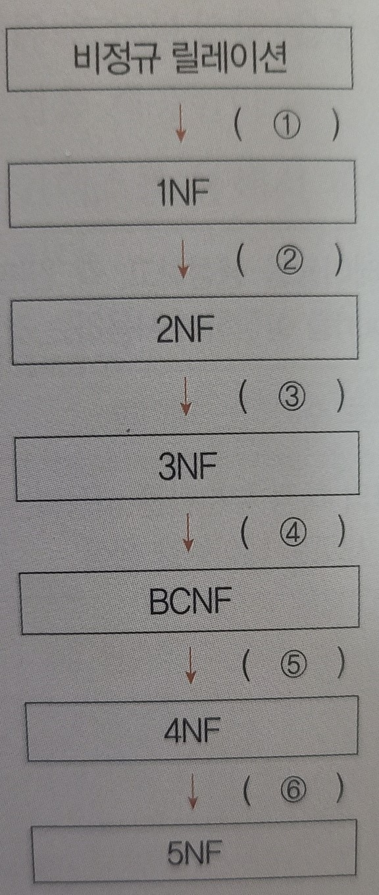

# 2장 데이터 입-출력 구현

```
1.
다음이 설명하는 것이 무엇인지 쓰시오.

운영중인 기존 정보 시스템에 축적되어 있는 데이터를 추출하여 새로 개발할 정보 시스템에서 운영할 수 있도록 변환한 후 적재하는 일련의 과정을 말한다.

- ()
```

```
2.
다음이 설명하는 것이 무엇인지 쓰시오.

원천 시스템의 데이터를 목적 시스템의 데이터로 전환하는 과정이 정상적으로 수행되었는지 여부를 확인하는 과정이다.

- ()
```

```
3.
다음에 제시된 오류 데이터 측정 및 정제 과정을 순서대로 나열 하시오.

오류 데이터 정제, 데이터 품질 분석, 오류 데이터 측정

- () -> () -> ()
```

```
4.
데이터베이스의 정의 중 '데이터베이스는 어떤 조직의 고유 기능을 수행하기 위해 반드시 필요한 데이터를 의미한다.'에 해당되는 정의는 무엇인지 쓰시오.

- ()
```

```
5.
데이터베이스 관리 시스템(DBMS)에 대한 다음 설명에서 괄호에 들어갈 알맞은 기능을 쓰시오.

DBMS는 사용자와 데이터베이스 사이에서 사용자의 요구에 따라 정보를 생성해주고 데이터베이스를 관리해 주는 소프트웨어로, 데이터의 형(Type)과 구조에 대한 정의, 이용 방식, 제약조건 등을 명시하는 정의 기능, 데이터 검색, 갱신, 삽입, 삭제 등을 위한 인터페이스 수단을 제공하는 조작 기능, 데이터의 무결성, 보안, 권한 검사, 병행 제어를 수행하는 ()이 있다.

- ()
```

```
6.
데이터베이스의 스키마(Schema)에 대해 간략히 서술하시오.

- ()
```

```
7.
스키마의 종류 중 다음이 설명하는 스키마가 무엇인지 쓰시오.

물리적 저장장치의 입장에서 본 데이터베이스 구조로서, 실제로 데이터베이스에 저장될 레코드의 형식을 정의하고 저장 데이터 항목의 표현 방법, 내부 레코드의 물리적 순서 등을 나타낸다.

- ()
```

```
8.
다음은 데이터베이스 구축까지의 과정을 나열한 것이다. 괄호에 들어갈 알맞은 용어를 쓰시오.

요구 분석 -> () -> () -> () -> 구현

- ()
```

```
9.
데이터베이스 설계에 대한 다음 설명에 가장 부합하는 용어를 쓰시오.

현실 세계에 대한 인식을 추상적 개념으로 표현하는 과정으로, 개념 스키마 모델링과 트랜잭션 모델링을 수행하며, 요구 조건 명세를 E-R 다이어그램으로 작성한다.

- ()
```

```
10.
데이터베이스 설계에 대한 다음 설명에 가장 부합하는 용어를 쓰시오.

현실의 자료를 특정 DBMS가 지원하는 자료 구조로 변환하는 과정으로, 트랜잭션의 인터페이스를 설계하고, 정규화를 통해 스키마를 평가 및 정제한다.

- ()
```

```
11.
데이터베이스 설계에 대한 다음 설명에 가장 부합하는 용어를 쓰시오.

논리적 구조로 표현된 데이터를 디스크 등의 저장장치에 저장할 수 있는 데이터로 변환하는 과정으로, 파일의 저장 구조 및 액세스 경로를 결정하며, 테이블 정의서 및 명세서가 산출된다.

- ()
```

```
12.
데이터 모델의 구성 요소에 대한 다음 설명에서 괄호 (1,2)에 들어갈 알맞은 구성 요소를 쓰시오.

1. (1)은 데이터베이스에 저장된 실제 데이터를 처리하는 작업에 대한 명세로서 데이터베이스를 조작하는 기본 도구에 해당한다.
2. (2)는 논리적으로 표현된 객체 타입들 간의 관계로서 데이터의 구조 및 정적 성질을 표현한다.
3. 제약 조건을 데이터베이스에 저장될 수 있는 실제 데이터의 논리적인 제약 조건을 의미한다.

- ()
```

```
13.
데이터 모델의 구성 요소 중 개체(Entity)의 개념을 간략히 서술하시오.

- ()
```

```
14.
다음은 관계(Relationship) 형태에 대한 설명이다. 괄호(1~3)에 들어갈 알맞은 형태를 쓰시오.

- ()
```
<table border="1">
    <tr>
        <td>(1)
        </td>
        <td>개체 집합 A의 각 원소는 개체 집합 B의 원소 여러 개와 대응하고 있지만, 개체 집합 B의 각 원소는 개체 집합 A의 원소 한 개와 대응하는 관계
        </td>
    </tr>
    <tr>
        <td>(2)
        </td>
        <td>개체 집합 A의 각 원소는 개체 집합 B의 원소 여러 개와 대응하고, 개체 집합 B의 각 원소도 개체 집합 A의 원소 여러 개와 대응하는 관계
        </td>
    </tr>
    <tr>
        <td>(3)
        </td>
        <td>개체 집합 A의 각 원소가 개체 집합 B의 원소 한 개와 대응하는 관계
        </td>
    </tr>
</table>

```
15.
다음이 설명하고 있는 데이터베이스 관련 용어를 쓰시오.
- 개념적 데이터 모델의 가장 대표적인 것으로, 1976년 피터 첸(Peter Chen)에 의해 제안되고 기본적인 구성요소가 정립되었다.
- 개체와 개체 간의 관계를 기본 요소로 이용하여 현실 세계의 무질서한 데이터를 개념적인 논리 데이터로 표현하기 위한 방법으로 많이 사용되고 있다.

- ()
```

```
16.
다음은 개체-관계 모델의 E-R 다이어그램에서 사용되는 기호에 대한 설명이다. 괄호 (1~3)에 들어갈 알맞은 기호의 의미를 쓰시오.

- ()
```
<table border="1">
    <tr>
        <th>기호
        </th>
        <th>의미
        </th>
    </tr>
    <tr>
        <td>타원
        </td>
        <td>(1)
        </td>
    </tr>
    <tr>
        <td>이중 타원
        </td>
        <td>다중값 속성(복합 속성)
        </td>
    </tr>
    <tr>
        <td>밑줄 타원
        </td>
        <td>기본키 속성
        </td>
    </tr>
    <tr>
        <td>마름모
        </td>
        <td>(2)
        </td>
    </tr>
    <tr>
        <td>사각형
        </td>
        <td>(3)
        </td>
    </tr>
    <tr>
        <td>선
        </td>
        <td>개체 타입과 속성을 연결
        </td>
    </tr>
</table>

```
17.
다음 표에서 릴레이션(Relation), 애트리뷰트(Attribute), 튜플(Tuple)의 수를 구하여 표시하시오.

- 릴레이션 : ()
- 애트리뷰트 : ()
- 튜플 : ()
```
<table border="1">
    <tr>
        <th>고객ID
        </th>
        <th>고객명
        </th>
        <th>지역
        </th>
    </tr>
    <tr>
        <td>SNG001
        </td>
        <td>이순신
        </td>
        <td>서울
        </td>
    </tr>
    <tr>
        <td>SNG002
        </td>
        <td>강감찬
        </td>
        <td>경기
        </td>
    </tr>
    <tr>
        <td>SNG003
        </td>
        <td>김동준
        </td>
        <td>인천
        </td>
    </tr>
    <tr>
        <td>SNG004
        </td>
        <td>홍길동
        </td>
        <td>서울
        </td>
    </tr>
    <tr>
        <td>SNG005
        </td>
        <td>이대로
        </td>
        <td>경기
        </td>
    </tr>
</table>

```
18.
A1, A2, A3 3개 속성을 갖는 한 릴레이션에서 A1의 도메인은 3개 값, A2의 도메인은 2개 값, A3의 도메인은 4개 값을 갖는다. 이 릴레이션에 존재 가능한 튜플(Tuple)의 최대 수는 몇 개인지 쓰시오.

- ()
```

```
19.
어떤 릴레이션의 스키마가 4개의 속성(Attribute), 2개의 후보키 그리고 그 스키마의 릴레이션 인스턴스가 7개의 튜플(Tuple)을 갖는다면 그 릴레이션의 차수(Degree)는 몇 개인지 쓰시오.

- ()
```

```
20.
관계형 데이터베이스의 릴레이션(Relation) 구조 중 도메인(Domain)의 개념을 간략히 서술하시오.

- ()
```

```
21.
키(Key)에 대한 다음 설명에서 괄호(1,2)에 들어갈 알맞은 용어를 쓰시오.

- 키(Key)는 데이터베이스에서 조건에 만족하는 튜플을 찾거나 순서대로 정렬할 때 기준이 되는 속성을 말한다.
- 후보키(Candidate Key)는 릴레이션을 구성하는 속성들 중에서 튜플을 유일하게 식별하기 위해 사용되는 속성들의 부분집합으로, (1) 과 (2)을 만족하는 특징이 있다.

- ()
```

```
22.
다음이 설명하고 있는 키(Key)의 종류를 쓰시오.

- 후보키 중에서 특별히 선정된 키이다.
- 한 릴레이션에서 특정 튜플을 유일하게 구별할 수 있는 속성이다.
- 후보키의 성질을 갖는다.
- 중복된 값이나 NULL 값을 가질 수 없다.

- ()
```

```
23.
관계형 데이터베이스의 제약 조건 중 대체키에 대한 개념을 간략히 서술하시오.

- ()
```

```
24.
키(Key)에 대한 다음 설명에서 괄호에 들어갈 알맞은 용어를 쓰시오.

- 키(Key)는 데이터베이스에서 조건에 만족하는 튜플을 찾거나 순서대로 정렬할 때 기준이 되는 속성을 말한다.
- 슈퍼키(Super Key)는 한 릴레이션 내에 있는 속성들의 집합으로 구성된 키로, 릴레이션을 구성하는 모든 튜플에 대해 ()을 만족한다.

- ()
```

```
25.
다음 두 릴레이션에서 외래키로 사용된 속성을 찾아 쓰시오. (단, 대괄호 속성은 기본키이다.)

과목( [과목번호], 과목명 )
수강( [수강번호], 학번, 과목번호, 학기 )

- ()
```

```
26.
데이터 무결성 제약조건 중 개체 무결성(Entity Integrity)의 개념을 간략히 서술하시오.

- ()
```

```
27.
다음이 설명하고 있는 데이터베이스 관련 용어를 쓰시오.

- 관계형 데이터베이스에서 원하는 정보와 그 정보를 검색하기 위해서 어떻게 유도하는가를 기술하는 절차적 언어이다.
- 주어진 릴레이션 조작을 위한 연산의 집합이다.

- ()
```

```
28.
다음이 설명하고 있는 관계대수 연산자의 기호를 쓰시오.

릴레이션 A, B가 있을 때 릴레이션 B의 조건에 맞는 것들만 릴레이션 A에서 분리하여 프로젝션을 하는 연산이다.

- ()
```

```
29.
다음 보기에서 제시된 연산자 중 관계대수의 순수 관계 연산자를 모두 골라 쓰시오.

<보기>
- UNION             - JOIN          - DIVISION
- INTERSECTION      - SELECT        - CARTESIAN PRODUCT
- DIFFERENCE        - PROJECT

- ()
```

```
30.
다음 두 릴레이션 R1과 R2를 카티션 프로덕트(Cartesian Product)한 결과의 새로운 릴레이션의 디그리(Degree)와
카디널리티(Cardinality)를 쓰시오.

- 디그리 : ()
- 카디널리티 : ()
```
- R1
<table border="1">
    <tr>
        <th>학년
        </th>
    </tr>
    <tr>
        <td>1
        </td>
    </tr>
    <tr>
        <td>2
        </td>
    </tr>
    <tr>
        <td>3
        </td>
    </tr>
</table>

- R2
<table border="1">
    <tr>
        <th>학과
        </th>
    </tr>
    <tr>
        <td>컴퓨터
        </td>
    </tr>
    <tr>
        <td>국문
        </td>
    </tr>
    <tr>
        <td>수학
        </td>
    </tr>
</table>

```
31.
다음이 설명하고 있는 데이터베이스 관련 용어를 쓰시오.

- 관계 데이터 모델의 제안자인 E. F. Codd가 수학의 술어 해석(Predicate Calculus)에 기반을
두고 관계 데이터베이스를 위해 제안했다.
- 관계 데이터의 연산을 표현하는 방법으로, 원하는 정보를 정의할 때는 계산 수식을 사용한다.
- 이것은 원하는 정보가 무엇이라는 것만 정의하는 비절차적 특성을 지니며, 질의어로 표현한다.

- ()
```

```
32.
정규화를 거치지 않으면 데이터베이스 내에 데이터들이 불필요하게 중복되어 릴레이션 조작 시 예기치 못한 곤란한 현상이 발생하는데, 이를 이상(Anomaly)이라 한다. 이상의 종류 3가지를 쓰시오.

- ()
```

```
33.
데이터의 중복으로 인해 테이블 조작 시 문제가 발생하는 현상을 이상(Anomaly)이라고 한다. 이상의 종류 중 삭제 이상(Deletion Anomaly)에 대해 간략히 서술하시오.

- ()
```

```
34.
어떤 릴레이션 R에서 X와 Y를 각각 R의 애트리뷰트 집합의 부분 집합이라고 할 경우 애트리뷰트 X의 값 각각에 대해 시간에 관계없이 항상 애트리뷰트 Y의 값이 오직 하나만 연관되어 있을 때 Y는 X에 함수 종속이라고 한다. 이 함수 종속의 표기를 쓰시오.

- ()
```

```
35.
데이터베이스에서 정규화(Normalization)의 개념을 간략히 서술하시오.

- ()
```

```
36.
다음과 같이 왼쪽 릴레이션을 오른쪽 릴레이션으로 정규화(Normalization)를 하였을 때 어떤 정규화 작업을 한 것인지 쓰시오.

- ()
```
<table border="1">
    <tr>
        <th>국가
        </th>
        <th>도시
        </th>
    </tr>
    <tr>
        <td>대한민국
        </td>
        <td>서울, 부산
        </td>
    </tr>
    <tr>
        <td>미국
        </td>
        <td>워싱턴, 뉴욕
        </td>
    </tr>
    <tr>
        <td>중국
        </td>
        <td>베이징
        </td>
    </tr>
</table>

```
37.
정규화 과정에 대한 다음 설명에서 괄호에 공통으로 들어갈 알맞은 정규형을 쓰시오.

테이블을 만들 때는 이상(Anomaly)을 방지하기 위해 데이터들의 중복성 및 종속성을 배제하는 정규화를 수행한다. 아래 그림은 부분 함수적 종속을 제거하여 제 () 정규형을 만드는 과정이다.

- ()

<제품납품>의 함수적 종속 관계
- 납품번호, 제품번호 -> 업체번호, 업체명, 납품수량
- 납품번호 -> 업체번호, 업체명

<제품납품>의 경우, 업체번호와 업체명은 기본키에 해당하는 납품번호와 제품번호 중 납품번호에만 종속되는 부분 함수적 종속이다. 이 문제 해결을 위해 <제품납품>에서 업체번호와 업체명을 분리하여 <납품목록>과 <주문>으로 만들면 제 () 정규형에 해당하는 테이블이 완성 된다.
```
- 제품납품 (대괄호가 기본키를 의미)
<table border="1">
    <tr>
        <th>[납품번호]
        </th>
        <th>[제품번호]
        </th>
        <th>업체번호
        </th>
        <th>업체명
        </th>
        <th>납품수량
        </th>
    </tr>
    <tr>
        <td>K102
        </td>
        <td>P7720
        </td>
        <td>214
        </td>
        <td>대한기계
        </td>
        <td>100
        </td>
    </tr>
    <tr>
        <td>J116
        </td>
        <td>P7620
        </td>
        <td>712
        </td>
        <td>모연전자
        </td>
        <td>150
        </td>
    </tr>
    <tr>
        <td>K217
        </td>
        <td>P0098
        </td>
        <td>879
        </td>
        <td>삼일제조
        </td>
        <td>300
        </td>
    </tr>
    <tr>
        <td>A548
        </td>
        <td>P0098
        </td>
        <td>523
        </td>
        <td>효진항공
        </td>
        <td>250
        </td>
    </tr>
    <tr>
        <td>K102
        </td>
        <td>P0892
        </td>
        <td>214
        </td>
        <td>대한기계
        </td>
        <td>100
        </td>
    </tr>
    <tr>
        <td>K217
        </td>
        <td>P7720
        </td>
        <td>879
        </td>
        <td>삼일제조
        </td>
        <td>250
        </td>
    </tr>
</table>


```
38.
다음은 정규화 과정을 간단하게 정리한 것이다. 괄호(1~6)에 각 정규화 과정별로 필요한 작업이 무엇인지 간략히 서술하시오.

- ()
```


```
39.
정규화된 데이터 모델을 의도적으로 통합, 중복, 분리하여 정규화 원칙을 위배하는 행위를 의미하는 용어를 쓰시오.

- ()
```

```
40.
반정규화 유형 중 중복 테이블을 추가하는 것이 있다. 이 때 추가하는 테이블의 종류 3가지를 쓰시오.

- ()
```

```
41.
다음 설명의 괄호에 공통적으로 들어갈 알맞은 용어를 쓰시오.

- ()는 시스템 자신이 필요로 하는 스키마 및 여러가지 객체에 관한 정보를 포함하고 있는 시스템 데이터베이스로, DBMS가 스스로 생성하고 유지한다.
- ()에 저장되는 내용을 메타 데이터라고도 한다.

- ()
```

```
42.
데이터베이스에서 하나의 논리적 기능을 수행하기 위한 작업의 단위 또는 한꺼번에 모두 수행되어야 할 일련의 연산들을 의미하는 용어를 쓰시오.

- ()
```

```
43.
다음은 트랜잭션의 특징이다. 괄호(1,2)에 들어갈 알맞은 특징을 쓰시오.

- ()
```
<table border="1">
    <tr>
        <td>(1)
        </td>
        <td>트랜잭션의 연산은 데이터베이스에 모두 반영되든지 아니면 전혀 반영되지 않아야 한다. (All or Nothing)
        </td>
    </tr>
    <tr>
        <td>일관성
        </td>
        <td>트랜잭션이 그 실행을 성공적으로 완료하면 언제나 일관성 있는 데이터베이스 상태로 변환한다.
        </td>
    </tr>
    <tr>
        <td>(2)
        </td>
        <td>둘 이상의 트랜잭션이 동시에 병행 실행되는 경우 어느 하나의 트랜잭션 실행중에 다른 트랜잭션의 연산이 끼어들 수 없다.
        </td>
    </tr>
    <tr>
        <td>지속성
        </td>
        <td>성공적으로 완료된 트랜잭션의 결과는 시스템이 고장나더라도 영구적으로 반영되어야 한다.
        </td>
    </tr>
</table>

```
44.
데이터베이스의 상태 변화를 일으키는 트랜잭션의 특성 중 원자성에 대해 간략히 서술하시오.

- ()
```

```
45.
데이터베이스에 영향을 주는 생성, 읽기, 갱신, 삭제 연산으로 프로세스와 테이블 간에 매트릭스를 만들어 트랜잭션을 분석하는 것이 무엇인지 쓰시오.

- ()
```

```
46.
다음 설명 중 괄호에 공통적으로 들어갈 가장 적합한 용어를 쓰시오.

()는 데이터 레코드(튜플)에 빠르게 접근하기 위해 <키 값, 포인터> 쌍으로 구성되는 데이터 구조이다. 기본키를 위한 ()를 기본()라 하고, 대부분의 관계형 데이터베이스 관리 시스템에서는 모든 기본키에 대해서 자동적으로 기본 ()를 생성한다. 대표적인 ()로는 트리 기반, 비트맵, 함수 기반, 비트맵 조인 등이 있다.

- ()
```

```
47.
인덱스 키의 순서에 따라 데이터가 정렬되어 저장되는 방식으로, 실제 데이터 순서대로 저장되어 있어 인덱스를 검색하지 않아도 원하는 데이터를 빠르게 찾을 수 있는 인덱스 방식이 무엇인지 쓰시오.

- ()
```

```
48.

```


```
2장 답 (역순)
47. (클러스터드 인덱스)
46. (인덱스)
45. (CRUD 분석)
44. (트랜잭션의 연산은 데이터베이스에 모두 반영되도록 완료되든지 아니면 전혀 반영되지 않도록 복구되어야 한다는 특성)
43. (원자성, 독립성)
42. (트랜잭션)
41. (시스템 카탈로그)
40. (집계 테이블, 진행 테이블, 특정 부분만을 포함하는 테이블)
39. (반정규화)
38. ( (도메인을 원자값으로만 구성), (부분적 함수 종속성 제거), (이행적 함수 종속성 제거), (결정자이면서 후보키가 아닌 것 제거), (다치 종속 제거), (조인 종속성 이용) )
37. (2)
36. (제 1정규화)
35. (테이블의 속성들이 상호 종속적인 관계를 갖는 특성을 이용하여 테이블을 무손실 분해하는 과정이다.)
34. (X -> Y)
33. (튜플을 삭제할 때 의도와는 상관없는 값들도 함께 삭제되는 현상)
32. (삽입 이상, 삭제 이상, 갱신 이상)
31. (관계 해석)
30. (2, 9)
29. (JOIN, DIVISION, SELECT, PROJECT)
28. (÷)
27. (관계대수)
26. (기본 테이블의 기본키를 구성하는 어떤 속성도 Null 값이나 중복값을 가질 수 없다는 규정)
25. (과목번호)
24. (유일성)
23. (후보키가 둘 이상일 때 기본키를 제외한 나머지 후보키를 의미한다.)
22. (기본키)
21. (유일성, 최소성)
20. (하나의 애트리뷰트가 취할 수 있는 같은 타입의 원자값들의 집합)
19. (4)
18. (9)
17. (1, 3, 5)
16. ( 속성(attribute), 관계(Relationship), 개체(Entity) )
15. (E-R 모델)
14. (1대다, 다대다, 일대일)
13. (사람이 생각하는 개념이나 정보 단위 같은 현실 세계의 대상체)
12. (연산, 구조)
11. (물리적 설계)
10. (논리적 설계)
9. (개념적 설계)
8. ( (개념적 설계), (논리적 설계), (물리적 설계) )
7. (내부 스키마)
6. (데이터베이스의 구조와 제약조건에 관한 전반적인 명세를 기술한 것)
5. (제어기능)
4. ( 운영 데이터(Operational Data) )
3. (데이터 품질 분석, 오류 데이터 측정, 오류 데이터 정제)
2. (데이터 검증)
1. (데이터 전환)
```