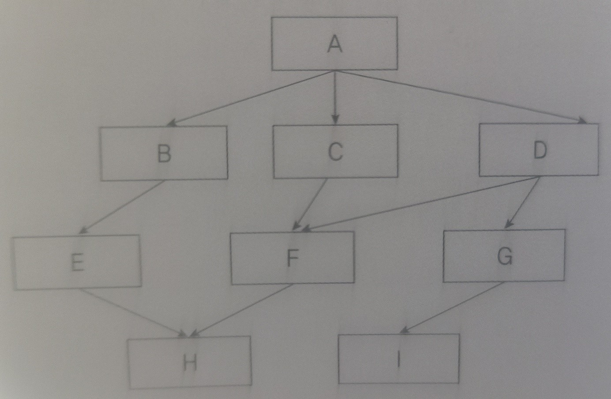

# 4장 서버 프로그램 구현

```
1.
응용 소프트웨어 개발을 위해 개발 프로젝트를 이해하고 소프트웨어 및 하드웨어 장비를 구축하는 
것을 의미하는 용어를 쓰시오.

- ()
```

```
2.
다음 설명의 괄호(1,2)에 들어갈 알맞은 용어를 쓰시오.

웹 애플리케이션 개발을 위한 하드웨어 환경은 사용자와의 인터페이스 역할을 하는 (1) 그리고 
(1)와 통신하여 서비스를 제공하는 (2)로 구성된다.

- ()
```

```
3.
다음 설명의 괄호에 공통으로 들어갈 알맞은 용어를 쓰시오.

웹 애플리케이션 개발을 위한 소프트웨어 환경은 ()와 개발 소프트웨어로 구성된다. ()의 
종류에는 운영체제, DBMS 등이 있고, 개발 소프트웨어의 종류에는 요구사항 관리 도구, 구현 
도구, 형상 관리 도구 등이 있다.

- ()
```

```
4.
웹 서버(Web Server)의 기능 중 네트워크 트래픽의 포화를 방지하기 위해 응답 속도를 제한하는 
기능이 무엇인지 쓰시오.

- ()
```

```
5.
소프트웨어 개발에서 개발 언어 선정 시 언어가 다른 개발 사례가 충분히 존재하고, 이미 여러
 곳에서 사용하고 있는지를 판단하는 기준을 가리키는 용어를 쓰시오.

- ()
```

```
6.
소프트웨어를 구성하는 요소들 간의 관계를 표현하는 시스템의 구조 또는 구조체를 의미하는 
용어를 쓰시오.

- ()
```

```
7.
다음 설명의 괄호(1,2)에 들어갈 알맞은 용어를 쓰시오.

소프트웨어 패키징이란 모듈별로 생성한 실행 파일들을 묶어 배포용 설치 파일을 만드는 것을
 말한다. 소스 코드는 향후 관리를 고려하여 모듈화하여 패키징한다. 모듈화는 모듈 간 (1)의 
 최소화와 모듈 내 요소들의 (2)를 최대화하는 것이 목표이다.

- ()
```

```
8.
다음에서 추상화의 유형을 모두 찾아 기호(ㄱ~ㅂ)로 쓰시오.

ㄱ. 자료 추상화         ㄴ. 강도 추상화         ㄷ. 논리 추상화
ㄹ. 과정 추상화         ㅁ. 제어 추상화         ㅂ. 개념 추상화

- ()
```

```
9.
문제를 상위의 중요 개념으로부터 하위의 개념으로 구체화시키는 분할 기법으로, Niklaus 
Wirth에 의해 제안된 하향식 설계 전략을 쓰시오.

- ()
```

```
10.
다른 모듈이 모듈 내부의 절차와 자료들의 정보에 접근 및 변경하는 것을 막기 위한 기법으로,
 모듈을 독립적으로 수행할 수 있고, 하나의 모듈이 변경되더라도 다른 모듈에 영향을 주지 
 않으므로 수정, 시험, 유지보수가 용이한 소프트웨어 아키텍처 설계의 기본 원리를 쓰시오.

- ()
```

```
11.
다음은 애플리케이션 개발 과정 중에 수행되는 작업들을 순서에 관계없이 나열한 것이다. 상위 
설계에 포함되는 작업들을 모두 찾아 기호(ㄱ~ㅇ)로 쓰시오.

ㄱ. 모듈 설계           ㄴ. 컴포넌트 설계       ㄷ. 알고리즘 구현
ㄹ. 인터페이스 설계      ㅁ. 자료 구조 설계      ㅂ. 유지 및 보수
ㅅ. 패키징              ㅇ. 아키텍처 설계

- ()
```

```
12.
다음 중 소프트웨어 아키텍처 설계에서 시스템 품질 속성에 포함되는 것을 모두 찾아 기호(ㄱ~ㅇ)
로 쓰시오.

ㄱ. 시장 적시성         ㄴ. 가용성          ㄷ. 독립성          ㄹ. 변경 용이성
ㅁ. 완결성              ㅂ. 시험성          ㅅ. 사용성          ㅇ. 구축 가능성

- ()
```

```
13.
다음은 컴포넌트 설계 단계에 대한 설명이다. 괄호에 들어갈 가장 알맞은 용어를 쓰시오.

컴포넌트 설계 시 "()에 의한 설계"를 따를 경우, 해당 명세에서는
(1) 컴포넌트의 오퍼레이션 사용 전에 참이 되어야 할 선행 조건
(2) 사용 후 만족되어야 할 결과 조건
(3) 오퍼레이션이 실행되는 동안 항상 만족되어야 할 불변조건 등이 포함되어야 한다.

- ()
```

```
14.
소프트웨어 설계와 관련된 다음 설명에 해당하는 용어를 쓰시오.

- 아키텍처를 설계할 때 참조할 수 있는 전형적인 해결 방식 또는 예제이다.
- 소프트웨어 시스템의 구조를 구성하기 위한 기본적인 윤곽을 제시한다.
- 서브시스템들과 그 역할이 정의되어 있다.

- ()
```

```
15.
시스템을 계층으로 구분하여 구성하는 고전적인 방법의 아키텍처 패턴으로, 하위 계층은 상위 
계층에 대한 서비스 제공자가 되고, 상위 계층은 하위 계층의 클라이언트가 되는 패턴을 쓰시오.

- ()
```

```
16.
하나의 서버 컴포넌트와 다수의 클라이언트 컴포넌트로 구성되어 있으며, 사용자가 클라이언트를 
통해 서버에 요청하면 클라이언트가 응답을 받아 사용자에게 제공하는 방식의 아키텍처 패턴을 
쓰시오.

- ()
```

```
17.
서브시스템이 입력 데이터를 받아 처리하고 결과를 다음 서브 시스템으로 넘겨주는 과정을 반복하는 아키텍처 패턴을 쓰시오.

- ()
```

```
18.
MVC 패턴은 서브시스템을 세 개의 컴포넌트로 구조화하는 패턴으로, 대화형 애플리케이션에 가장
많이 사용되는 패턴 중 하나이다. MVC 패턴에서 세 개의 컴포넌트가 무엇인지 쓰시오.

- ()
```

```
19.
소프트웨어 아키텍처에 대한 다음 설명에서 괄호(1,2)에 들어갈 가장 적합한 종류를 쓰시오.

목표로 하는 시스템이나 고객의 핵심적인 요구사항에 따라 적합한 아키텍처 패턴을 선정해야 
한다. 막대한 연산이 필요한 작업을 수행하기 위해 여러 대의 컴퓨터를 병렬로 연결하고자 한다면 
(1) 패턴이, 외국어를 번역하거나 프로그래밍 언어를 개발할 때는 (2) 패턴이 상황에 맞는 
아키텍처 패턴에 해당한다.

- ()
```

```
20.
다음 설명에 가장 부합하는 용어를 쓰시오.

- 소프트웨어의 각 요소들을 객체로 만든 후 객체들을 조립해서 소프트웨어를 개발하는 기법이다.
- 구성 요소로는 객체, 클래스, 메시지 등이 있고, 캡슐화, 상속, 다형성, 연관성 등의 특징을
갖고 있다.

- ()
```

```
21.
다음 설명이 가리키는 객체지향 기법의 구성 요소를 쓰시오.

- 실세계 또는 개념적으로 존재하는 세계의 사물들이다.
- 데이터를 가지며 이 데이터를 변경하는 함수를 가지고 있는 경우도 있다.
- 상호작용의 수단으로 메시지를 사용한다.

- ()
```

```
22.
객체지향 소프트웨어 공학에서 하나 이상의 유사한 객체들을 묶어서 하나의 공통된 특성을 
표현하며, 데이터를 추상화하는 단위로 사용되는 객체지향의 구성 요소를 쓰시오.

- ()
```

```
23.
객체들 간의 상호작용에 사용되는 수단으로, 객체에게 어떤 행위를 하도록 지시하는 명령을 
의미하는 객체지향의 구성 요소를 쓰시오.

- ()
```

```
24.
다음 설명과 가장 밀접한 관계가 있는 객체지향의 특징을 쓰시오.

- 인터페이스가 단순화 된다.
- 소프트웨어 재사용성이 높아진다.
- 변경 발생 시 오류의 파급 효과가 작다.
- 정보 은닉과 관계가 있다.

- ()
```

```
25.
상위 클래스에서 속성이나 연산을 전달받아 새로운 형태의 클래스로 확장하여 사용하는 것을 
의미하는 객체지향의 특징을 쓰시오.

- ()
```

```
26.
상속받은 여러 개의 하위 객체들이 다른 형태의 특성을 갖는 객체로 이용될 수 있는 성질을 
의미하는 객체지향의 특징을 쓰시오.

- ()
```

```
27.
객체지향 기법에서 연관성을 나타내는 표현들 중 '부분-전체(Part-Whole)' 관계 또는 '부분
(is-a-part-of)'의 관계로 설명되는 연관성을 쓰시오.

- ()
```

```
28.
소프트웨어를 개발하기 위한 비즈니스를 객체와 속성, 클래스와 멤버, 전체와 부분 등으로 
나누어서 분석해 내는 기법을 쓰시오.

- ()
```

```
29.
객체지향 분석 방법론 중 E-R 다이어그램을 사용하여 객체의 행위를 모델링하며, 객체 식별, 
구조 식별, 주체 정의, 속성 및 관계 정의, 서비스 정의 등의 과정으로 구성되는 기법을 쓰시오.

- ()
```

```
30.
럼바우(Rumbaugh) 데이터 모델링에 대한 다음 설명에서 각 지문(1~3)에 해당하는 모델링을 
<보기>에서 찾아 기호(ㄱ~ㅇ)로 쓰시오.

1. 다수의 프로세스들 간의 자료 흐름을 중심으로 처리 과정을 표현한 모델링
ex. 자료흐름도(DFD)
2. 시간의 흐름에 따른 객체들 간의 제어 흐름, 상호 작용, 동작 순서 등의 동적인 행위를 
표현하는 모델링
ex. 상태 변화도(STD), 사건 추적도
3. 시스템에서 요구되는 객체를 찾아내어 속성과 연산 식별 및 객체들간의 관계를 규정하여 
표시하는 모델링
ex. ER 다이어그램(ERD)

<보기>
ㄱ. Operation       ㄴ. Sequence        ㄷ. Information
ㄹ. Transaction     ㅁ. Function        ㅂ. I/O
ㅅ. Dynamic         ㅇ. Cause-Effect

- 1. ()
- 2. ()
- 3. ()
```

```
31.
다음 내용이 설명하는 객체지향 설계 원칙을 쓰시오.

- 클라이언트는 자신이 사용하지 않는 메소드와 의존관계를 맺으면 안된다.
- 클라이언트가 사용하지 않는 인터페이스에 영향을 받아서는 안된다.

- ()
```

```
32.
소프트웨어 구조를 이루며, 다른 것들과 구별될 수 있는 독립적인 기능을 갖는 단위로, 하나 
또는 몇 개의 논리적인 기능을 수행하기 위한 명령어들의 집합이라고도 할 수 있는 것을 쓰시오.

- ()
```

```
33.
다음에 제시된 결합도를 결합도가 낮은 것부터 높은 것 순으로 기호(ㄱ~ㅂ)로 나열하시오.

- ()
```

```
34.
결합도의 종류 중 단순 처리 대상인 데이터만 전달되는 것이 아니라 어떻게 처리해야 하는지를 
결정하는 제어 요소가 전달되는 경우의 결합도를 영문으로 쓰시오.

- ()
```

```
35.
데이터 모델의 구성 요소에 대한 다음 설명에서 괄호 (1~3)에 들어갈 알맞은 용어를 <보기>에서 
찾아 기호 (ㄱ~ㅂ)로 쓰시오.

1. (1)는 모듈 간의 인터페이스로 데이터, 지역 변수 등을 직접 참조하거나 수정할 때의 
결합도이다.
2. (2)는 모듈 간의 인터페이스로 배열이나 레코드 등의 자료 구조가 전달될 때의 결합도이다.
3. (3)는 모듈 간의 인터페이스로 파라미터가 아닌 모듈 밖에 선언된 전역 변수를 사용하여 전역
 변수를 갱신하는 방식으로 상호작용 하는 때의 결합도이다.

<보기>
ㄱ. 자료 결합도             ㄴ. 스탬프 결합도           ㄷ. 제어 결합도
ㄹ. 공통 결합도             ㅁ. 내용 결합도             ㅂ. 외부 결합도

- ()
```

```
36.
다음에 제시된 응집도를 응집도가 높은 것부터 순서대로 기호(ㄱ~ㅅ)로 나열하시오.

ㄱ. 교환적 응집도           ㄴ. 순차적 응집도           ㄷ. 우연적 응집도
ㄹ. 기능적 응집도           ㅁ. 시간적 응집도           ㅂ. 절차적 응집도
ㅅ. 논리적 응집도

- ()
```

```
37.
모듈에 대한 다음 설명에서 각 지문(1~3)에 해당하는 응집도(Cohesion)를 <보기>에서 찾아 기호
(ㄱ~ㅅ)로 쓰시오.

1. 내부의 요소들이 기능적으로 연관성은 없으나, 순차적으로 실행될 때의 응집도
2. 서로 다른 기능을 수행하지만 동일한 입력과 출력을 사용할 때의 응집도
3. 하나의 기능에 밀접하게 관련되어 있거나 연관되어 있을 때의 응집도

<보기>
ㄱ. 기능적 응집도           ㄴ. 순차적 응집도           ㄷ. 교환적 응집도
ㄹ. 절차적 응집도           ㅁ. 시간적 응집도           ㅂ. 논리적 응집도
ㅅ. 우연적 응집도

- ()
```

```
38.
다음의 모듈 관계를 표현한 시스템 구조도를 참고하여 팬인(Fan-In)이 2 이상인 모듈을 모두 
쓰시오.

- ()
```


```
39.
다음 내용이 설명하는 용어를 쓰시오.

- 논리의 기술에 중점을 둔 도형식 표현 방법으로, 박스 다이어그램 Chapin Chart라고도 한다.
- 연속, 선택 및 다중 선택, 반복 등의 제어 논리 구조로 표현한다.
- 조건이 복합되어 있는 곳의 처리를 시각적으로 명확히 식별하는데 적합하다.

- ()
```

```
40.
소프트웨어 구현을 위해 필요한 여러 동작 중 한 가지 동작을 수행하는 작은 기능을 모듈로 
구현한 것을 무엇이라고 하는지 쓰시오.

- ()
```

```
41.
네트워크에 관련된 다음 설명에 해당하는 용어를 영문 약어로 쓰시오.

모듈 간 통신 방식을 구현하기 위해 사용되는 대표적인 프로그래밍 인터페이스 집합으로, 
대표적인 메소드에는 Shared Memory, Socket, Semaphores, Pipes & named Pipes, Message 
Queueing이 있다.

- ()
```

```
42.
다음 테스트 케이스를 참조하여 괄호(1~3)에 들어갈 테스트 케이스의 구성 요소를 <보기>에서 
찾아 쓰시오.

<보기>
요구 절차           의존성 여부         테스트 데이터          테스트 조건
하드웨어 환경       예상 결과           소프트웨어 환경         성공/실패 기준
```
<table border="1">
    <tr>
        <th>식별자_ID
        </th>
        <th>테스트 항목
        </th>
        <th>(1)
        </th>
        <th>(2)
        </th>
        <th>(3)
        </th>
    </tr>
    <tr>
        <td>LS_W10_35
        </td>
        <td>로그인 기능
        </td>
        <td>사용자 초기 화면
        </td>
        <td>아이디(test_a01) <br/>
        비밀번호 (203a!d5%ffa1)
        </td>
        <td>로그인 성공
        </td>
    </tr>
    <tr>
        <td>LS_W10_36
        </td>
        <td>로그인 기능
        </td>
        <td>사용자 초기 화면
        </td>
        <td>아이디(test_a01) <br/>
        비밀번호 (1234)
        </td>
        <td>로그인 실패(1) - 비밀번호 비일치
        </td>
    </tr>
    <tr>
        <td>LS_W10_37
        </td>
        <td>로그인 기능
        </td>
        <td>사용자 초기 화면
        </td>
        <td>아이디(" ") <br/>
        비밀번호 (" ")
        </td>
        <td>로그인 실패(2) - 미입력
        </td>
    </tr>
</table>

```
43.
공통 모듈 명세 시 해당 기능에 대해 일관되게 이해되고 한 가지로 해석될 수 있도록 작성해야
 한다는 명세 기법 원칙을 쓰시오.

- ()
```

```
44.
다음 중 공통 모듈의 재사용 규모에 따른 분류에 해당하는 것을 모두 찾아 쓰시오.

컴포넌트, 더미코드, 함수와 객체, 애플리케이션, 주석, 파일 구조

- ()
```

```
45.
다음에 제시된 기능 중 코드의 기능들만 모두 골라 기호(ㄱ~ㅂ)로 쓰시오.

ㄱ. 복잡성          ㄴ. 표준화          ㄷ. 분류
ㄹ. 보안            ㅁ. 식별            ㅂ. 제어

- ()
```

```
46.
코드 설계에서 일정한 일련번호를 부여하는 코드 부여 방식을 쓰시오.

- ()
```

```
47.
코드화 대상 항목의 중량, 면적, 용량 등의 물리적 수치를 이용하여 코드를 부여하는 코드 부여 
방식을 쓰시오.

- ()
```

```
48.
소프트웨어 공학의 디자인 패턴(Design Pattern)에 대한 다음 설명에서 괄호에 들어갈 알맞은 
용어를 쓰시오.

- 디자인 패턴은 1995년 GoF(Gang of Four)라고 불리는 에릭 감마(Erich Gamma), 리차드 헬름
(Richard Helm), 랄프 존슨(Ralph Johnson), 존 블리시디스(John Vissides)가 처음으로 구체화 및 체계화하였다.
- 디자인 패턴은 수많은 디자인 패턴들 중 가장 일반적인 사례에 적용될 수 있는 패턴들을 
분류하여 정리함으로써, 지금까지도 소프트웨어 공학이나 현업에서 가장 많이 사용되는 디자인 
패턴이다.
- 디자인 패턴은 23가지로, 생성, 구조, ()의 3가지로 분류한다.

- ()
```

```
49.
디자인 패턴에 관한 다음 설명에서 괄호에 들어갈 알맞은 패턴을 <보기>에서 찾아 쓰시오.

() 패턴은 객체 생성을 서브 클래스에서 처리하도록 분리하여 캡슐화 한 패턴으로, 상위 클래스에서 인터페이스만 정의하고 실제 생성은 서브 클래스가 담당한다. 다른 이름으로 가상 생성자(Virtual Constructor) 패턴이라고도 불린다.

<보기>
Singleton       Abstract Factory        Factory Method      Prototype
Facade          Composite               Template Method     Builder

- ()
```

```
50.
다음은 Gof(Gangs of Four) 디자인 패턴에 대한 설명이다. 괄호(1,2)에 들어갈 알맞은 패턴을 
쓰시오.

- (1)은 구현부에서 추상층을 분리하여, 서로가 독립적으로 확장할 수 있도록 구성한 패턴입니다.
- (2)은 기존 클래스를 이용하고 싶을 때 중간에서 맞춰주는 역할을 수행하는 패턴이다.

- ()
```

```
51.
디자인 패턴에 관련된 다음 설명에서 괄호에 들어갈 알맞은 용어를 쓰시오.

디자인 패턴은 모듈 간의 관계 및 인터페이스를 설계할 때 참조할 수 있는 전형적인 해결 방식 
또는 예제를 의미한다. 그 중 ()패턴은 클래스나 객체들이 서로 상호작용하는 방법이나 책임
 분배 방법을 정의하는 패턴으로, Interpreter, Observer, Command 등이 그 예에 해당한다.

 - ()
```

```
52.
디자인 패턴 중 한 객체의 상태가 바뀌면 그 객체에 의존하는 다른 객체들에게 연락이 가서 
자동으로 내용이 갱신되는 방식으로, 일대다의 의존성을 정의하는 패턴이다. 상호 작용을 하는 
객체 사이에서는 가능하면 느슨하게 결합하는 패턴을 영문으로 쓰시오.

- ()
```

```
53.
서버 프로그램 개발 시 다양한 네트워크 설정, 요청 및 응답 처리, 아키텍처 모델 구현 등을 
손쉽게 처리할 수 있도록 클래스나 인터페이스를 제공하는 소프트웨어를 쓰시오.

- ()
```

```
54.
Python을 기반으로 만들었으며, 컴포넌트의 재사용과 플러그인화를 강조하여 신속한 개발이 
가능한 서버 개발 프레임워크를 쓰시오.

- ()
```

```
55.
서버 개발 과정 중 사용자의 요청에 적절한 서비스를 호출하여, 그 결과를 사용자에게 반환하는 
코드를 구현하는 과정은 무엇인지 쓰시오.

- ()
```

```
56.
소프트웨어 개발에서 운영체제나 프로그래밍 언어 등에 있는 라이브러리를 이용할 수 있도록 규칙 
등을 정의해 놓은 인터페이스를 가리키는 용어를 영문 약어로 쓰시오.

- ()
```

```
57.
배치 프로그램에 대한 다음 설명에서 괄호(1,2)에 들어갈 알맞은 답을 쓰시오.

배치 프로그램은 사용자와의 상호 작용 없이 여러 작업들을 미리 정해진 일련의 순서에 따라 
일괄적으로 처리하는 것을 의미하며 다음의 필수 요소를 갖춰야 한다.

- 대용량 데이터 : 대용량 데이터의 처리 능력
- (1) : 사용자의 개입 없는 작업의 수행
- 견고성 : 시스템의 중단없는 지속 능력
- (2) : 오류 추적 능력
- 성능 : 작업 수행 능력

- ()
```

```
58.
배치 프로그램이 일괄 처리 작업을 설정된 주기에 맞춰 원활히 수행하도록 지원하는 도구로, 이 
도구를 사용하면 코드를 직접 작성하여 구현하는 것에 비해 안정적이며 생산성에서도 큰 차이가 
있다. 주로 사용되는 도구로는 Spring Batch, Quartz, Cron이 있다. 이 도구를 가리키는 
용어가 무엇인지 쓰시오.

- ()
```

```
59.
리눅스(Linux)의 크론탭(crontab) 명령어를 이용하여 다음의 설명에 해당하는 작업을 등록하는 
명령문을 작성하시오.(단, 하나의 명령문으로 처리해야 한다.)

A사의 개발자는 3월, 6월, 9월, 12월 마다 수행되어야 하는 데이터 백업 작업을 예약하고자 
한다. 해당 작업은 각 월의 25일에 서버 이용이 가장 적은 시간대인 오후 10시 정각에 처음 
실행되어 15분마다 총 4회 수행할 예정이다. 백업과 관련된 명령어는 /backup/batch.sh 파일에 
모두 준비해 두었다.

- ()
```


```
4장 답 (역순)
59. (*/15 22 25 */3 * /backup/batch.sh)
58. (배치 스케줄러)
57. (자동화, 안정성/신뢰성)
56. ( API(Application Programming Interface) )
55. (Controller 구현)
54. (Django)
53. (서버 개발 프레임워크)
52. (Observer)
51. (행위)
50. (브리지 패턴, 어댑터)
49. (Factory Method)
48. (행위)
47. (표의 숫자 코드)
46. (순차 코드)
45. (ㄴ, ㄷ, ㅁ)
44. (컴포넌트, 함수와 객체, 애플리케이션)
43. (명확성)
42. (테스트 조건, 테스트 데이터, 예상 결과)
41. ( IPC(Inter-Process Communications) )
40. (단위 모듈)
39. ( N-S차트(Nassi-Schneiderman Chart) )
38. (F, H)
37. (ㄹ, ㄷ, ㄱ)
36. (ㄹ, ㄴ, ㄱ, ㅂ,ㅁ, ㅅ, ㄷ)
35. (ㅁ, ㄴ ,ㄹ)
34. (Control Coupling)
33. (ㄴ, ㄹ, ㅂ, ㅁ, ㄷ, ㄱ)
32. (모듈)
31. ( 인터페이스 분리 원칙(ISP) )
30. ( (ㅁ), (ㅅ), (ㄷ) )
29. (Coad와 Yourdon 방법)
28. ( 객체지향 분석(Object Oriented Analysis) )
27. (집단화)
26. (다형성)
25. (상속)
24. (캡슐화)
23. (메시지)
22. (클래스)
21. (객체)
20. (객체 지향)
19. (마스터-슬레이브, 인터프리터)
18. (Model, View, Controller)
17. (파이프-필터 패턴)
16. (클라이언트-서버 패턴)
15. (레어이 패턴)
14. (아키텍처 패턴)
13. (협약)
12. (ㄴ, ㄹ, ㅅ)
11. (ㄹ, ㅇ)
10. (정보 은닉)
9. ( 단계적 분해(Stepwise Refinement) )
8. (ㄱ, ㄹ, ㅁ)
7. (결합도, 응집도)
6. (소프트웨어 아키텍처)
5. (범용성)
4. ( 대역폭 제한(Bandwidth Throttling) )
3. (시스템 소프트웨어)
2. (클라이언트, 서버)
1. (개발 환경 구축)
```