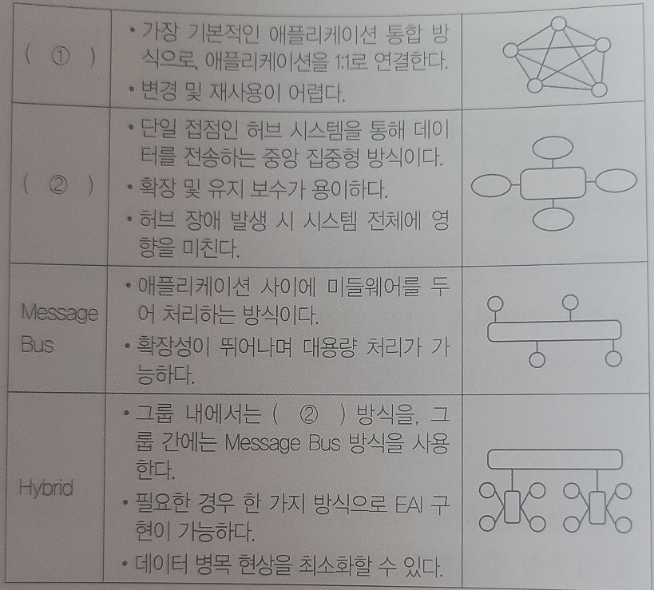

# 5장 인터페이스 구현

```
1.
다음에 제시된 요구사항 검증 수행 방법을 기호(ㄱ~ㄷ)로 순서대로 나열하시오.

ㄱ. 검토 및 오류 수정
ㄴ. 요구사항 검토 및 계획 수립
ㄷ. 베이스라인 설정

- ()
```

```
2.
검토 회의 전에 요구사항 명세서를 미리 배포하여 사전 검토한 후 짧은 검토 회의를 통해 오류를 
조기에 검출하는데 목적을 두는 요구사항 검토 방법을 쓰시오.

- ()
```

```
3.
인터페이스 요구사항 검증은 사용자들의 요구사항이 요구사항 명세서에 정확하고 완전하게 
기술되었는지 검토하고 개발 범위의 기준인 베이스라인을 설정하는 것이다. 다음 중 인터페이스 
요구사항 검증의 주요 항목을 모두 골라 기호(ㄱ~ㅇ)로 쓰시오.

ㄱ. 검증 가능성         ㄴ. 확장성          ㄷ. 시험성
ㄹ. 변경 용이성         ㅁ. 구축 가능성     ㅂ. 완전성
ㅅ. 신뢰성              ㅇ. 유지 보수성

- ()
```

```
4.
내-외부 시스템이 연계하여 작동할 때 인터페이스별 송-수신 방법, 송-수신 데이터, 오류 식별 
및 처리 방안에 대한 내용을 문서로 정리하는 것을 무엇이라고 하는지 쓰시오.

- ()

```

```
5.
인터페이스 방법을 명세화 할 때 필요한 시스템 연계 기술 중 서버는 통신을 위해 포트를 
할당하고 클라이언트는 통신을 요청해 클라이언트와 연결하여 통신하는 네트워크 기술을 쓰시오.

- ()
```

```
6.
인터페이스 통신 유형 중 시스템에서 거래를 요청하고 응답이 올 때까지 대기(Request-Reply)
하는 방식을 의미하는 용어를 쓰시오.

- ()
```

```
7.
인터페이스 처리 유형 중 대량의 데이터를 처리할 때 사용하는 방식을 쓰시오.

- ()
```

```
8.
다음 설명의 괄호에 공통적으로 들어갈 용어를 쓰시오.

- ()는 클라이언트와 서버 간의 통신을 담당하는 시스템 소프트웨어로, 표준화된 인터페이스를 
제공함으로써 시스템 간의 데이터 교환에 일관성을 보장한다.
- ()는 통신 제공 방법이나 기능에 따라 DB, RPC, MOM, TPMonitor, ORB, WAS 등으로 구분한다.

- ()
```

```
9.
다음에서 설명하고 있는 미들웨어의 종류는 무엇인지 쓰시오.

응용 프로그램의 프로시저를 사용하여 원격 프로시저를 로컬 프로시저처럼 호출하는 방식의 \
미들웨어이다.

- ()
```

```
10.
다음 중 모듈 연계 방법을 모두 골라 기호(ㄱ~ㅂ)로 쓰시오.
ㄱ. API         ㄴ. XML         ㄷ. EAI
ㄹ. ESB         ㅁ. 웹 서비스    ㅂ. HIPO

- ()
```

```
11.
기업 내 각종 애플리케이션 및 플랫폼 간의 정보 전달, 연계, 통합 등 상호 연동이 가능하게 
해주는 솔루션으로, Point-to-Point, Hub&Spoke, Message Bus, Hybrid 등의 다양한 방식으로 
구축이 가능한 모듈 연계 방법을 영문 약어로 쓰시오.

- ()
```

```
12.
다음의 EAI(Enterprise Application Integration)의 구축 유형에 대한 설명이다. 괄호(1,2)에 
들어갈 알맞은 유형을 쓰시오.

- ()
```


```
13.
애플리케이션 간 연계, 데이터 변환, 웹 서비스 지원 등 표준 기반의 인터페이스를 제공하는 
솔루션으로, 특정 서비스에 국한되지 않고 범용적으로 사용하기 위하여 애플리케이션과의 
결합도를 약하게 유지하는 모듈 연계 방식을 쓰시오.

- ()
```

```
14.
웹 서비스와 관련된 서식이나 프로토콜 등을 표준적인 방법으로 기술하고 게시하기 위한 언어로, 
XML로 작성되며 UDDI의 기초가 되는 것은 무엇인지 쓰시오.

- ()
```

```
15.
다음 설명의 괄호에 들어갈 가장 적합한 용어를 쓰시오.

()은 송-수신 시스템 간의 데이터 교환 및 처리를 실현해 주는 작업으로, 대표적으로 데이터 
통신을 이용한 방법과 인터페이스 엔티티를 이용한 방법이 있다.

- ()
```

```
16.
소프트웨어 인터페이스 구현에 관련된 다음 설명에서 괄호에 공통으로 들어갈 알맞은 용어를 
쓰시오.

- ()은 속성-값 쌍으로 이루어진 데이터 객체를 전달하기 위해 사람이 읽을 수 있는 텍스트를 
사용하는 개방형 표준 포맷이다.
- ()은 비동기 처리에 사용되는 AJAX에서 XML을 대체하여 사용되고 있다.

- ()
```

```
17.
클라이언트와 서버 간 자바스크립트 및 XML을 비동기 방식으로 처리하며, 전체 페이지를 새로 
고치지 않고도 웹페이지 일부 영역만을 업데이트할 수 있도록 하는 기술을 의미하는 용어를 
쓰시오.

- ()
```

```
18.
다음 중 인터페이스 보안을 위해 네트워크 영역에 적용될 수 있는 솔루션에 해당하는 것을 모두 
골라 기호 (ㄱ~ㅂ)로 쓰시오.

ㄱ SMTP         ㄴ. STAF        ㄷ. IPSec
ㄹ. SSL         ㅁ. POP3        ㅂ. S-HTTP

- ()
```

```
19.
네트워크 트래픽에 대해 IP(Internet Protocol) 계층에서 IP 패킷 단위의 데이터 변조 방지 및 
은닉 기능을 제공하는 네트워크 계층에서의 보안 통신 규약을 쓰시오.

- ()
```

```
20.
다음 중 데이터 무결성 검사 도구를 모두 골라 기호(ㄱ~ㅂ)로 쓰시오.

ㄱ. trace       ㄴ. tripwire        ㄷ. AIDE
ㄹ. udpdump     ㅁ. samhain         ㅂ. cron

- ()
```

```
21.
인터페이스 구현 검증 도구에 대한 다음 설명에 해당하는 용어를 영문으로 쓰시오.

Kent Beck과 Erich Gamma 등이 개발한 자바(JAVA) 프로그래밍 언어용 유닛 테스트 
프레임워크로, xUnit 계열의 한 종류이다. 같은 테스트 코드를 여러 번 작성하지 않게 도와주며, 
테스트마다 예상 결과를 기억할 필요가 없는 자동화된 해법을 제공한다는 특징이 있다.

- ()
```

```
22.
다음 설명의 괄호 안에 들어갈 가장 적합한 용어를 쓰시오.

인터페이스 동작 상태는 APM을 사용하여 모니터링 할 수 있다. APM중 ()는 애플리케이션의 
개발부터 테스트, 오픈, 운영, 안정화까지, 전 단계에 걸쳐 성능을 모니터링하고 분석해주는 
소프트웨어이다.

- ()
```

```
23.
다음이 설명하고 있는 인터페이스 구현 감시 도구를 영문 약어로 쓰시오.

- 애플리케이션의 성능 관리를 위해 접속자, 자원 현황, 트랜잭션 수행 내역, 장애 진단 등 
다양한 모니터링 기능을 제공하는 도구를 의미한다.
- Nagios, Zabbix, Cacti 등의 리소스 방식과 VisualVM, 제니퍼, 스카우터 등의 엔드투엔드
(End-to-End) 방식이 있다.

- ()
```

```
5장 답(역순)
23. ( APM(Application Performance Management/Monitoring) )
22. ( 제니퍼(Jennifer) )
21. (JUnit)
20. (ㄴ, ㄷ, ㅁ)
19. (IPSec)
18. (ㄷ, ㄹ, ㅂ)
17. (AJAX)
16. (JSON)
15. (인터페이스 구현)
14. (WSDL)
13. ( ESB(Enterprise Service Bus) )
12. (Point-to-Point, Hub & Spoke)
11. ( EAI(Enterprise Application Integration) )
10. (ㄷ,ㄹ,ㅁ)
9. ( RPC(원격 프로시저 호출) )
8. (미들웨어)
7. (배치 방식)
6. (동기)
5. (Socket)
4. (인터페이스 방법 명세화)
3. (ㄱ,ㄹ, ㅂ)
2. (워크스루)
1. (ㄴ, ㄱ, ㄷ)
```