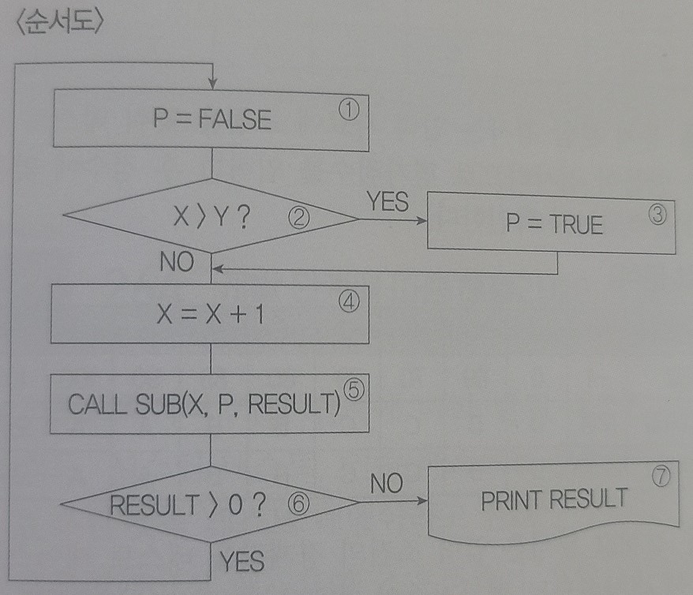
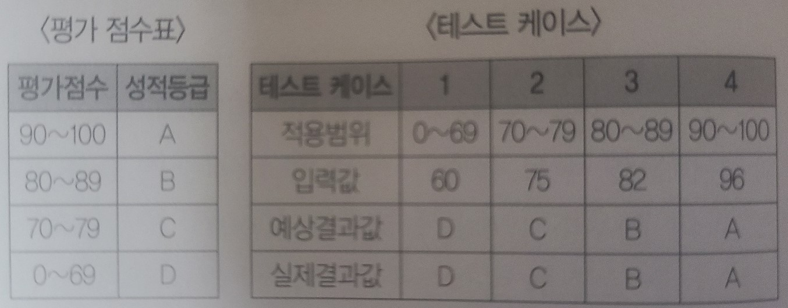
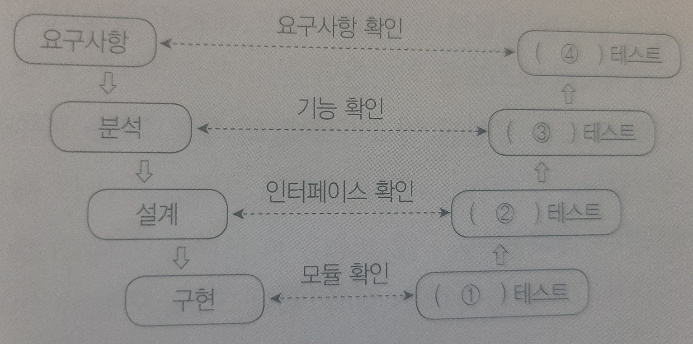
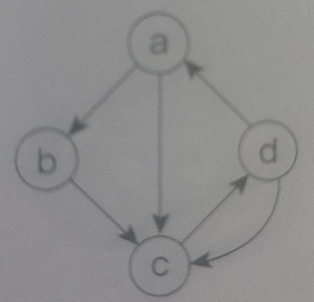

# 7장 애플리케이션 테스트 관리

```
1.
다음 설명의 괄호에 들어갈 가장 적합한 용어를 쓰시오.

()는 애플리케이션에 잠재되어 있는 결함을 찾아내는 일련의 행위 또는 절차로, 개발된 
소프트웨어가 고객의 요구사항을 만족시키는지 확인(Validation)하고 소프트웨어가 기능을 
정확히 수행하는지 검증(Verification)한다.

- ()
```

```
2.
애플리케이션 테스트에서 사용되는 살충제 패러독스(Pesticide Paradox)의 개념을 간략히 
서술하시오.

- ()
```

```
3.
애플리케이션을 실행하지 않고, 소스 코드에 대한 코딩 표준, 코딩 스타일, 코드 복잡도 및 남은 
결함을 발견하기 위하여 사용하는 테스트를 쓰시오.

- ()
```

```
4.
다음 설명의 괄호에 들어갈 가장 알맞은 용어를 쓰시오.

애플리케이션 테스트의 분류 중 테스트 기반에 따른 테스트는 () 기반 테스트, () 기반 테스트, 
() 기반 테스트로 구분한다.

- ()
```

```
5.
다음 설명의 괄호(1,2)에 들어갈 알맞은 용어를 쓰시오.

(1)은 작업 제품이 사용자의 요구에 적합한지 측정하는 것이고, (2)은 작업 제품이 개발자의 
기대를 충족시키는지를 측정하는 것이다.

- ()
```

```
6.
애플리케이션 테스트 중 시스템에 과다 정보량을 부과하여 과부하 시에도 시스템이 정상적으로 
작동되는지를 확인하는 테스트가 무엇인지 쓰시오.

- ()
```

```
7.
Module의 Source Code를 오픈시킨 상태에서 원시 코드의 논리적인 모든 경로를 테스트하여 
테스트 케이스를 설계하는 방법을 쓰시오.

- ()
```

```
8.
다음에 제시된 테스트 중 화이트박스 테스트의 종류를 모두 골라 기호(ㄱ~ㅂ)로 쓰시오.

ㄱ. 경계값 분석         ㄴ. 제어 구조 검사          ㄷ. 오류 예측 검사
ㄹ. 동치 분할 검사      ㅁ. 기초 경로 검사          ㅂ. 비교 검사

- ()
```

```
9.
테스트에 대한 다음 설명에서 각 지문(1~3)에 해당하는 커버리지(Coverage)를 <보기>에서 찾아 
기호(ㄱ~ㅂ)로 쓰시오.

1. 최소 한번은 모든 문장이 수행되도록 구성하는 검증 기준
2. 조건식이 참(True)/거짓(False)일 때 수행되도록 구성하는 검증 기준
3. 2번과 달리 조건식에 상관없이 개별 조건이 참(True)/거짓(False)일 때 수행되도록 구성하는 
검증 기준

<보기>
ㄱ. 다중 조건 검증 기준         ㄴ. 선택 검증 기준
ㄷ. 조건 검증 기준              ㄹ. 결정(분기) 검증 기준
ㅁ. 결정(분기)/조건 검증 기준   ㅂ. 구문(문장) 검증 기준

- ()
```

```
10.
다음은 화이트박스 테스트의 프로그램 제어흐름이다. 다음의 순서도를 참고하여 분기 커버리지로 
구성할 테스트 케이스를 작성하시오.

<작성예시>
(1) -> (2) -> (3)

() -> () -> () -> () ... -> () (전체 13개)
```


```
11.
소프트웨어가 수행할 특정 기능을 알기 위해서 각 기능이 완전히 작동되는 것을 입증하는 
테스트로, 동치 클래스 분해 및 경계값 분석 등을 이용하는 테스트 기법을 쓰시오.

- ()
```

```
12.
테스트 기법 중 다음과 같이 <평가 점수표>를 미리 정해 놓은 후 각 영역에 해당하는 입력값을 
넣고, 예상되는 출력값이 나오는지 실제 값과 비교하는 명세 기반 테스트 기법을 쓰시오.

- ()
```


```
13.
애플리케이션 테스트에 대한 다음 설명에서 괄호(1,2)에 들어갈 알맞은 테스트 종류를 쓰시오.

(1)은 입력 조건의 중간값보다 경계값에서 오류가 발생될 확률이 높다는 점을 이용한 검사 
기법이고, (2)는 입력 조건이 유효한 경우와 그렇지 않은 경우의 입력 자료의 개수를 균등하게 
정하는 검사 기법이다. 예를 들어 0 <= x <= 10과 같은 조건이 있을 때, (1)은 -1, 0, 10, 
11을 입력값으로, (2)는 0이상 10이하의 수 n개와 0미만 10초과의 수 n개를 입력값으로 정한다.

- ()
```

```
14.
테스트 기법 중 그래프를 활용하여 입력 데이터 간의 관계와 출력에 영향을 미치는 상황을 
체계적으로 분석한 다음 효용성이 높은 테스트 케이스를 선정하여 검사하는 기법을 <보기>에서 
찾아 쓰시오.

<보기>
Equivalence Partition       Boundary Value Analysis     Condition Test
Cause-Effect Graph          Error Guess                 Comparison Test
Base Path Test              Loop Test                   Data Flow Test

- ()
```

```
15.
다음은 진행 중인 프로젝트의 개발 수명 주기에 따른 테스트 방식을 표시한 V-모델이다. 괄호
(1~4)에 들어갈 가장 적합한 테스트 종류를 쓰시오.

- ()
```


```
16.
개별 모듈을 시험하는 것으로 모듈이 정확하게 구현되었는지, 예정한 기능이 제대로 
수행되었는지를 점검하는 것이 주목적인 테스트를 쓰시오.

- ()
```

```
17.
애플리케이션 테스트에 대한 다음 설명에서 각 지문(1,2)에 해당하는 용어를 <보기>에서 찾아 
기호(ㄱ~ㅂ)로 쓰시오.

1. 코딩 직후 소프트웨어 설계의 최소 단위인 모듈이나 컴포넌트에 초점을 맞춰 수행하는 
테스트로, 모듈 테스트라고도 불린다. 사용자의 요구사항을 기반으로 한 기능성 테스트를 
최우선으로 인터페이스, 외부적 I/O, 자료 구조, 독립적 기초 경로, 오류 처리 경로, 경계 조건 
등을 검사한다.
2. 모듈들을 결합하여 하나의 시스템으로 완성시키는 과정에서의 테스트를 의미하며, 모듈 간 
또는 컴포넌트 간의 인터페이스가 정상적으로 실행되는지 검사한다.

<보기>
ㄱ. 시스템 테스트           ㄴ. 인수 테스트             ㄷ. 알파 테스트
ㄹ. 단위 테스트             ㅁ. 통합 테스트             ㅂ. 회귀 테스트

- ()
```

```
18.
애플리케이션 테스트 중 개발된 소프트웨어가 해당 컴퓨터 시스템에서 완벽하게 수행되는가를 점검하는 테스트를 쓰시오.

- ()
```

```
19.
다음 설명에서 괄호(1,2)에 들어갈 알맞은 인수 테스트의 종류를 쓰시오.

(1)는 개발자의 장소에서 사용자가 개발자 앞에서 행하는 기법이며, 일반적으로 통제된 환경에서 
사용자와 개발자가 함께 확인하면서 수행되는 검사이고, (2)는 필드 테스팅(Field Testing)
이라고도 불리며 개발자 없이 고객의 사용 환경에 소프트웨어를 설치하여 수행되는 검사이다.

- ()
```

```
20.
하향식 통합에 있어서 모듈 간의 통합 시험을 위해 일시적으로 필요한 조건만을 가지고 임시로 
제공되는 시험용 모듈을 무엇이라고 하는지 쓰시오.

- ()
```

```
21.
애플리케이션 테스트에 관한 다음 설명에서 괄호(1,2)에 들어갈 알맞은 용어를 쓰시오.

- (1)는 소프트웨어의 하위 모듈에서 상위 모듈 방향으로 통합하면서 테스트하는 기법이다.
- 하나의 주요 제어 모듈과 관련된 종속 모듈의 그룹인 클러스터(Cluster)가 필요하다.
- 데이터의 입-출력을 확인하기 위해 더미 모듈인 (2)를 생성한다.

- ()
```

```
22.
하위 수준에서는 상향식 통합, 상위 수준에서는 하향식 통합을 사용하여 최적의 테스트를 
지원하며, 샌드위치식 통합 테스트 방법이라고도 불리는 테스트를 쓰시오.

- ()
```

```
23.
통합 테스트로 인해 변경된 모듈이나 컴포넌트에 새로운 오류가 있는지 확인하는 테스트로, 이미 
테스트된 프로그램의 테스팅을 반복하는 테스트를 쓰시오.

- ()
```

```
24.
구현된 소프트웨어가 사용자의 요구사항을 정확하게 준수했는지를 확인하기 위해 설계된 입력 값, 
실행 조건, 기대 결과 등으로 구성된 테스트 항목에 대한 명세서의 명칭을 쓰시오.

- ()
```

```
25.
테스트 케이스를 적용하는 순서에 따라 여러 개의 테스트 케이스들을 묶은 집합으로, 테스트 
케이스들을 적용하는 구체적인 절차를 명세한 문서는 무엇인지 쓰시오.

- ()
```

```
26.
다음이 설명하는 테스트 용어를 쓰시오.

- 테스트의 결과가 참인지 거짓인지를 판단하기 위해서 사전에 정의된 참값을 입력하여 비교하는 
기법 및 활동을 말한다.
- 종류에는 참, 샘플링, 휴리스틱, 일관성 검사가 존재한다.

- ()
```

```
27.
특정한 몇몇 테스트 케이스의 입력 값들에 대해서만 기대하는 결과를 제공하는 오라클로, 전수 
테스트가 불가능한 경우 사용하고, 경계값 및 구간별 예상값 결과 작성시 사용하는 오라클을 
쓰시오.

- ()
```

```
28.
애플리케이션의 처리량, 응답 시간, 경과 시간, 자원 사용률에 대해 가상의 사용자를 생성하고 
테스트를 수행함으로써 성능 목표를 달성하였는지를 확인하는 테스트 자동화 도구는 무엇인지 
쓰시오.

- ()
```

```
29.
테스트 하네스의 구성 요소 중 테스트 대상 컴포넌트나 모듈, 시스템에 사용되는 테스트 케이스의 
집합을 의미하는 요소를 쓰시오.

- ()
```

```
30.
다음 괄호에 공통으로 들어갈 가장 적합한 용어를 쓰시오.

()은 오류 발생, 작동 실패 등과 같이 소프트웨어가 개발자의 설계와 다르게 동작하거나 다른 
결과가 발생되는 것을 의미한다. 사용자가 예상한 결과와 실행 결과 간의 차이나 업무 내용과의 
불일치 등으로 인해 변경이 필요한 부분도 모두 ()에 해당된다.

- ()
```

```
31.
테스트를 완료한 후에는 발견된 결함에 대한 결함 관리 측정 지표의 속성 값들을 분석하고 향후 
어떤 결함이 발생할지를 추정해야 한다. 결함 관리 측정 지표 3가지가 무엇인지 쓰시오.

- ()
```

```
32.
결함은 소프트웨어가 개발자가 설계한 것과 다르게 동작하거나 다른 결과가 발생되는 것을 
의미한다. 결함 중 애플리케이션의 기획, 설계, 업무 시나리오 등의 단계에서 유입된 결함을 
무엇이라고 하는지 쓰시오.

- ()
```

```
33.
결함 우선순위는 발견된 결함 처리에 신속성을 나타내는 척도를 의미한다. 다음 중 결함 
우선순위의 분류에 해당하는 것을 모두 골라 기호(ㄱ~ㅇ)로 쓰시오.

ㄱ. 즉시 해결           ㄴ. 단순(Simple)    ㄷ. 높음(High)
ㄹ. 주요(Major)         ㅁ. 경미(Minor)     ㅂ 우선(First)
ㅅ. 대기                ㅇ. 결정적(Critical)

- ()
```

```
34.
애플리케이션 성능이란 최소한의 자원을 사용하여 최대한 많은 기능을 신속하게 처리하는 정도를 
나타낸다. 애플리케이션 성능 측정의 지표에 대한 다음 설명에서 괄호(1~3)에 들어갈 알맞은 
용어를 쓰시오.

- ()
```
<table border="1">
    <tr>
        <td>(1)
        </td>
        <td>일정 시간 내에 애플리케이션이 처리하는 일의 양
        </td>
    </tr>
    <tr>
        <td>(2)
        </td>
        <td>애플리케이션에 요청을 전달한 시간부터 응답이 도착할 때까지 걸린 시간
        </td>
    </tr>
    <tr>
        <td>(3)
        </td>
        <td>애플리케이션에 작업을 의뢰한 시간부터 처리가 완료될 때까지 걸린 시간
        </td>
    </tr>
    <tr>
        <td>자원 활용률
        </td>
        <td>애플리케이션이 의뢰한 작업을 처리하는 동안의 CPU, 메모리, 네트워크 등의 자원 사용률
        </td>
    </tr>
</table>

```
35.
서버 모니터링, Drag&Drop 등 사용자의 편리성이 강화된 부하 테스트 도구로, HTTP, JDBC 등 
다양한 프로토콜을 지원하는 성능 테스트 도구를 <보기>에서 찾아 쓰시오.

<보기>
Scouter         Gradle          LoadUI          Perforce
Mom             Jenkins         Slipwire        Bazaar

- ()
```

```
36.
다음 중 시스템 모니터링 도구를 모두 찾아 기호(ㄱ~ㅂ)로 쓰시오.

ㄱ. Valgrind        ㄴ. Zabbix          ㄷ. Cppcheck
ㄹ. Pmd             ㅁ. Avalanche       ㅂ. Scouter

- ()
```

```
37.
알고리즘을 수행하기 위해 프로세스가 수행하는 연산 횟수를 수치화한 것을 의미하는 용어를 쓰시오.

- ()
```

```
38.
빅오 표기법(Big-O Notation)에서 알고리즘의 수행시간이 입력 데이터 수와 관계 없이 
일정하다는 것을 의미하는 알고리즘 시간 복잡도를 쓰시오.

- ()
```

```
39.
제어 흐름 그래프가 다음과 같을 때 McCabe의 cyclomatic 수가 얼마인지 쓰시오.

- ()
```


```
40.
누구나 쉽게 이해하고 수정 및 추가할 수 있는 단순, 명료한 코드, 즉 잘 작성된 코드를 
의미하는 용어를 쓰시오.

- ()
```

```
41.
다음에서 설명하는 클린 코드 작성 원칙을 쓰시오.

- 한 번에 한 가지 처리만 수행한다.
- 클래스/메서드/함수를 최소 단위로 분리한다.

- ()
```

```
42.
소스 코드 품질 분석 도구에 대한 다음 설명에서 괄호(1,2)에 들어갈 알맞은 용어를 쓰시오.

- (1) 도구는 작성하 소스 코드를 실행하지 않고 코딩 표준이나 코딩 스타일, 결함 등을 확인하는 코드 분석 도구이다.
- (2) 도구는 소스 코드를 직접 실행하여 프로그램의 동작이나 반응을 추적하고 보고하는 분석 도구로, 프로그램 모니터링 기능이나 스냅샷 생성 기능들을 포함하고 있다.

- ()
```


```
7장 답(역순)
42. (정적 분석, 동적 분석)
41. (단순성)
40. (클린 코드)
39. (4)
38. ( O(1) )
37. (시간 복잡도)
36. (ㄴ, ㅂ)
35. (LoadUI)
34. (처리량, 응답 시간, 경과 시간)
33. (ㄱ, ㄷ, ㅅ, ㅇ)
32. (기능 결함)
31. (결함 분포, 결함 추세, 결함 에이징)
30. (결함)
29. (테스트 슈트)
28. (성능 테스트 도구)
27. (샘플링 오라클)
26. (테스트 오라클)
25. (테스트 시나리오)
24. (테스트 케이스)
23. (회귀 테스트)
22. (혼합식 통합 테스트)
21. (상향식 통합 테스트, 드라이버)
20. ( 스텁(Stub) )
19. (알파 테스트, 베타 테스트)
18. (시스템 테스트)
17. (ㄹ, ㅁ)
16. (단위 테스트)
15. (단위, 통합, 시스템, 인수)
14. (Cause-Effect Graph)
13. (경계값 분석, 동치 분할 검사)
12. (동치 분할 검사)
11. (블랙박스 테스트)
10. (1->2->3->4->5->6->7, 1->2->4->5->6->1 or 1->2->3->4->5->6->1, 1->2->4->5->6->7)
9. ( (ㅂ), (ㄹ), (ㄷ) )
8. (ㄴ, ㅁ)
7. (화이트박스 테스트)
6. (강도 테스트)
5. (확인, 검증)
4. (명세, 구조, 경험)
3. (정적 테스트)
2. (동일한 테스트 케이스로 동일한 테스트를 반복하면 더 이상 결함이 발견되지 않는 현상)
1. (애플리케이션 테스트)
```