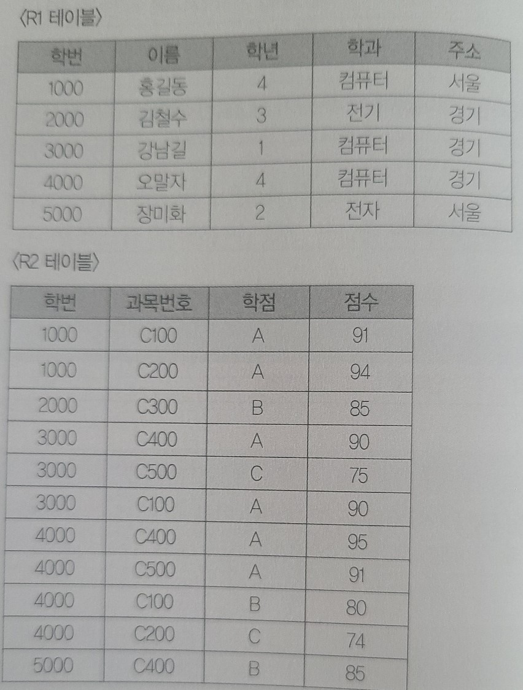
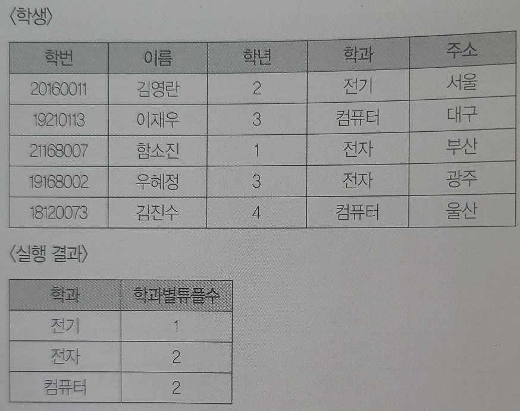
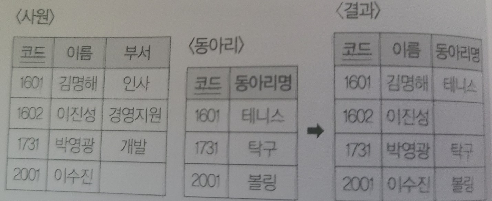

# 8장 SQL 응용

```
1.
데이터 언어는 데이터베이스를 구축하고 이용하기 위한 데이터베이스 관리 시스템과의 통신 
수단이다. 데이터 언어는 데이터베이스의 구조를 정의 및 변경하는 DDL, 데이터를 조작하는 DML, 
보안 및 무결성, 병행 제어 등을 위한 DCL로 구분된다. 다음 <보기>에서 DDL에 속하는 
명령어들을 골라 적으시오.

<보기>
Commit, Table, Insert, Domain, Update, Query, Create, Trigger, Alter, Rollback, Procedure, Drop, Select, Grant, Delete, Revoke, View

- ()
```

```
2.
다음은 기본키인 '직위' 속성의 값으로 "사원", "대리", "과장", "부장", "이사", "사장"만을 허용하고, 기본 값으로 "사원"을 취하는 도메인 무결성 제약 조건을 설정하기 위한 SQL문이다. 괄호를 채워 SQL문을 완성하시오.

<SQL문>
CREATE DOMAIN 직위 VARCHAR2(10)
(1)
(2) VALID-직위 (3)

- ()
```

```
3.
<사원> 테이블을 정의하는 SQL문이다. 아래의 <요구사항>을 만족하도록 괄호(1,2)에 적합한 
명령을 넣어 SQL문을 완성하시오.

<요구사항>
- '근무지번호'는 <근무지> 테이블의 '근무지번호'를 참조하는 외래키이다.
- <근무지> 테이블에서 '근무지번호'가 삭제되면 <사원> 테이블의 '근무지번호'도 삭제된다.

<SQL문>
CREATE TABLE 사원
    (사원번호 NUMBER(4) PRIMARY KEY,
    사원명 VARCHAR2(10),
    근무지번호 NUMBER(2) ( 1 ) 근무지
        ON DELETE ( 2 ));

- ()
```

```
4.
아래의 <요구사항>을 만족하는 뷰 <CC>를 정의하는 SQL문을 작성하시오.

<요구사항>
- <Course>와 <Instructor>릴레이션을 이용한다.
- <Course>의 'instructor' 속성 값과 <Instructor>의 'id' 속성이 같은 자료에 대한 view를 
정의한다.
- <CC> 뷰는 'ccid', 'ccname', 'instname' 속성을 가진다.
- <CC> 뷰는 <Course> 테이블의 'id', 'name', <Instructor> 테이블의 'name' 속성을 
사용한다.

- ()
```

```
5.
다음 <student> 테이블을 참고하여 'name' 속성으로 'idx_name'이라는 인덱스를 생성하는 SQL문을 작성하시오.

- ()
```
- student
<table border="1">
    <tr>
        <th>stid
        </th>
        <th>name
        </th>
        <th>score
        </th>
        <th>deptid
        </th>
    </tr>
    <tr>
        <td>2001
        </td>
        <td>brown
        </td>
        <td>85
        </td>
        <td>PE01
        </td>
    </tr>
    <tr>
        <td>2002
        </td>
        <td>white
        </td>
        <td>45
        </td>
        <td>EF03
        </td>
    </tr>
    <tr>
        <td>2003
        </td>
        <td>black
        </td>
        <td>67
        </td>
        <td>UW11
        </td>
    </tr>
</table>

```
6.
다음 <속성 정의서>를 참고하여 <학생> 테이블에 20자의 가변 길이를 가진 '주소' 속성을 
추가하는 <SQL문>을 완성하시오. (단, SQL문은 ISO/IEC 9075 표준을 기반으로 작성하시오.)

<SQL 문>
( 1 ) TABLE 학생 ( 2 ) 주소 VARCHAR(20);

- ()
```
<table border="1">
    <tr>
        <th>속성명
        </th>
        <th>데이터타입
        </th>
        <th>제약조건
        </th>
        <th>테이블명
        </th>
    </tr>
    <tr>
        <td>학번
        </td>
        <td>CHAR(10)
        </td>
        <td>UNIQUE
        </td>
        <td>학생
        </td>
    </tr>
    <tr>
        <td>이름
        </td>
        <td>VARCHAR(8)
        </td>
        <td>NOT NULL
        </td>
        <td>학생
        </td>
    </tr>
    <tr>
        <td>주민번호
        </td>
        <td>CHAR(13)
        </td>
        <td>
        </td>
        <td>학생
        </td>
    </tr>
    <tr>
        <td>학과
        </td>
        <td>VARCHAR(16)
        </td>
        <td>FOREIGN KEY
        </td>
        <td>학생
        </td>
    </tr>
    <tr>
        <td>학년
        </td>
        <td>INT
        </td>
        <td>
        </td>
        <td>학생
        </td>
    </tr>
</table>

```
7.
다음은 뷰(View)를 제거하는 SQL문이다. SQL문이 완성되도록 괄호에 적합한 명령어를 쓰시오.

() VIEW V_Emp;

- ()
```

```
8.
SQL 명령어에 관한 다음 설명에서 각 번호(1~3)에 들어갈 알맞은 용어를 <보기>에서 찾아 쓰시오.

DCL은 데이터의 보안, 무결성, 회복, 병행 수행 제어 등을 정의하는 데 사용되는 언어로, 데이터 
관리를 목적으로 사용한다.
1 - 데이터베이스 조작 작업을 물리적 디스크에 반영한 후 정상적으로 완료되었음을 알림
2 - 데이터베이스 조작 작업이 비정상적으로 종료되었을 때 원래의 상태로 복구함
3 - 데이터베이스 사용자에게 사용 권한을 부여함

<보기>
CREATE, COMMIT, ALTER, INSERT, DROP, GRANT, REVOKE, SELECT, ROLLBACK, DELETE

- ()
```

```
9.
데이터를 제어하는 DCL의 하나인 GRANT의 기능에 대해 간략히 서술하시오.

- ()
```

```
10.
DBA가 사용자 PARK에게 테이블 [STUDENT]의 데이터를 갱신할 수 있는 시스템 권한을 부여하는 
SQL문을 작성하려고 한다. 다음 <SQL문>을 완성하시오.

<SQL문>
( 1 ) UPDATE ( 2 ) STUDENT TO PARK;

- ()
```

```
11.
데이터를 제어하는 DCL의 하나인 ROLLBACK에 대해 간략히 서술하시오.

- ()
```

```
12.
SQL에 대한 다음 설명에서 괄호에 들어갈 알맞은 답을 쓰시오.

트랜잭션 수행 중에 ROLLBACK이 발생하는 경우 수행중이던 트랜잭션은 모두 취소된다. 하지만 
트랜잭션 중간에 () 명령어를 활용하여 저장점을 지정하는 경우 해당 지점까지 수행했던 작업은 
보존되고, 이후 작업만 취소된다.

- ()
```

```
13.
다음 <보기>에서 DML(Data Manipulation Language)에 속하는 명령어들을 골라 적으시오.

<보기>
Commit, Table, Insert, Domain, Update, Query, Create, Trigger, Alter, Rollback, Procedure, Drop, Select, Grant, Delete, Revoke, View

- ()
```

```
14.
다음 <처리 조건>에 부합하는 SQL문을 작성하시오.

<처리 조건>
1. 테이블명은 학생으로 정의한다.
2. 학생 테이블의 구조는 아래와 같다.
3. 학생 테이블에 학번이 22170823, 성명이 '한국산', 학년이 3, 과목이 '경영학개론', 
연락처가 '?-1234-1234'인 학생의 정보를 입력하시오.
4. 명령문 마지막의 세미콜론(;)은 생략이 가능하다.
5. 인용 부호가 필요한 경우 작은 따옴표('')를 사용한다.

- ()

```
<table border="1">
    <tr>
        <th>속성명
        </th>
        <th>데이터 타입
        </th>
        <th>비고
        </th>
    </tr>
    <tr>
        <td>학번
        </td>
        <td>INT
        </td>
        <td>PRIMARY KEY
        </td>
    </tr>
    <tr>
        <td>성명
        </td>
        <td>VARCHAR(20)
        </td>
        <td>
        </td>
    </tr>
    <tr>
        <td>학년
        </td>
        <td>INT
        </td>
        <td>
        </td>
    </tr>
    <tr>
        <td>과목
        </td>
        <td>VARCHAR(20)
        </td>
        <td>
        </td>
    </tr>
    <tr>
        <td>연락처
        </td>
        <td>VARCHAR(20)
        </td>
        <td>
        </td>
    </tr>
</table>

```
15.
<학생> 테이블에서 '이름'이 '민수'인 튜플을 삭제하고자 한다. 다음 <처리 조건>을 참고하여 
SQL문을 작성하시오.

<처리 조건>
- 명령문 마지막의 세미콜론(;)은 생략이 가능하다.
- 인용 부호가 필요한 경우 작은 따옴표('')를 사용한다.

- ()
```

```
16.
SQL과 관련한 다음 설명에서 괄호(1,2)에 들어갈 알맞은 답을 쓰시오.

UPDATE문은 테이블에 있는 튜플의 내용을 갱신할 때 사용하는 명령문으로, DML에 해당한다. 다른
 DML로는 INSERT, DELETE가 있으며, 각각 새로운 튜플을 삽입하거나 삭제할 때 사용한다.

다음은 <학부생> 테이블에서 '입학생수'가 300 이상인 튜플의 '학과번호'를 999로 갱신하는 
SQL문이다.

( 1 ) 학부생 ( 2 ) 학과번호 = 999 WHERE 입학생수 >= 300;

- ()

```
- <학부생> 테이블
<table border="1">
    <tr>
        <th>학부
        </th>
        <th>학과번호
        </th>
        <th>입학생수
        </th>
        <th>담당관
        </th>
    </tr>
    <tr>
        <td>정경대학
        </td>
        <td>110
        </td>
        <td>300
        </td>
        <td>김해율
        </td>
    </tr>
    <tr>
        <td>공과대학
        </td>
        <td>310
        </td>
        <td>250
        </td>
        <td>이성관
        </td>
    </tr>
    <tr>
        <td>인문대학
        </td>
        <td>120
        </td>
        <td>400
        </td>
        <td>김해율
        </td>
    </tr>
    <tr>
        <td>정경대학
        </td>
        <td>120
        </td>
        <td>300
        </td>
        <td>김성수
        </td>
    </tr>
    <tr>
        <td>인문대학
        </td>
        <td>420
        </td>
        <td>180
        </td>
        <td>이율해
        </td>
    </tr>
</table>

```
17.
사원(EMPLOYEE) 테이블에 기획부 직원이 100명, 생산부 직원이 200명, 홍보부 직원이 150명 
있다고 할 때, 다음 SQL문의 실행 결과로 표시되는 튜플의 수를 쓰시오(단, DEPT 필드는 
부서명을 의미한다).

SELECT DEPT FROM EMPLOYEE;

- ()
```

```
18.
사원(EMPLOYEE) 테이블에 기획부 직원이 100명, 생산부 직원이 200명, 홍보부 직원이 150명 
있다고 할 때, 다음 SQL문의 실행 결과로 표시되는 튜플의 수를 쓰시오(단, DEPT 필드는 
부서명을 의미한다).

SELECT DISTINCT DEPT FROM EMPLOYEE;

- ()
```

```
19.
다음 <학생> 테이블을 참고하여 <처리 조건>에서 요구하는 SQL문을 작성하시오.

<처리 조건>
- 3, 4학년의 학번, 이름을 조회한다.
- IN 예약어를 사용해야 한다.
- 속성명 아래의 괄호는 속성의 자료형을 의미한다.

- ()

```
- <학생>
<table border="1">
    <tr>
        <th>학번(varchar)
        </th>
        <th>이름(varchar)
        </th>
        <th>학년(number)
        </th>
        <th>수강과목(varchar)
        </th>
        <th>점수(number)
        </th>
        <th>연락처(varchar)
        </th>
    </tr>
    <tr>
        <td>20E0232
        </td>
        <td>김인영
        </td>
        <td>3
        </td>
        <td>세무행정
        </td>
        <td>4.5
        </td>
        <td>010-5412-4544
        </td>
    </tr>
    <tr>
        <td>19D0024
        </td>
        <td>이성화
        </td>
        <td>2
        </td>
        <td>토목개론
        </td>
        <td>3
        </td>
        <td>010-1548-4796
        </td>
    </tr>
    <tr>
        <td>20E0135
        </td>
        <td>성유수
        </td>
        <td>4
        </td>
        <td>실용법학
        </td>
        <td>3.5
        </td>
        <td>010-9945-7411
        </td>
    </tr>
    <tr>
        <td>20E0511
        </td>
        <td>우인혁
        </td>
        <td>1
        </td>
        <td>데이터론
        </td>
        <td>2
        </td>
        <td>010-3451-4972
        </td>
    </tr>
</table>

```
20.
다음은 <성적> 테이블에서 이름(name)과 점수(score)를 조회하되, 점수를 기준으로 내림차순 
정렬하여 조회하는 <SQL문>이다. 괄호(1~3)에 알맞은 답을 적어 <SQL문>을 완성하시오.

<SQL문>
SELECT name, score
FROM 성적
( 1 ) BY ( 2 ) ( 3 )

- ()
```
<table border="1">
    <tr>
        <th>name
        </th>
        <th>class
        </th>
        <th>score
        </th>
    </tr>
    <tr>
        <td>정기찬
        </td>
        <td>A
        </td>
        <td>85
        </td>
    </tr>
    <tr>
        <td>이영호
        </td>
        <td>C
        </td>
        <td>74
        </td>
    </tr>
    <tr>
        <td>환정형
        </td>
        <td>C
        </td>
        <td>95
        </td>
    </tr>
    <tr>
        <td>김지수
        </td>
        <td>A
        </td>
        <td>90
        </td>
    </tr>
    <tr>
        <td>최은영
        </td>
        <td>B
        </td>
        <td>82
        </td>
    </tr>
</table>

```
21.
다음 <SQL문>을 수행했을 때 조회되는 튜플의 개수는?

<SQL문>
SELECT 이름
FROM R1
WHERE 학번 IN
    (SELECT 학번
    FROM R2
    WHERE 과목번호 = 'C100');

- ()
```


```
22.
<EMP_TBL> 테이블을 참고하여 <SQL문>의 실행 결과를 쓰시오.

<SQL문>
SELECT COUNT(*) FROM EMP_TBL WHERE EMPNO > 100 AND SAL >= 3000 OR EMPNO = 200;

- ()
```
- <EMP_TBL>
<table border="1">
    <tr>
        <th>EMPNO
        </th>
        <th>SAL
        </th>
    </tr>
    <tr>
        <td>100
        </td>
        <td>1500
        </td>
    </tr>
    <tr>
        <td>200
        </td>
        <td>3000
        </td>
    </tr>
    <tr>
        <td>300
        </td>
        <td>2000
        </td>
    </tr>
</table>

```
23.
질의 내용에 대한 SQL문을 작성하시오.

<질의>
학생 테이블에서 학과별 튜플의 개수를 검색하시오.
(단, 아래의 실행 결과가 되도록 한다.)

<처리 조건>
- WHERE 조건절은 사용할 수 없다.
- GROUP BY는 반드시 포함한다.
- 집계합수(Aggregation Function)을 적용한다.
- 학과별튜플수 컬럼이름 출력에 Alias(AS)를 활용한다.
- 문장 끝의 세미콜론(;)은 생략해도 무방하다.
- 인용부호 사용이 필요한 경우 단일 따옴표('' : Single Quotation)를 사용한다.

- ()
```


```
24.
다음 <SQL문>과 테이블 R1, R2를 참조하여 괄호에 들어갈 알맞은 답을 쓰시오.

<SQL문>
(SELECT 학번 FROM R1)
INTERSECT
(SELECT 학번 FROM R2)

- ()
```

- <R1 테이블>
<table border="1">
    <tr>
        <th>학번
        </th>
        <th>학점 수
        </th>
    </tr>
    <tr>
        <td>20201111
        </td>
        <td>15
        </td>
    </tr>
    <tr>
        <td>20202222
        </td>
        <td>20
        </td>
    </tr>
</table>

- <R2 테이블>
<table border="1">
    <tr>
        <th>학번
        </th>
        <th>과목번호
        </th>
    </tr>
    <tr>
        <td>20202222
        </td>
        <td>CS200
        </td>
    </tr>
    <tr>
        <td>20203333
        </td>
        <td>CS300
        </td>
    </tr>
</table>

- <결과>
<table border="1">
    <tr>
        <th>학번
        </th>
    </tr>
    <tr>
        <td>( )
        </td>
    </tr>
</table>

```
25.
SQL(Structured Query Language)에 관한 다음 설명에서 괄호에 공통으로 들어갈 알맞은 용어를 
쓰시오.

- ()은 2개의 릴레이션에서 연관된 튜플들을 결합하여, 하나의 새로운 릴레이션을 반환한다.
- ()은 크게 INNER ()과 OUTER ()으로 구분된다.
- ()은 일반적으로 FROM절에 기술하지만, 릴레이션이 사용되는 곳 어디서나 사용할 수 있다.

- ()
```

```
26.
다음은 <R1>과 <R2>의 테이블에서 '이름'이 "강남길"인 튜플의 '과목번호'와 '과목이름'을 
구하는 <SQL문>이다. 올바른 결과가 나올 수 있도록 괄호에 들어갈 알맞은 조건식을 쓰시오.

<SQL문>
SELECT 과목번호, 과목이름 FROM R1, R2 WHERE () AND R1.이름 = '강남길';

- ()
```
- <R1 테이블>
<table border="1">
    <tr>
        <th>학번
        </th>
        <th>이름
        </th>
        <th>학년
        </th>
        <th>학과
        </th>
        <th>주소
        </th>
    </tr>
    <tr>
        <td>1000
        </td>
        <td>홍길동
        </td>
        <td>1
        </td>
        <td>컴퓨터공학
        </td>
        <td>서울
        </td>
    </tr>
    <tr>
        <td>2000
        </td>
        <td>김철수
        </td>
        <td>1
        </td>
        <td>전기공학
        </td>
        <td>경기
        </td>
    </tr>
    <tr>
        <td>3000
        </td>
        <td>강남길
        </td>
        <td>2
        </td>
        <td>전자공학
        </td>
        <td>경기
        </td>
    </tr>
    <tr>
        <td>4000
        </td>
        <td>오말자
        </td>
        <td>2
        </td>
        <td>컴퓨터공학
        </td>
        <td>경기
        </td>
    </tr>
    <tr>
        <td>5000
        </td>
        <td>장미화
        </td>
        <td>3
        </td>
        <td>전자공학
        </td>
        <td>서울
        </td>
    </tr>
</table>

- <R2 테이블>
<table border="1">
    <tr>
        <th>학번
        </th>
        <th>과목번호
        </th>
        <th>과목이름
        </th>
        <th>성적
        </th>
        <th>점수
        </th>
    </tr>
    <tr>
        <td>1000
        </td>
        <td>C100
        </td>
        <td>컴퓨터구조
        </td>
        <td>A
        </td>
        <td>91
        </td>
    </tr>
    <tr>
        <td>2000
        </td>
        <td>C200
        </td>
        <td>데이터베이스
        </td>
        <td>A+
        </td>
        <td>99
        </td>
    </tr>
    <tr>
        <td>3000
        </td>
        <td>C100
        </td>
        <td>컴퓨터구조
        </td>
        <td>B+
        </td>
        <td>89
        </td>
    </tr>
    <tr>
        <td>3000
        </td>
        <td>C200
        </td>
        <td>데이터베이스
        </td>
        <td>B
        </td>
        <td>85
        </td>
    </tr>
    <tr>
        <td>4000
        </td>
        <td>C200
        </td>
        <td>데이터베이스
        </td>
        <td>A
        </td>
        <td>93
        </td>
    </tr>
    <tr>
        <td>4000
        </td>
        <td>C300
        </td>
        <td>운영체제
        </td>
        <td>B+
        </td>
        <td>88
        </td>
    </tr>
    <tr>
        <td>5000
        </td>
        <td>C300
        </td>
        <td>운영체제
        </td>
        <td>B
        </td>
        <td>82
        </td>
    </tr>
</table>

```
27.
다음 <사원> 테이블과 <동아리> 테이블을 조인(Join)한 <결과>를 확인하여 <SQL문>의 괄호(1,2)에 들어갈 알맞은 답을 쓰시오.

<SQL문>
SELECT a.코드, 이름, 동아리명 FROM 사원 a LEFT OUTER JOIN 동아리 b ( 1 ) a.코드=b.( 2 );

- ()
```


```
28.
데이터베이스 시스템에서 삽입, 갱신, 삭제 등의 이벤트가 발생할 때마다 관련 작업이 자동으로 
수행되는 절차형 SQL을 쓰시오.

- ()
```

```
29.
DBMS에서 쿼리의 실행 결과가 저장되어 있는 메모리를 가리키는 포인터(Pointer)로, 패치된 
튜플의 수 등을 간편하게 조회할 수 있도록 다양한 속성을 제공하는 이것을 가리키는 용어를 
쓰시오.

- ()
```

```
30.
JAVA Standard Edition에 포함되어 있는 DBMS 접속 기술로, 1997년 2월 Sun 
Microsystems에서 개발하였으며, Java 언어로 다양한 종류의 데이터베이스에 접속하고 SQL문을 
수행할 때 사용되는 표준 API는 무엇인지 쓰시오.

- ()
```

```
31.
데이터베이스 접속 기술 중 동적 SQL(Dynamic SQL)에 대해 간략히 서술하시오.

- ()
```

```
32.
객체와 관계형 데이터베이스의 데이터를 연결하는 ORM 기술을 제공하는 프레임워크는 언어별로 
다양하게 존재한다. 다음 <보기>에서 ORM 프레임워크에 해당하는 소프트웨어를 모두 골라 
쓰시오.

<보기>
JPA         JDBC        iBatis      Eclipse     Hibernate
ODBC        Doctrine    Oracle      PL/SQL

- ()
```

```
33.
옵티마이저의 한 종류로, 쿼리의 입-출력 속도, CPU 사용량, 블록 개수, 개체의 속성, 튜플 
개수 등을 종합하여 산출되는 비용을 기반으로 쿼리가 가장 효율적으로 수행되는 최적의 경로를 
찾는 모듈을 영문 약어로 쓰시오.

- ()
```


```
8장 답 (역순)
33. ( CBO(Cost Based Optimizer) )
32. (Hibernate, JPA, Doctrine)
31. (다양한 조건에 따라 SQL 구문을 동적으로 변경하여 처리할 수 있는 SQL 처리 방식)
30. (JDBC)
29. ( 커서(Cursor) )
28. ( 트리거(Trigger) )
27. (ON, 코드)
26. ( R1.학번=R2.학번 )
25. (JOIN)
24. (20202222)
23. ( SELECT 학과, count(*) AS 학과별튜플수 FROM 학생 GROUP BY 학과; )
22. (1)
21. (3)
20. (ORDER, score DESC)
19. ( SELECT 학번, 이름 FROM 학생 WHERE 학년 IN (3, 4) )
18. (3)
17. (450)
16. (UPDATE, SET)
15. ( DELETE FROM 학생 WHERE 이름='민수'; )
14. ( INSERT INTO 학생 VALUES (22170823, '한국산', 3, '경영학개론', '?-1234-1234') )
13. (Insert, Update, Select, Delete)
12. (SAVEPOINT)
11. (변경되었으나 아직 COMMIT되지 않은 모든 내용들을 취소하고 데이터베이스를 이전 상태로 
되돌리는 명령어)
10. (GRANT, ON)
9. (데이터베이스 관리자가 데이터베이스 사용자에게 권한을 부여하는 데 사용하는 명령어)
8. (COMMIT, ROLLBACK, GRANT)
7. (DROP)
6. (ALTER, ADD)
5. ( CREATE INDEX idx_name ON student(name); )
4. ( CREATE VIEW CC(ccid, ccname, instname) AS SELECT Course.id, Course.name, 
Instructor.name FROM Course, Instructor WHERE Course.instructor = Instructor.id; )
3. (FOREIGN KEY REFERENCES, CASCADE)
2. ( DEFAULT "사원", CONSTRAINT, CHECK(VALUE IN('사원', '대리', '과장', '부장', 
'이사', '사장')) ) 
1. (Create, Drop, Alter)
```