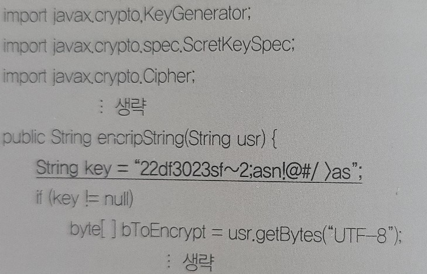

# 9장 소프트웨어 개발 보안 구축

```
1.
실무적으로 검증된 개발 보안 방법론 중 하나로, SW 보안의 모범 사례를 SDLC(Software 
Development Life Cycle)에 통합한 소프트웨어 개발 보안 생명주기 방법론은 무엇인지 쓰시오.

- ()
```

```
2.
데이터베이스 보안에서 가용성(Availability)에 대해 간략히 서술하시오.

- ()
```

```
3.
소프트웨어의 구현 단계에서 발생할 수 있는 보안 취약점들을 최소화하기 위해 보안 요소들을 
고려하며 코드를 구현하는 것으로, 보안 취약점을 사전에 대응하여 안전성과 신뢰성을 확보하기 
위해 사용되는 것은 무엇인지 쓰시오.

- ()
```

```
4.
다음 설명의 괄호에 공통적으로 들어갈 용어를 쓰시오.

- ()는 세션의 연결과 연결로 인해 발생하는 정보를 관리하는 것을 의미한다.
- 소프트웨어 개발 과정 중 요구사항 분석 및 설계 단계에서 진단해야 하는 보안 점검 내용이다.
- ()의 보안 약점에는 불충분한 세션 관리, 잘못된 세션에 의한 정보 노출이 있다.

- ()
```

```
5.
경로 탐색 시 '/', '\', '..' 등의 기호를 사용하여 허가되지 않은 서버 자원에 접근하는 
방식을 가리키는 용어를 쓰시오.

- ()
```

```
6.
보안 위협의 하나인 SQL Injection에 대해 간략히 서술하시오.

- ()
```

```
7.
웹페이지에 악의적인 스크립트를 포함시켜 사용자 측에서 실행되게 유도함으로써, 정보 유출 등의 
공격을 유발할 수 있는 보안 취약점을 쓰시오.

- ()
```

```
8.
할당된 메모리의 범위를 벗어난 위치에서 자료를 읽거나 쓰는 등 메모리를 다루는데 오류가 
발생하여 잘못된 동작을 하는 프로그램 취약점을 쓰시오.

- ()
```

```
9.
보안 기능을 제공하는 프로토콜 중 데이터를 송-수신하는 두 컴퓨터 사이에 위치하여 인증, 
암호화, 무결성을 보장하는 표준 프로토콜을 쓰시오.

- ()
```

```
10.
다음 JAVA 코드에서 밑줄로 표시된 부분에는 어떤 보안 약점이 존재하는지 쓰시오(단, key는 
암호화 키를 저장하는 변수이다.).

- ()
```


```
11.
다음의 설명에 가장 부합하는 보안 약점을 쓰시오.

- 검사 시점과 사용 시점을 고려하지 않고 코딩하는 경우 발생하는 보안 약점이다.
- 프로세스가 가진 자원 정보와 실제 자원 상태가 일치하지 않는 동기화 오류나 교착상태 등이 
발생할 수 있다.
- 코드 내에 동기화 구문을 사용하여 해당 자원에는 한 번에 하나의 프로세스만 접근 가능하도록 
구성함으로써 방지할 수 있다.

- ()
```

```
12.
포인터에 NULL이 저장되어 있을 때 이를 참조할 경우 발생하며, 주로 함수의 반환값을 
참조하도록 코딩한 경우 함수가 오류로 인해 NULL을 반환하면서 발생하는 보안 약점을 
<보기>에서 찾아 쓰시오.

<보기>
- 부적절한 자원 해제
- 해제된 자원 사용
- 널 포인터 역참조
- 초기화되지 않은 변수 사용

- ()
```

```
13.
메모리상에서 프로그램의 복귀 주소와 변수 사이에 특정 값을 저장해 두었다가 그 값이 
변경되었을 경우 오버플로우 상태로 가정하여 프로그램 실행을 중단하는 기술은 무엇인지 쓰시오.

- ()
```

```
14.
다음 중 Java에서 사용하는 접근 제어자에 해당하는 예약어를 모두 골라 고르시오.

internal, private, default, restrict, public, cascade, protected, abstract, interface

- ()
```

```
15.
개인키 암호화(Private Key Encryption) 기법은 동일한 키로 데이터를 암호화하고 복호화하는 
암호화 기법이다. 다음 중 개인키 암호화 알고리즘에 해당하는 것을 모두 골라 기호(ㄱ~ㅇ)로 
쓰시오.

ㄱ. DSA         ㄴ. AES         ㄷ. RSA         ㄹ. RC4
ㅁ. ECC         ㅂ. MD5         ㅅ. SEED        ㅇ. LAND

- ()
```

```
16.
다음 설명에 해당하는 암호화 기법을 쓰시오.

- 공개키(Public Key)는 사용자에게 공개하고, 복호화키(Secret Key)는 비공개한다.
- 송신자는 수신자의 공개키로 문서를 암호화한다.
- 널리 알려진 알고리즘은 RSA가 있다.

- ()
```

```
17.
128비트의 블록 크기를 갖는 128비트 및 256비트 수준의 국산 대칭 키 블록 암호화 
알고리즘으로, 2000년까지 미국이 자국 기술보호 등을 이유로 해외로 수출되는 암호 기술의 보안 
수준을 40비트로 제한하자 1999년 한국정보보호진흥원(현재의 한국인터넷진흥원)에서 국내 
보안수준 향상을 위해 개발한 암호화 알고리즘의 이름을 쓰시오.

- ()
```

```
18.
2004년 우리나라에서 국가정보원과 산학연협회가 개발한 블록 암호화 알고리즘으로, AES 암호화 
알고리즘의 규격을 따르며 학계, 연구소, 정부 기관의 앞 글자를 따 만들어진 암호화 알고리즘의 
이름을 쓰시오.

- ()
```

```
19.
1974년 IBM이 개발하고 1975년 NBS에 의해 미국의 국가 표준으로 발표된 암호화 알고리즘으로, 
블록 크기는 64비트, 키 길이는 56비트이며 16회의 라운드를 수행한다. 컴퓨터 기술이 발달함에 
따라 해독이 쉬워지면서 미국의 국가 표준이 2001년 AES로 대체된 암호화 알고리즘을 쓰시오.

- ()
```

```
20.
보안 및 암호화와 관련된 다음 설명에 해당하는 용어를 쓰시오.

- 2001년 미국 표준 기술 연구소(NIST)에서 발표한 대칭키 암호화 알고리즘이다.
- DES의 한계를 느낀 NIST에서 공모한 후 발표하였다.
- 블록 크기는 128비트이며, 키 길이에 따라 128, 192, 256으로 분류된다.

- ()
```

```
21.
암호화를 위한 양방향 알고리즘 중 다음의 설명에 가장 적합한 암호화 알고리즘을 쓰시오.

- 1978년 제안된 공개키 암호화 알고리즘이다.
- 큰 숫자는 소인수분해 하기 어렵다는 것을 기반으로 만들어졌다.
- 공개키와 비밀키를 사용하는데, 여기서 키란 메시지를 열고 잠그는 상수(Constant)를 의미한다.

- ()
```

```
22.
다음 설명에 가장 적합한 암호화 알고리즘을 쓰시오.

- 임의의 길이의 입력 데이터를 받아 고정된 길이의 해시값으로 변환한다.
- 대표적인 알고리즘으로 HAVAL, SHA-1 등이 있다.
- 일방향 함수(One-way function)이다.

- ()
```

```
23.
해시(Hash) 알고리즘 중 1993년 미국 국가안보국이 설계하고 미국 국립표준기술연구소에 의해 
발표된 암호화 알고리즘을 <보기>에서 찾아 쓰시오.

<보기>
SHA, RSA, MD4, MD5, DES, N-NASH, AES, SNEFRU

- ()
```

```
24.
1991년 R.rivest가 MD4를 개선한 암호화 알고리즘으로, 각각의 512 비트짜리 입력 메시지 
블록에 대해 차례로 동작한다. 각 512 비트 입력 메시지 블록을 처리하고 나면 128 비트 스테이트
(state)의 값이 변하는 암호화 알고리즘을 쓰시오.

- ()
```

```
25.
1989년 일본의 전신전화주식회사(NTT)에서 발표한 해시 함수로, 블록 크기와 키 길이가 모두 
128비트로 구성된 이 암호화 알고리즘의 이름을 쓰시오.

- ()
```

```
26.
1990년 R.C.Merkle가 Xerox PARC에서 일하다가 개발한 암호화 해시 함수로, 128비트 및 
256비트의 출력을 지원하며 이집트 파라오의 이름을 따 명명된 이 해시 함수의 이름을 쓰시오.

- ()
```

```
27.
보안 프로토콜에 대한 다음 설명에 해당하는 용어를 영문 약어로 쓰시오.

무선 랜 보안에 사용된 웹 방식을 보완한 데이터 보안 프로토콜로, 임시키 무결성 
프로토콜이라고도 한다. WEP의 취약성을 보완하기 위해 암호 알고리즘의 입력 키 길이를 
128비트로 늘리고 패킷당 키 할당, 키값 재설정 등의 키 관리 방식을 개선하였다.

- ()
```

```
28.
다음 설명에 가장 알맞은 용어를 쓰시오.

- 다중 사용자 컴퓨터 시스템 또는 네트워크 시스템에서 로그인을 요청한 사용자의 정보를 
확인하고 접근 권한을 검증하는 보안 절차이다.
- 망(Network)을 경유해서 컴퓨터에 접속해 오는 사용자가 등록된 사용자인지 확인하는 것과 
전송된 메시지가 변조되거나 의미가 그릇되지 않고 송신자가 보낸 그대로의 것인지를 확인하는 
것이 있다.

- ()
```

```
29.
다음 설명의 괄호에 공통으로 들어갈 알맞은 용어를 쓰시오.

- ()란 정보 시스템의 무결성(Integrity), 가용성(Availability), 기밀성(Confidentiality)을 
확보하기 위해 보안 요소 및 보안 체계를 식별하고 이들 간의 관계를 정의한 구조를 말한다.
- ()는 보안 수준에 변화가 생겨도 기본 ()의 수정 없이 지원이 가능해야 한다.
- ()는 보안 요구사항의 변화나 추가를 수용할 수 있어야 한다.

- ()
```

```
30.
소프트웨어 개발 보안에 관한 다음 설명에서 괄호에 들어갈 알맞은 용어를 쓰시오.

- ()는 정보보안 관리를 위한 국제 표준으로, 일종의 보안 인증이자 가장 대표적인 보안 
프레임워크이다.
- 영국의 BSI(British Standards Institute)가 제정한 BS 7799를 기반으로 구성되어 있다.

- ()
```

```
31.
정보 보안에 대한 다음 설명에 해당하는 용어를 쓰시오.

- 내부 네트워크에서 외부로 나가는 패킷은 그대로 통과시키고, 외부에서 내부 네트워크로 
들어오는 패킷은 내용을 엄밀히 체크하여 인증된 패킷만 통과시키는 구조이다.
- 해킹 등에 의한 외부로의 정보 유출을 막기 위해 사용한다.

- ()
```

```
32.
침입 탐지 시스템(IDS)에 대한 다음 설명에서 괄호(1,2)에 들어갈 알맞은 용어를 쓰시오.

- (1) 기법은 평균적인 시스템의 상태를 기준으로 비정상적인 행위나 자원의 사용이 감지되면 
이를 탐지하고 경고한다.
- (2) 기법은 Signature Base나 Knowledge Base라고도 불리며 이미 발견되고 정립된 공격 
패턴을 입력해두었다가 탐지 및 차단한다.

- ()
```

```
33.
방화벽과 침입 탐지 시스템을 결합한 것으로, 비정상적인 트래픽을 능동적으로 차단하고 격리하는 
등의 방어 조치를 취하는 보안 솔루션을 영문 약어로 쓰시오.

- ()
```

```
34.
정보 보안에 대한 다음 설명에 해당하는 용어를 쓰시오.

내부 정보의 외부 유출을 방지하는 보안 솔루션으로, 조직 내의 PC와 네트워크상의 모든 정보를 
검색하고 메일, 메신저, 웹하드, 네트워크 프린터 등의 사용자 행위를 탐지-통제하여 외부로의 
유출을 사전에 막는 역할을 수행한다.

- ()
```

```
35.
일반 방화벽이 탐지하지 못하는 SQL 삽입 공격, XSS 등의 웹 기반 공격을 방어할 목적으로 
만들어진 웹 서버에 특화된 방화벽으로, 웹 관련 공격을 감시하고 공격이 웹 서버에 도달하기 
전에 이를 차단해주는 보안 솔루션을 쓰시오.

- ()
```

```
36.
이용자가 인터넷과 같은 공중망에 사설망을 구축하여 마치 전용망을 사용하는 효과를 가지는 보안 
솔루션이 무엇인지 영문 약어 3글자로 쓰시오.

- ()
```

```
37.
정보 보안에 대한 다음 설명에 해당하는 용어를 쓰시오.

- 내부망에 접속하는 단말의 보안성을 강제할 수 있는 망 보안 시스템으로, 네트워크에 접속하는 
내부 PC의 MAC 주소를 IP 관리 시스템에 등록한 후 일관된 보안 관리 기능을 제공한다.
- 망에 접속한 PC들의 소프트웨어 사용 현황을 관리하여 불법적인 소프트웨어 설치를 방지한다.

- ()
```

```
38.
방화벽, IDS, IPS, 웹 방화벽, VPN 등에서 발생한 로그 및 보안 이벤트를 통합하여 
관리함으로써 비용 및 자원을 절약할 수 있는 보안 솔루션을 쓰시오.

- ()
```

```
39.
AAA 서버에 관한 다음 설명에서 각 번호(1~3)에 들어갈 알맞은 용어를 <보기>에서 찾아 쓰시오.

AAA 서버는 사용자의 컴퓨터 자원 접근 처리와 서비스 제공에 있어서의 다음 3가지 기능을 
제공하는 서버이다.
1 - 접근하는 사용자의 신원을 검증하는 기능
2 - 신원이 검증된 사용자에게 특정된 권한과 서비스를 허용하는 기능
3 - 사용자가 어떤 종류의 서비스를 이용했고, 얼마만큼의 자원을 사용했는지 기록 및 보관하는 
기능

<보기>
Application         Authentication          Avalanche
Authorization       Accounting              Ascii

- ()
```

```
40.
정보 보호에 대한 다음 설명에 해당하는 용어를 영문 약어로 쓰시오.

정보 자산을 안전하게 보호하기 위한 보호 절차와 대책으로, 정보보호관리 체계라고 한다. 조직에 
맞는 정보보호 정책을 수립하고, 위험에 상시 대응하는 여러 보안 대책을 통합 관리한다. 공공 
부문과 민간기업 부문에서 이것을 평가하고 인증하는 사업을 한국인터넷진흥원(KISA)에서 
운영중이다.

- ()
```

```
41.
다음 <보기>에서 서비스 거부 공격(DoS Attack)에 해당하는 것을 모두 골라 기호(ㄱ~ㅅ)로 
쓰시오.

<보기>
ㄱ. Ping of Death       ㄴ. Smurfing        ㄷ. TearDrop        ㄹ. DDoS
ㅁ. XSS                 ㅂ. SYN Flooding    ㅅ. SQL Injection

- ()
```

```
42.
다음 설명에 해당하는 서비스 공격 기법을 쓰시오.

- Ping 명령을 전송할 때 패킷의 크기를 인터넷 프로토콜 허용 범위 이상으로 전송하여 공격 
대상의 네트워크를 마비시키는 서비스 거부 공격 방법이다.
- 공격에 사용되는 큰 패킷은 수백 개의 패킷으로 분할되어 전송되는데, 공격 대상은 분할된 
대량의 패킷을 수신함으로써 분할되어 전송된 패킷을 재조립해야 하는 부담과 분할되어 전송된 
각각의 패킷들의 메시지에 대한 응답을 처리하느라 시스템이 다운되게 된다.
- jolt, sPING, ICMP bug, IceNewk 등의 변종 공격에 대비하여 ICMP Ping 메시지가 전송되지 
못하도록 방화벽에서 차단하는 기술이 개발 되었다.

- ()
```

```
43.
IP 또는 ICMP의 특성을 악용하여 특정 사이트에 집중적으로 데이터를 보내 네트워크 또는 
시스템의 상태를 불능으로 만드는 공격 방법을 영문으로 쓰시오.

- ()
```

```
44.
서비스 거부(DoS) 공격 기법 중 TCP가 신뢰성 있는 전송을 위해 3-way-handshake 과정을 의도적으로 중단시킴으로써 공격 대상지인 서버가 대기 상태에 놓여 정상적인 서비스를 수행하지 못하게 하는 공격 방법을 가리키는 용어를 쓰시오.

- ()
```

```
45.
서비스 거부 공격(DoS)의 하나인 티어드롭 공격(Teardrop Attack)에 대해 간략히 설명하시오.

- ()
```

```
46.
다음은 네트워크 공격에 대한 패킷 로그를 표현한 것이다. 아래의 패킷 로그와 같이 공격자가 
패킷의 출발지 주소(Address)또는 포트(Port)를 임의로 변경하여 송신측 IP 주소 또는 포트를 
동일하게 함으로써 송신 IP 주소가 자신이므로 자신에게 응답을 수행하게 되는데, 이러한 패킷을 
계속 전송하여 자신에 대해 무한히 응답하게 하여 컴퓨터의 실행 속도를 느리게 하거나 동작을 
마비시켜 서비스 거부 상태에 빠지도록 하는 공격 방법으로, 수신되는 패킷 중 출발지 주소 또는 
포트와 목적지 주소 또는 포트를 검사하여 동일한 패킷들을 차단하여 이런 공격을 피할 수 있다. 
이러한 서비스 공격 유형이 무엇인지 쓰시오.

source : 192.168.1.200
destination : 192.168.1.200
protocol : 6
src port : 21845
dst port : 21845

- ()
```

```
47.
컴퓨터 네트워크 보안 위협 중 하나인 DDoS(Distributed Denial of Service) 공격에 대해 
간략히 서술하시오.

- ()
```

```
48.
다음 보기에서 DDoS 공격과 연관이 있는 공격 방법을 모두 골라 기호(ㄱ~ㅅ)로 쓰시오.

ㄱ. Secure shell        ㄴ. Tribe Flood Network         ㄷ. Nimda
ㄹ. Stacheldraht        ㅁ. Trin00                      ㅂ. TFN2k
ㅅ. Deadlock

- ()
```

```
49.
네트워크 및 인터넷 보안에 관련된 다음 설명에서 괄호에 공통으로 들어갈 알맞은 용어를 쓰시오.

()은 '세션을 가로채다'라는 의미로, 정상적인 연결을 RST 패킷을 통해 종료시킨 후 재연결 시 
희생자가 아닌 공격자에게 연결하는 공격 기법이다. TCP ()은 공격자가 TCP 3-Way-Handshake 
과정에 끼어듦으로써 서버와 상호 간의 동기화된 시퀀스 번호를 갖고 인가되지 않은 시스템의 
기능을 이용하거나 중요한 정보에 접근할 수 있게 된다.

- ()
```

```
50.
보안 위협에 관한 다음 설명에서 괄호에 공통으로 들어갈 알맞은 용어를 쓰시오.

() 스푸핑은 로컬 네트워크(LAN)에서 사용하는 ()의 취약점을 이용한 공격 기법으로, 자신의 
물리적 주소(MAC)를 변조하여 다른 PC에게 도달해야 하는 데이터 패킷을 가로채거나 방해한다.

- ()
```

```
51.
스니핑(Sniffing)은 사전적 의미로 '코를 킁킁 거리다, 냄새를 맡다'이다. 네트워크 보안에서 
스니핑에 대한 개념을 간략히 한 문장(1 문장)으로 쓰시오.

- ()
```

```
52.
보안 위협에 대한 다음 설명에 해당하는 용어를 쓰시오.

목표 조직이 자주 방문하는 웹 사이트를 사전에 감염시켜 목표 조직의 일원이 웹 사이트에 
방문했을 때 악성 코드에 감염되게 한다. 이후에는 감염된 PC를 기반으로 조직의 중요 시스템에 
접근하거나 불능으로 만드는 등의 영향력을 행사하는 웹 기반 공격이다.

- ()
```

```
53.
컴퓨터 사용자의 키보드 움직임을 탐지해 ID, 패스워드, 계좌번호, 카드번호 등과 같은 개인의 
중요한 정보를 몰래 빼가는 공격 기법을 가리키는 용어를 쓰시오.

- ()
```

```
54.
다음 설명의 정보보안 침해 공격 관련 용어를 영문으로 쓰시오.

인터넷 사용자의 컴퓨터에 침입하여 내부 문서 파일 등을 암호화해 사용자가 열지 못하게 하는 프로그램으로, 암호 해독용 프로그램의 전달을 조건으로 사용자에게 돈을 요구하기도 한다.

- ()
```

```
55.
다음 중 백도어 탐지 방법에 해당하는 것을 모두 골라 기호(ㄱ~ㅂ)로 쓰시오.

ㄱ. 무결성 검사             ㄴ. 컴파일러 버전 확인          ㄷ. 열린 포트 확인
ㄹ. 로그 분석               ㅁ. 취약한 API 사용 확인        ㅂ. SetUID 파일 검사

- ()
```

```
56.
현대 사회의 다양한 보안 위협 중 IT 기술과 현대화된 방식들을 이용해 조직적으로 특정 
기업이나 네트워크에 침투해 활동 거점을 마련한 뒤 때를 기다리다가 보안을 무력화시키고 정보를 
수집한 다음 외부로 빼돌리는 형태의 공격 기법을 쓰시오.

- ()
```

```
57.
보안 취약점이 발견되었을 때 발견된 취약점의 존재 자체가 널리 공표되기도 전에 해당 취약점을 
통하여 이루어지는 보안 공격을 가리키는 용어를 쓰시오.

- ()
```


```
9장 답 (역순)
57. ( 제로 데이 공격(Zero Day Attack) )
56. ( APT(Advanced Persistent Threats; 지능형 지속 위협) )
55. (ㄱ,ㄷ,ㄹ,ㅂ)
54. (랜섬웨어)
53. (키로거 공격)
52. (워터링 홀)
51. (네트워크의 중간에서 남의 패킷 정보를 도청하는 해킹 유형)
50. (ARP)
49. (세션 하이재킹)
48. (ㄴ, ㄹ, ㅁ, ㅂ)
47. (여러 곳에 분산된 공격 지점에서 한 곳의 서버에 대해 서비스 거부 공격을 수행하는 것)
46. (LAND Attack)
45. (Offset 값을 변경시켜 수신 측에서 패킷을 재조립할 때 오류로 인한 과부하를 발생시킴으로써 시스템이 다운되도록 하는 공격 방법이다.)
44. (SYN Flooding)
43. (SMURFING)
42. (Ping of Death)
41. (ㄱ, ㄴ, ㄷ, ㄹ, ㅂ)
40. ( ISMS(Information Security Management System) )
39. (Authentication, Authorization, Accounting)
38. ( ESM(Enterprise Security Management) )
37. ( NAC(Network Access Control) )
36. (VPN)
35. (웹 방화벽)
34. ( 데이터 유출 방지(DLP) )
33. (Intrusion Prevention System)
32. (이상 탐지, 오용 탐지)
31. (방화벽)
30. (ISO 27001)
29. (보안 아키텍처)
28. (인증)
27. (TKIP)
26. (SNEFRU)
25. (N-NASH)
24. (MD5)
23. (SHA)
22. (해시)
21. (RSA)
20. (AES)
19. (DES)
18. (ARIA)
17. (SEED)
16. (공개키 암호화 기법)
15. (ㄴ, ㄹ, ㅅ)
14. (private, default, public, protected)
13. (스택 가드)
12. (널 포인터 역참조)
11. ( TOCTOU(Tim Of Check와 TIme Of Use) 경쟁 조건 )
10. (하드코드된 암호화 키)
9. (SSL)
8. (메모리 버퍼 오버플로)
7. ( 크로스사이트 스크립팅(XSS) )
6. (웹 응용 프로그램에 SQL을 삽입하여 내부 데이터베이스 서버의 데이터를 유출 및 변조하고 
관리자 인증을 우회하는 보안 약점)
5. ( 경로 순회(Directory Traversal) )
4. (세션 통제)
3. (시큐어 코딩)
2. (인가받은 사용자는 시스템 내의 정보와 자원을 언제라도 사용할 수 있음을 의미)
1. (Seven Touchpoints)
```