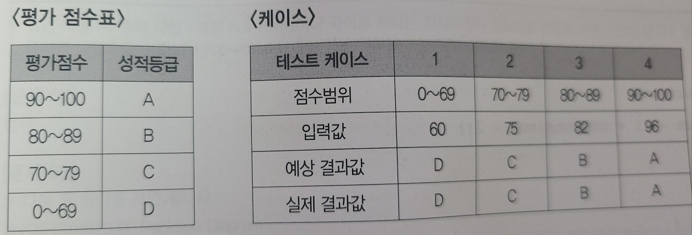

# 2020년도 4,5회 기출

```
일단 65점 합격

1. IPv6 o
2. 행위 o
3. 패키지 다이어그램 o
4.  x
5. [1, 2, 3]
    7
    1 2 3
    4 5
    6 7 8 9 o
6. 웹사이트에 접속한 사용자의 보안을 탈취하는 행위 x
7. 1 : i<8, 2 : n%2 ? 0 : 1 o
8. 1 : 3, 2 : 5 o
9. SELECT 학과, COUNT(*) AS 학과별튜플수 FROM 학생 GROUP BY 학과 o
10. KOREA
    EA
    K
    E
    M o
11. NAT o
12. SVN x
13. 테스트 오라클 x
14. 삭제이상, 오용이상, 탐지이상 x
15. 전수 테스트 x
16. UNIX o
17. 블록체인 o
18. 준비, 실행, 대기 o
19. 1 o
20. 데이터베이스가 갑작스럽게 종료되는 것을 방지하기 위하여 추가적으로 설치함으로써 유지력을 높여줌 x
```


```
문제 4번

데이터베이스 회복(Recovery) 기법에 관련된 다음 설명에서 괄호에 공통적으로 들어갈 가장 
알맞은 답을 쓰시오.

()은 트랜잭션이 데이터를 변경하면 트랜잭션이 부분 완료되기 전이라도 즉시 실제 DB에 그 
내용을 반영하는 기법으로, 장애가 발생하여 회복 작업할 경우를 대비하여 갱신된 내용들을 로그
(Log)에 보관시킨다. ()에서 회복 작업을 수행할 경우 Redo와 Undo 모두 수행이 가능하다.

- ()

- 즉각 갱신 기법
```

```
문제 6번

스니핑(Sniffing)은 사전적 의미로 '코를 킁킁 거리다, 냄새를 맡다'이다. 네트워크 보안에서 
스니핑에 대한 개념을 간략히 한 문장(1 문장)으로 쓰시오.

- ()

- 네트워크의 중간에서 남의 패킷 정보를 도청하는 해킹 유형
```

```
문제 12번

분산 컴퓨팅에 대한 다음 설명에 해당하는 용어를 쓰시오.

- 오픈 소스 기반 분산 컴퓨팅 플랫폼이다.
- 분산 저장된 데이터들은 클러스터 환경에서 병렬 처리된다.
- 일반 PC급 컴퓨터들로 가상화된 대형 스토리지를 형성하고 그 안에 보관된 거대한 데이터 
세트를 병렬로 처리할 수 있도록 개발되었다.
- 더그 커팅과 마이크 캐퍼렐라가 개발했으며, 구글의 맵리듀스(MapReduce) 엔진을 사용하고 
있다.

- ()

- 하둡
```

```
문제 13번

특정한 몇몇 테스트 케이스의 입력 값들에 대해서만 기대하는 결과를 제공하는 오라클로, 전수 
테스트가 불가능한 경우 사용하고, 경계값 및 구간별 예상값 결과 작성시 사용하는 오라클을 
쓰시오.

- ()

- 샘플링 오라클
```

```
문제 14번

데이터베이스의 이상(Anomaly)의 종류 3가지를 쓰시오.

- ()

- 삽입 이상, 갱신 이상, 삭제 이상
```

```
문제 15번

테스트 기법 중 다음과 같이 '평가 점수표'를 미리 정해 놓은 후 각 영역에 해당하는 입력값을 
넣고, 예상되는 출력값이 나오는지 실제 값과 비교하는 명세 기반 테스트 기법을 쓰시오.

- ()

- 동치 분할 검사
```


```
문제 20번

데이터베이스의 보안에서 가용성(Availability)에 대해 간략히 서술하시오.

- 인가받은 사용자는 시스템 내의 정보와 자원을 언제라도 사용할 수 있다는 보안 요건
```