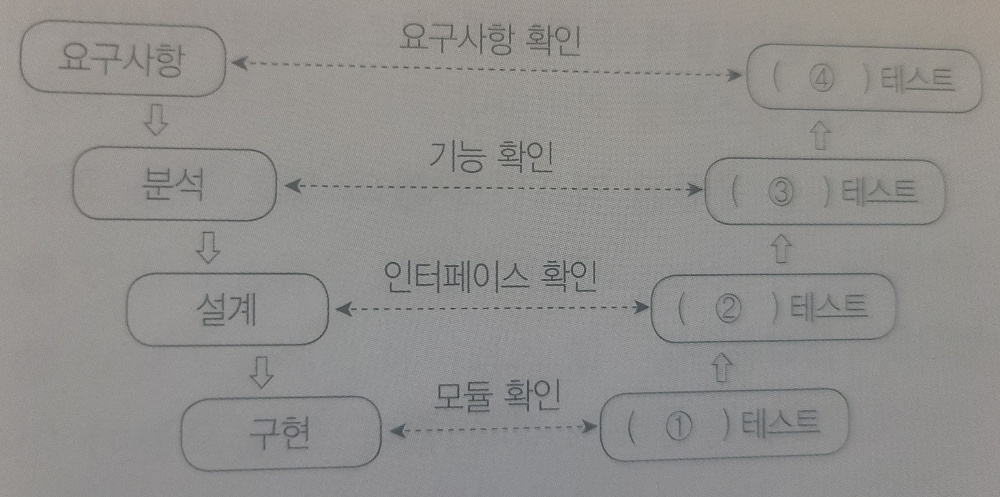

# 2022년도 1회 기출

```
일단 70점 합격

1. 2000                                                     o
2. 0                                                        o
3. 1 : REDO, 2 : UNDO                                       o
4. 1 : ORDER, 2 : score, 3 : DESC                           o
5. Car                                                      o
6. 데이터를 삭제 시 원하지 않던 데이터까지 중복 삭제되는 현상    o
----- 튜플을 삭제할 때 의도와는 상관없는 값들도 함께 삭제되는 현상
7. a = 20 b = 2                                             o
8. 1. extend(), 2. pop(), 3. reverse()                      o
9. WEP                                                      x
10. 1. Static Analysis, 2. Dynamic Analysis                 o
11. JUnit                                                   o
12. 120                                                     o
13. NUI                                                     o
14. ㄱ,ㄴ,ㄹ,ㅁ,ㅂ                                           x
15. 1. !=, 2. %, 3. /                                       o
16. ISMS                                                    o
17. 11                                                      x
18. 1 : 유일성, 2 : 원자성                                   x
19. Ransomware                                              x
20.                                                         x
```


```
문제 9번

보안 프로토콜에 대한 다음 설명에 해당하는 용어를 영문 약어로 쓰시오.

무선랜 보안에 사용된 웹 방식을 보완한 데이터 보안 프로토콜로, 임시 키 무결성 
프로토콜이라고도 한다. WEP의 취약성을 보완하기 위해 암호 알고리즘의 입력 키 길이를 
128비트로 늘리고 패킷당 키 할당, 키값 재설정 등 키 관리 방식을 개선하였다.

- ()

Temporal Key Integrity Protocol (TKIP) 802.11E
```

```
문제 14번

다음 중 블랙 박스 테스트 기법에 해당하는 것을 모두 골라 기호(ㄱ~ㅈ)로 쓰시오.

ㄱ. Base Path Testing           ㄴ. Condition Testing   
ㄷ. Boundary Value Analysis     ㄹ. Equivalence Partitioning
ㅁ. Data Flow Testing           ㅂ. Cause-Effect Graph
ㅅ. Branch Coverage Testing     ㅇ. Statement Coverage Testing
ㅈ. Boundary Division Analysis

- ()

ㄷ, ㄹ, ㅂ

화이트박스 테스트
기초 경로 검사(Base Path Testing)
제어 구조 검사(Control Structure Testing)

블랙박스 테스트
동치 분할 검사(Equivalence Partitioning)
경계값 분석(Boundary Value Analysis)
원인-효과 그래프 검사(Cause-Effect Graphing Testing)
오류 예측 검사(Error Guessing)
비교 검사(Comparison Testing)
```

```
문제 17번

다음 C언어로 구현된 프로그램을 분석하여 그 실행 결과를 쓰시오. (단, 출력문의 출력 서식을 
준수하시오.)

- ()

- 29 (계산 실수)
```
``` C
#include <stdio.h>

int isPrime(int number) {
    for (int i = 2; i < number; i++)
        if (number % i = 0) return 0;
    return 1;
}

int main() {
    int number = 13195;
    int max_div = 0;
    for (int i = 2; i < number; i++)
        if (isPrime(i) == 1 && number % i == 0) max_div = i;
    printf("%d", max_div);
}
```

```
문제 18번

키(Key)에 대한 다음 설명에서 괄호(1,2)에 들어갈 알맞은 용어를 쓰시오.

키(Key)는 데이터베이스에서 조건에 만족하는 튜플을 찾거나 순서대로 정렬할 때 기준이 되는 
속성을 말한다.

- 슈퍼키(Super Key)는 한 릴레이션 내에 있는 속성들의 집합으로 구성된 키로, 릴레이션을 
구성하는 모든 튜플에 대해 (1)을 만족한다.
- 후보키(Candidate Key)는 릴레이션을 구성하는 속성들 중에서 튜플을 유일하게 식별하기 위해 
사용되는 속성들의 부분집합으로, (1)과 (2)을 만족하는 특징이 있다.

- ()

- 유일성, 최소성
```

```
문제 19번

보안 위협에 대한 다음 설명에 해당하는 용어를 <보기>에서 찾아 쓰시오.

목표 조직이 자주 방문하는 웹 사이트를 사전에 감염시켜 목표 조직의 일원이 웹 사이트에 
방문했을 때 악성 코드에 감염되게 한다. 이후에는 감염된 PC를 기반으로 조직의 중요 시스템에 
접근하거나 불능으로 만드는 등의 영향력을 행사하는 웹 기반 공격이다.

<보기>
ㄱ. Pharmig     ㄴ. Drive-by Download       ㄷ. Watering Hole       ㄹ. Business SCAM
ㅁ. Phishing    ㅂ. Cyber Kill Chain        ㅅ. Ransomware          ㅇ. Sniffing

- ()

- Watering Hole
```

```
문제 20번

개발 단계에 따른 애플리케이션 테스트에 대한 다음 V-모델에서 괄호(1~4)에 들어갈 알맞은 
테스트를 쓰시오.

- ()

- 단위, 통합, 시스템, 인수
```
