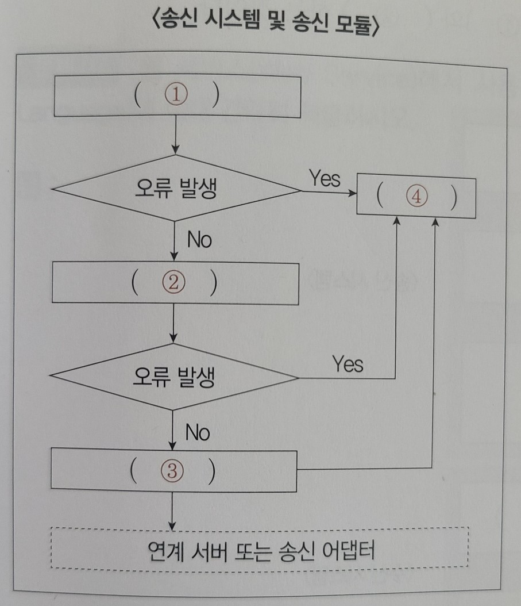
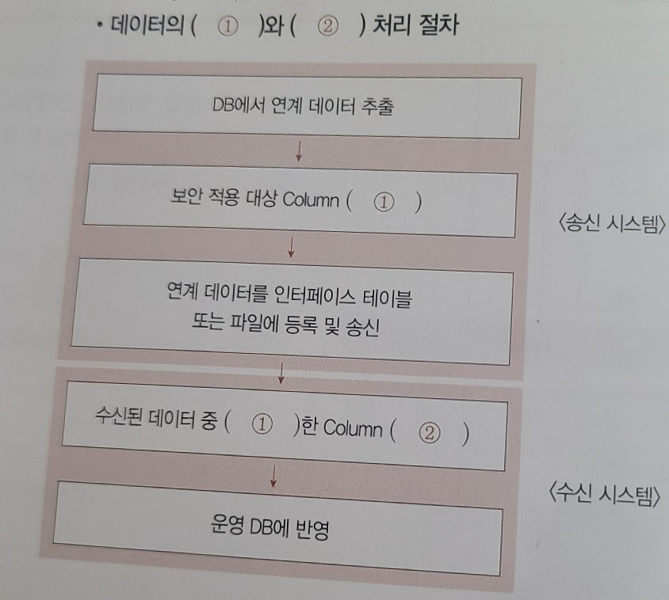

# 3장 추가

```
틀린 문제만 체크
```

```
1. ㄴ,ㄷ,ㅁ,ㅅ x
2. 송신, 재시도, x 
3. x
4. x
5. XML o
6. SOAP o
7. x
```

```
1.
통합 구현은 사용자의 요구사항에 맞춰 송-수신 모듈과 중계 모듈 간의 연계를 구현하는 것을 의미한다. 일반적인 통합 구현의 구성 요소를 <보기>에서 모두 골라 기호(ㄱ~ㅊ)로 쓰시오.

<보기>
ㄱ. 인터페이스 데이터 표준          ㄴ. 중계 시스템
ㄷ. 수신 시스템과 모듈              ㄹ. 연계 테스트
ㅁ. 연계 데이터                     ㅂ. EAI
ㅅ. 송신 시스템과 모듈              ㅇ. 암호화 알고리즘
ㅈ. ESB                            ㅊ. 네트워크

- ()

- ㄴ,ㄷ,ㅁ,ㅅ,ㅊ
```

```
2.
다음 그림은 연계 메커니즘에서 송신 시스템의 주요 기능 및 역할을 표현한 것이다. 괄호(1~4)
에 들어갈 알맞은 용어를 쓰시오.

- ()

- 연계 데이터 생성 및 추출, 코드 매핑 및 데이터 변환, 인터페이스 테이블 또는 파일 생성, 
로그 기록
```


```
3.
다음은 연계 메커니즘의 구성에 대한 설명이다. 괄호(1~3)에 들어갈 알맞은 용어를 쓰시오.

- ()


- 수신 시스템, 송신 시스템, 연계 서버
```
<table border="1">
    <tr>
        <td>(1)
        </td>
        <td>수신 데이터를 인터페이스 테이블이나 파일로 생성하는 시스템이다.
        </td>
    </tr>
    <tr>
        <td>(2)
        </td>
        <td>인터페이스 테이블 또는 파일의 데이터를 전송 형식에 맞도록 변환 및 송신을 
        수행하는 시스템이다.
        </td>
    </tr>
    <tr>
        <td>(3)
        </td>
        <td>데이터를 전송 형식에 맞게 변환하고 송-수신을 수행하는 등 송-수신과 관련된 
        모든 처리를 수행한다.
        </td>
    </tr>
</table>

```
4.
다음은 데이터 보안에 대한 설명이다. 괄호(1,2)에 들어갈 알맞은 용어를 쓰시오.

- 데이터 보안은 송신 시스템에서 연계 데이터를 추출할 때와 수신 시스템에서 데이터를 운영 DB에 반영할 때 데이터를 (1)와 (2) 하는 것이다.

- ()

- 암호화, 복호화
```


```
7.
웹 서비스(Web Service)에서 사용하는 WSDL(Web Services Description Language)에 대해 
간략히 서술하시오.

- ()

- 웹 서비스와 관련된 서식이나 프로토콜 등을 표준적인 방법으로 기술하고 게시하기 위한 
언어
```